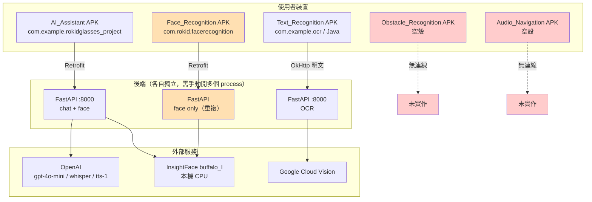
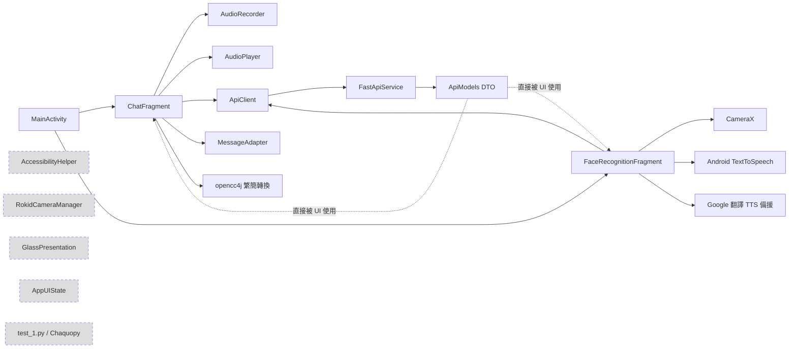

# 第一部：Repository 完整分析

> ⚠️ **本文件部分結論已被修正。**
> 2026-08-05 依據團隊提供的實際狀況重新分析後，以下結論已不成立：
> 五個獨立專案是刻意的分工、Face_Recognition 已在眼鏡上實機運作、
> App 直接跑在眼鏡上（CameraX 可用）、金鑰已全部重發。
> **請以 [`08_CORRECTIONS_AND_REANALYSIS.md`](08_CORRECTIONS_AND_REANALYSIS.md) 為準。**
> 本文件保留不改寫，僅供分析過程的可追溯性。

> 分析對象：`guide_glasses_project_` 全部 263 個檔案（排除 build / .gradle / .idea）
> 分析日期：2026-08-05
> 分析基準 commit：`1adfd1a`

---

## 0. 三分鐘摘要

| 項目 | 現況 |
|---|---|
| 專案型態 | **5 個完全獨立的 Gradle 專案 + 4 個獨立 Python 後端**，彼此無任何程式碼共用 |
| 實際可執行程度 | AI_Assistant 約 40%、Text_Recognition 約 60%、Face_Recognition 約 50%（與 AI_Assistant 重複）、Obstacle_Recognition 約 5%、Audio_Navigation **0%** |
| 是否真的跑在 Rokid 眼鏡上 | **否。** 目前所有程式跑在手機／平板上，用的是手機自己的 CameraX 相機 |
| Rokid SDK 使用率 | **0%。** `com.rokid.cxr:client-m` 只宣告在 gradle，程式碼中沒有任何一行呼叫 |
| 架構模式 | 無。沒有 ViewModel、沒有 Repository、沒有 DI、沒有 UseCase、沒有 domain 層 |
| 立即阻斷問題 | 3 個（見 §4.1），其中 2 個是**已外洩的正式金鑰** |

---

## 1. 全域結構

```
guide_glasses_project_/
├── AI_Assistant/            ← 最完整的模組
│   ├── android/             Kotlin, com.example.rokidglasses_project, minSdk 31
│   └── python/              FastAPI + LangChain + InsightFace
├── Audio_Navigation/        ← 空殼
│   ├── android/             Kotlin, com.rokid.audio_navigation（僅權限檢查）
│   └── python/main.py       0 bytes
├── Face_Recognition/        ← 與 AI_Assistant 高度重複
│   ├── android/             Kotlin, com.rokid.facerecognition
│   └── Python/              FastAPI + InsightFace（與 AI_Assistant/python 幾乎相同）
├── Obstacle_Recognition/    ← 空殼 + 桌面實驗腳本
│   ├── android/             Kotlin, com.rokid.obstacle_recognition（僅權限檢查）
│   ├── python/main.py       0 bytes
│   ├── zebra/main.py        單張圖片推論腳本
│   └── trafficlight/main.py 單張圖片推論腳本
├── Text_Recognition/
│   └── text_recognize/
│       ├── andriod/         Java（！）, com.example.ocr
│       └── python/          FastAPI + Google Cloud Vision
├── README.md                新手教學文件，內容與實際程式碼不符
└── requirements.txt         根目錄，內容與各子專案不一致
```

### 1.1 五個 Gradle 專案彼此完全獨立

| 專案 | 語言 | package | minSdk | 有無 settings.gradle |
|---|---|---|---|---|
| AI_Assistant | Kotlin | `com.example.rokidglasses_project` | 31 | 有（獨立 root） |
| Audio_Navigation | Kotlin | `com.rokid.audio_navigation` | ? | 有（獨立 root） |
| Face_Recognition | Kotlin | `com.rokid.facerecognition` | ? | 有（獨立 root） |
| Obstacle_Recognition | Kotlin | `com.rokid.obstacle_recognition` | ? | 有（獨立 root） |
| Text_Recognition | **Java** | `com.example.ocr` | ? | 有（獨立 root） |

**後果：** 沒有共用的 `network`、`tts`、`camera`、`domain` 程式碼。同樣的東西被抄寫了 3～5 次。使用者最終會拿到 **5 個獨立 APK**，而不是一個導盲眼鏡 App。

---

## 2. 逐模組 / 逐檔案分析

### 2.1 AI_Assistant / android

| 檔案 | 行數 | 職責 | 評估 |
|---|---|---|---|
| `MainActivity.kt` | 101 | Fragment 協調器，AI_CHAT ⇄ FACE_RECOGNITION 切換 | 職責合理，但 `currentMode` 賦值後從未被讀取（dead field）；`addToBackStack` 只在單向加入，返回鍵行為不對稱 |
| `AppState.kt` | 13 | `AppMode` enum + `AppUIState` data class | `AppUIState` **完全沒有被使用**（無 ViewModel 消費它）→ 死碼 |
| `ChatFragment.kt` | 548 | 錄音、上傳、TTS、播放、繁簡轉換、關鍵字路由、UI | **God Object。** 至少混雜 6 種職責 |
| `FaceRecognitionFragment.kt` | 528 | CameraX 綁定、RGBA→JPEG、3 秒輪詢、上傳、TTS 播報 | **God Object。** 且與 `Face_Recognition/MainActivity.kt` 約 90% 重複 |
| `audio/AudioRecorder.kt` | 88 | MediaRecorder 封裝（AAC/MPEG_4） | 品質尚可。`import retrofit2.http.Tag` 是誤加的無用 import |
| `audio/AudioPlayer.kt` | 148 | MediaPlayer 播放 byte[] | **有 bug**：`setOnCompletionListener` 內呼叫 `release()`，該 `release()` 解析到 `MediaPlayer.release()` 而非外層 `AudioPlayer.release()`，`mediaPlayer` 欄位不會被設為 null |
| `network/ApiClient.kt` | 39 | Retrofit 單例 | **阻斷級 bug**：`BASE_URL = "你的ip位址"`，Retrofit `baseUrl()` 會直接丟 `IllegalArgumentException`。App 一碰到網路就 crash |
| `network/FastApiService.kt` | 36 | Retrofit interface | 定義了 `/chat`、`/chat_audio`、`/tts`、`/recognize`、`/faces`、`/` |
| `network/ApiModels.kt` | 42 | DTO | 直接被 UI 使用，**沒有 domain model**，DTO 洩漏到整個 App |
| `ui/MessageAdapter.kt` | — | RecyclerView adapter | 一般 |
| `utils/AccessibilityHelper.kt` | 44 | 無障礙描述工具 | **從未被呼叫** → 死碼。諷刺的是這是視障專案 |
| `face_recognition/RokidCameraManager.kt` | 171 | UVC（USB Video Class）相機管理 | **從未被實例化** → 死碼。且 `captureFrame()` 回傳的是一張全新的空白 Bitmap，邏輯本身就是錯的 |
| `face_recognition/GlassPresentation.kt` | 78 | 投影到眼鏡鏡片的 Presentation | **從未被實例化** → 死碼 |
| `python/test_1.py` | 11 | Chaquopy 測試用 | 死碼 |

#### build.gradle.kts 的問題

```kotlin
// AI_Assistant/android/app/build.gradle.kts:97
buildPython("C:\\Users\\jerry\\AppData\\Local\\Programs\\Python\\Python310\\python.exe")
```
**硬編碼別人電腦的絕對路徑**。任何其他人 clone 下來都無法 build。而 Chaquopy 唯一裝的套件是 `matplotlib`，唯一的 Python 檔案是 `test_1.py`（兩個沒用的函式）→ **整個 Chaquopy 依賴應該移除**，它讓 APK 多出數十 MB。

```kotlin
implementation("com.rokid.cxr:client-m:1.0.1-20250812.080117-2")  // 宣告了，但 0 處使用
```

`ndk.abiFilters` 包含 `x86`，Rokid Glasses 是 ARM64 → 無謂膨脹。
`libs.versions.toml` 只管了 8 個依賴，其他 12 個直接硬寫版本號在 `build.gradle.kts` → version catalog 形同虛設。

#### AndroidManifest.xml 的問題

- `INTERNET`、`ACCESS_NETWORK_STATE` **各宣告兩次**
- 宣告了 `<meta-data android:resource="@xml/device_filter" />`，但 **AI_Assistant 沒有 `res/xml/device_filter.xml`**（那個檔案在 Face_Recognition）→ 這會造成 build 失敗或 resource not found
- 缺少 `ACCESS_BACKGROUND_LOCATION`（導航需要）
- 缺少 `FOREGROUND_SERVICE` 與 `FOREGROUND_SERVICE_LOCATION`（持續導盲必需）
- `android:allowBackup="true"` 且未來會存人臉資料 → 隱私風險

### 2.2 AI_Assistant / python（FastAPI 後端）

| 檔案 | 職責 | 評估 |
|---|---|---|
| `main.py` | 全部 API endpoint | 混雜 chat / audio / TTS / face 四種領域在同一個檔案 |
| `face_engine.py` | InsightFace `buffalo_l` 封裝 | 邏輯正確，但 **每次辨識都線性掃描整個 dict** → O(n)，人數多會慢 |
| `function/stt.py` | OpenAI `gpt-4o-transcribe` | 可用 |
| `function/tts.py` | OpenAI `tts-1` | **參數 bug**：函式簽名 `voice:str = "alloy"`，但內部寫死 `voice = "nova"`，參數完全被忽略 |
| `function/file_manager.py` | 暫存檔管理 | — |
| `admin.py` | 人臉資料庫網頁管理介面 | **嚴重安全問題**：無任何認證，任何人可新增／改名／刪除人臉；HTML 用 f-string 拼接使用者輸入 → **XSS**；`rename` 未過濾 `../` → **路徑穿越** |

#### 後端關鍵設計缺陷

```python
# main.py:34-39 —— 全域單一 memory
memory = ConversationBufferMemory()
conversation = ConversationChain(llm=llm, memory=memory)
```
**所有使用者共用同一段對話記憶。** 兩個人同時用，對話會互相污染。而且 memory 無上限成長 → token 成本無上限、最終超過 context window 而爆掉。

```python
# main.py:165-167 —— 正式路徑留著 debug 寫檔
cv2.imwrite("debug.jpg", image)
```
每次辨識都往磁碟寫一張圖，且會**保存使用者拍到的路人臉部影像** → 隱私 + 效能雙重問題。

```python
# main.py:82-86 —— TTS 用簡體，畫面用繁體
response_1 = cc.convert(response)     # 繁體，只用來 print
output_audio_path = await tts.generate_text(response)   # 傳的是原始（簡體）
```
**繁簡轉換的結果被丟掉了**，實際送去 TTS 與回傳 header 的都是未轉換的文字。

`requirements.txt` **缺少** `opencv-python`、`numpy`、`insightface`、`onnxruntime`、`opencc-python-reimplemented` → 照著裝一定跑不起來。

### 2.3 Face_Recognition（整個模組是重複的）

`Face_Recognition/android/.../MainActivity.kt`（425 行）與 `AI_Assistant/.../FaceRecognitionFragment.kt`（528 行）**逐行比對約 90% 相同** —— `rgbaToJpeg()`、`autoDetectRunnable`、`displayResult()`、`speakWithMediaPlayer()`、TTS 初始化全部一模一樣。

`Face_Recognition/Python/` 與 `AI_Assistant/python/` 的 `face_engine.py`、`admin.py` 也重複。

**結論：Face_Recognition 整個模組應該刪除**，功能已被 AI_Assistant 涵蓋。唯一有價值的是 `res/xml/device_filter.xml`（USB device filter），應搬到統一專案。

### 2.4 Obstacle_Recognition（幾乎不存在）

- `android/MainActivity.kt`：54 行，**只有權限檢查**，`onRequestPermissionsResult` 裡是 `// TODO`
- `python/main.py`：**0 bytes**
- `zebra/main.py`：19 行桌面腳本，`YOLO("yolo-seg.pt")` —— **權重檔不在 repo**
- `trafficlight/main.py`：25 行桌面腳本，`YOLO("trafficlight.pt")` —— **權重檔不在 repo**

兩個腳本都是「讀一張 jpg → 推論 → 存一張 jpg」，沒有串流、沒有 TTS、沒有距離估計、沒有方位判斷。**距離「即時障礙物偵測 + 語音提醒」還有 100% 的路要走。**

### 2.5 Audio_Navigation（0%）

- `android/MainActivity.kt`：與 Obstacle_Recognition 逐字相同的 54 行權限樣板
- `python/main.py`：**0 bytes**

**智慧導航功能目前完全不存在。**

### 2.6 Text_Recognition（品質最好的無障礙實作，但技術棧不一致）

| 檔案 | 評估 |
|---|---|
| `MainActivity.java` | **用 Java 寫的**（其他全是 Kotlin）。但 `splitTextForSpeech()` 的斷句分段朗讀、焦點朗讀按鈕名稱、`USAGE_ASSISTANCE_ACCESSIBILITY` 音訊屬性 —— **這是整個 repo 唯一真正為視障使用者設計的程式碼，非常值得保留並移植** |
| `CameraPreviewActivity.java` | 拍照，透過 `Intent` 傳 `byte[]` → **超過 1MB 會 `TransactionTooLargeException` crash** |
| `python/api.py` | FastAPI + Google Cloud Vision，`allow_origins=["*"]` |
| `python/ocr_doc.py` | **硬編碼絕對路徑** `C:\Users\user\Downloads\blind-glasses-ocr-d82297cbca1a.json`；且 `preprocess_doc()` 把彩色轉灰階再送 Vision —— Google Vision 對彩色原圖表現更好，**這個前處理反而降低準確率** |

```java
// MainActivity.java:57-58
private static final String OCR_URL = "http://172.20.10.5:8000/ocr/doc";
```
硬編碼區網 IP + **明文 HTTP**。

---

## 3. 現況架構圖

### 3.1 目前的模組關係（現實）



### 3.2 AI_Assistant 內部依賴（唯一有實體的模組）


（灰色虛線＝完全沒有被引用的死碼）

**觀察：**
- 沒有任何 ViewModel、Repository、UseCase、DI container
- Fragment 直接呼叫 `ApiClient.api.xxx()` —— UI 層直達網路層
- DTO 直接在 UI 使用，沒有 domain model
- 兩個 Fragment 之間用 `setFragmentResult` 字串 key 溝通（`"from_face"`）→ 無型別安全

---

## 4. 問題清單（依嚴重度分級）

### 4.1 🔴 阻斷級（必須立刻處理）

| # | 問題 | 位置 | 影響 |
|---|---|---|---|
| B1 | **OpenAI API Key 已提交進 git** | `AI_Assistant/python/.env`（git tracked） | 金鑰已外洩，且存在於 git 歷史。**必須立刻到 OpenAI 後台撤銷並重新產生**，光刪檔案沒用 |
| B2 | **GCP Service Account 私鑰已提交進 git** | `Text_Recognition/text_recognize/python/blind-glasses-ocr-d82297cbca1a.json` | 同上，**必須到 GCP IAM 撤銷該 key**。此檔案含專案完整存取權 |
| B3 | `BASE_URL = "你的ip位址"` | `network/ApiClient.kt:12` | Retrofit 建構即拋 `IllegalArgumentException`，App 無法運作 |
| B4 | Chaquopy 硬編碼 `C:\Users\jerry\...` | `app/build.gradle.kts:97` | 除了原作者的電腦，**沒有人能 build** |
| B5 | Manifest 引用不存在的 `@xml/device_filter` | `AI_Assistant/AndroidManifest.xml:54` | resource 解析失敗 |

### 4.2 🟠 嚴重級

| # | 問題 | 位置 | 影響 |
|---|---|---|---|
| S1 | `/admin` 無認證 + XSS + 路徑穿越 | `admin.py` | 任何人可竄改人臉資料庫；`rename` 傳 `../../` 可寫到任意路徑 |
| S2 | 全域共用 `ConversationBufferMemory` | `main.py:34` | 多使用者對話互相污染；記憶無上限成長 |
| S3 | `debug.jpg` 每次辨識落地 | `main.py:166` | 未經同意保存路人臉部影像（個資法風險） |
| S4 | 明文 HTTP + 硬編碼區網 IP | `Text_Recognition/MainActivity.java:58` | 影像與辨識文字明文傳輸 |
| S5 | Face_Recognition 整個模組重複 | 全模組 | 維護成本 ×2，修 bug 要修兩次 |
| S6 | `Intent` 傳遞完整 JPEG byte[] | `CameraPreviewActivity.java` | 大圖必 crash（`TransactionTooLargeException`） |
| S7 | `requirements.txt` 缺 6 個必要套件 | `AI_Assistant/python/requirements.txt` | 照文件安裝必定失敗 |

### 4.3 🟡 中等級

| # | 問題 | 位置 |
|---|---|---|
| M1 | `AudioPlayer` 的 `release()` 解析到錯誤的接收者，`mediaPlayer` 未清空 | `AudioPlayer.kt:46` |
| M2 | `tts.py` 的 `voice` 參數被硬編碼覆蓋 | `function/tts.py:25` |
| M3 | 繁簡轉換結果被丟棄，TTS 唸簡體 | `main.py:78-86` |
| M4 | `FaceEngine.recognize()` O(n) 線性掃描 | `face_engine.py:133` |
| M5 | 人臉辨識用「關鍵字比對」路由（`shouldSwitchToFaceRecognition`） | `ChatFragment.kt:480` |
| M6 | 3 秒固定輪詢，無視畫面是否有變化 | `FaceRecognitionFragment.kt:60` |
| M7 | Google 翻譯 TTS 當備援（非公開 API，隨時會壞） | 兩處 |
| M8 | OCR 前處理轉灰階，降低 Vision 準確率 | `ocr_doc.py:26-36` |
| M9 | `x86` ABI 無謂打包 | `build.gradle.kts:32` |

### 4.4 死碼清單（可直接刪除）

| 檔案 | 理由 |
|---|---|
| `AI_Assistant/.../utils/AccessibilityHelper.kt` | 0 引用 |
| `AI_Assistant/.../face_recognition/RokidCameraManager.kt` | 0 引用，且 `captureFrame()` 邏輯本身錯誤 |
| `AI_Assistant/.../face_recognition/GlassPresentation.kt` | 0 引用 |
| `AI_Assistant/.../AppState.kt` 的 `AppUIState` | 0 引用（`AppMode` 保留） |
| `AI_Assistant/android/app/src/main/python/test_1.py` + Chaquopy 整段設定 | 無實際用途，徒增 APK 體積 |
| `AI_Assistant/android/test.txt` | 空檔 |
| `Face_Recognition/` **整個資料夾** | 與 AI_Assistant 重複 90% |
| `Obstacle_Recognition/android/` | 空樣板，重寫成本低於改造成本 |
| `Audio_Navigation/android/` | 同上 |
| `Obstacle_Recognition/python/main.py`、`Audio_Navigation/python/main.py` | 0 bytes |
| `AI_Assistant/android/.kotlin/errors/*.log` | build 產物不該進版控 |
| `**/__pycache__/` | 同上 |

---

## 5. 可以改用 SDK 取代的自寫程式碼

| 現有自寫程式碼 | 可用 SDK / Library 取代 | 依據 |
|---|---|---|
| `RokidCameraManager`（UVC 相機） | **Rokid CXR-M `openGlassCamera()` / `takeGlassPhoto()` / `setPhotoParams()`** | 見第二部 §2.2。UVC 是通用 USB 相機協定，Rokid Glasses 走的是 BLE/Wi-Fi Direct，UVC 路線方向就錯了 |
| `GlassPresentation`（Presentation 投影） | **CXR-M `controlScene()` + `configTranslationText()` / `configWordTipsText()`** | 眼鏡顯示由 CXR 場景管理，不是 Android Presentation |
| `speakWithMediaPlayer()`（Google 翻譯 TTS） | **CXR-M `sendTtsContent()`**（眼鏡端播報）或 Android `TextToSpeech`（手機端） | 非公開 API 不可用於正式產品 |
| `ChatFragment` 的關鍵字比對路由 | **LLM Function Calling / Tool Use** | 見第三部 §功能三 |
| `rgbaToJpeg()` 逐像素轉換（慢速路徑） | **CameraX `ImageProxy.toBitmap()`**（camera-core 1.3+ 已內建） | 官方 API 有硬體加速 |
| `FaceEngine` 的 cosine 線性掃描 | **ObjectBox HNSW 向量索引** 或 sqlite-vec | O(log n) 取代 O(n) |
| 後端 InsightFace 人臉辨識 | **手機端 MediaPipe FaceDetector + MobileFaceNet TFLite** | 見第三部 §功能二 |
| 後端 Whisper STT | **Android `SpeechRecognizer`**（免費、低延遲）或 **Gemini Live API** | 見第三部 §功能五 |
| `Text_Recognition` 後端 Cloud Vision | **ML Kit Text Recognition v2（中文版，完全離線）** | 見第三部 §功能六 |
| `opencc4j` 繁簡轉換 | 直接在 LLM system prompt 指定「一律使用臺灣繁體中文」 | 少一個依賴，且品質更好（詞彙也會在地化） |

---

## 6. 需要保留的資產

不是所有東西都要重寫。以下是**有價值、應該保留並移植**的部分：

1. **`Text_Recognition/MainActivity.java` 的 `splitTextForSpeech()`** —— 依標點斷句、80 字分塊、短句加「標題，」前綴。這是整個 repo 最懂視障使用者的程式碼。
2. **`FaceRecognitionFragment` 的播報冷卻機制**（`announceCooldown = 10s`，同一人不重複播報）—— 這個 UX 判斷是對的，直接沿用。
3. **`AtomicBoolean` 背壓控制**（`shouldCaptureNextFrame` / `isProcessing`）—— 避免同時送多個請求，思路正確。
4. **`face_database/` 的 5 筆人臉資料** —— 測試資料，保留。
5. **`res/raw/*.mp3` 預錄提示音** —— 預錄音檔比即時 TTS 快得多，對「錄音開始／結束」這種高頻提示是正確選擇，保留。
6. **`AudioAttributes.USAGE_ASSISTANCE_ACCESSIBILITY`** 的用法 —— 正確，讓提示音走無障礙音訊通道。

---

## 7. 小結：Repository 的三個結構性問題

1. **它不是一個產品，是五個互不相干的原型。** 沒有共用層，沒有統一入口，使用者要裝五個 App。
2. **它沒有真的用到 Rokid 眼鏡。** 宣告了 CXR-M 依賴但一行沒用；真正在跑的是手機的 CameraX 與手機的 TTS。目前的東西在一支普通 Android 手機上跑起來是一樣的。
3. **它把所有運算都推到一台開發者自己的電腦（`你的ip位址` / `172.20.10.5`）。** 這在展示 demo 可行，但離開那個區網就完全不能用 —— 對一個要陪視障者走在路上的系統，這是根本性的架構問題。

→ 續讀 [`02_ROKID_SDK_ANALYSIS.md`](02_ROKID_SDK_ANALYSIS.md)
