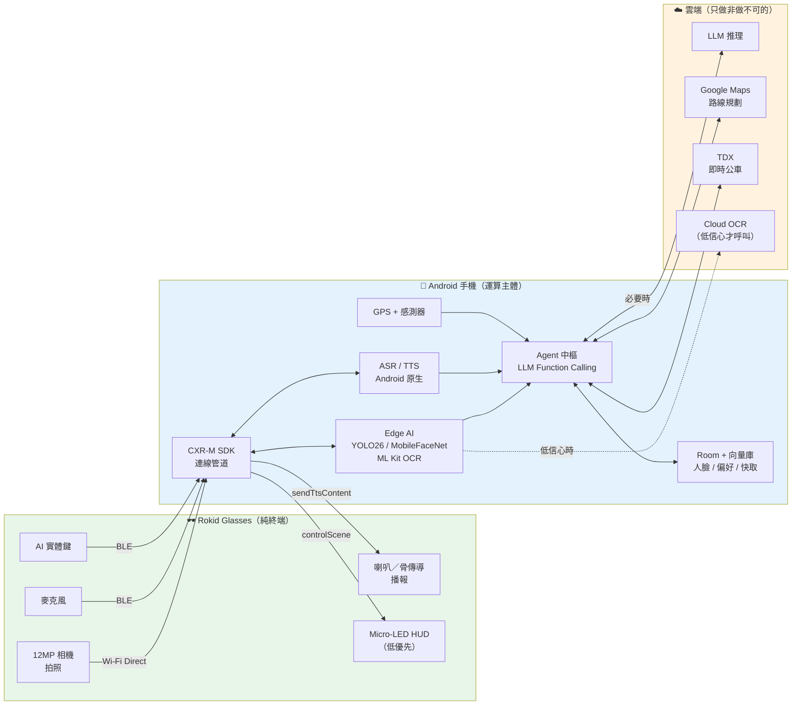

# 第二部：Rokid SDK 能力分析

> ⚠️ **本文件部分結論已被修正。**
> 2026-08-05 依據團隊提供的實際狀況重新分析後，以下結論已不成立：
> 五個獨立專案是刻意的分工、Face_Recognition 已在眼鏡上實機運作、
> App 直接跑在眼鏡上（CameraX 可用）、金鑰已全部重發。
> **請以 [`08_CORRECTIONS_AND_REANALYSIS.md`](08_CORRECTIONS_AND_REANALYSIS.md) 為準。**
> 本文件保留不改寫，僅供分析過程的可追溯性。

> 所有 API 名稱皆標註出處。**凡是官方文件未明確載明者，一律標示為「推測／待驗證」。**

---

## 1. ⚠️ 最重要的前提：你面對的是「兩條不同的產品線」

閱讀你提供的四份文件後，發現它們**不是同一個 SDK，也不是同一台裝置**。這件事會決定整個系統架構，必須先釐清。

| | **A 線：Rokid Glasses（消費級）+ CXR SDK** | **B 線：Rokid Glass 3 / Sprite 企業版 SDK** |
|---|---|---|
| 對應你給的文件 | 文件 2（segmentfault）、文件 3（open.rokid.com） | **文件 1**（x-docs.rokid.com Glass3 眼镜端 API） |
| 裝置 | Rokid Glasses，49g，雙目綠色 Micro-LED | Rokid Glass 3（企業／工業用） |
| App 跑在哪 | **手機**（眼鏡是終端） | **眼鏡上**（眼鏡是完整 Android 裝置） |
| Maven 座標 | `com.rokid.cxr:client-m`（手機端） `com.rokid.cxr:cxr-service-bridge`（眼鏡端） | 企業 SDK，需另行申請 |
| ASR / TTS / LLM | **SDK 不提供，開發者自備** | **SDK 內建**（`IAsrService` / `ITtsService` / `IAiChatService`） |
| 人臉辨識 | **SDK 不提供** | **SDK 內建**（`IOnlineRecService.recognizeFace()`） |
| 相機連續影像 | 官方文件僅見「拍照」 | **`startCameraNv21Export()` 連續 NV21 幀** |
| 翻譯 | 需自備翻譯引擎 | **`ITranslateService` 內建** |

### 你的專案目前站在 A 線

`AI_Assistant/android/app/build.gradle.kts:77` 宣告的是 `com.rokid.cxr:client-m` → **A 線（消費級 Rokid Glasses + 手機當大腦）**。

### 這代表什麼

**文件 1（Glass3 企業 SDK）裡那些看起來「什麼都有」的 API —— `IAsrService`、`ITtsService`、`IOnlineRecService.recognizeFace()`、`ITranslateService`、`startCameraNv21Export()` —— 在 A 線上你一個都用不到。**

如果你手上的裝置是消費級 Rokid Glasses，那麼：
- 人臉辨識 → **必須自己做**
- ASR → **必須自己做**
- TTS 引擎 → **必須自己做**（SDK 只負責把你合成好的內容送到眼鏡播放）
- 障礙物偵測 → **必須自己做**
- 連續影像串流 → **官方 API 未提供，是最大風險點**

> **🔴 這是本次分析中最需要你確認的一件事：你手上的實體裝置到底是哪一台？**
> 如果是 Glass 3 企業版，整個架構會簡單非常多（很多功能 SDK 直接給）。
> 如果是消費級 Rokid Glasses，就是下面規劃的方案。
> 以下**全部以消費級 Rokid Glasses（A 線）為基準**，因為那符合你 repo 現有的依賴宣告。

---

## 2. Rokid Glasses 硬體規格（決定 Edge AI 可行性）

| 項目 | 規格 | 對本專案的意義 |
|---|---|---|
| SoC | Qualcomm Snapdragon AR1 | 有 NPU，但被 RAM 卡死 |
| **RAM** | **2 GB** | 🔴 **決定性限制。** 扣掉 YodaOS 系統本身，第三方可用記憶體極少。跑 YOLO + 人臉模型完全不可能 |
| ROM | 32 GB | 尚可 |
| 相機 | 12 MP | 畫質足夠 |
| 顯示 | 雙目**單色綠** Micro-LED，480×398/眼，23° FOV，1500 nits | 🔴 **對視障使用者幾乎無意義** |
| 電池 | **210 mAh，約 4 小時** | 🔴 連續開相機串流會大幅縮短，實測可能 <1.5 小時 |
| 連線 | Wi-Fi 6、Bluetooth 5.3 | Wi-Fi Direct 是高頻寬管道 |
| 重量 | 49 g | 適合長時間配戴 ✅ |
| 防水 | IPX4 | 小雨可用 ✅ |

> 資料來源：[Rokid 官方產品頁](https://global.rokid.com/products/rokid-glasses)、[MicroLED-Info](https://www.microled-info.com/rokid-announces-new-smart-ar-glasses-microled-microdisplays)、[Notebookcheck](https://www.notebookcheck.net/Rokid-announces-new-smart-glasses-with-MicroLED-display-and-Garmin-integration.921792.0.html)

### 由硬體直接推出的三個架構結論

**結論 1：眼鏡上不跑任何 AI 模型。**
2 GB RAM + 210 mAh，連 YOLO-nano 都不該放。**手機是唯一的運算主體。** 這也正是 CXR 架構本身的設計意圖。

**結論 2：眼鏡顯示層應該降到最低優先級。**
主要使用者是視障者，單色綠 23° FOV 的 HUD 對他們沒有作用。顯示只在兩種情境有價值：(a) 低視力者的大字提示、(b) 陪同的明眼人。**目前 repo 花在 `GlassPresentation`、`glass_overlay.xml` 的工夫，投資報酬率很低。**

**結論 3：續航是產品級的硬限制。**
4 小時（且是不開相機的 4 小時）。導盲眼鏡如果只能用 1.5 小時，實用性存疑。**必須設計「事件驅動」而非「常時串流」的相機策略**，並把行動電源盒（3000 mAh，可充 10 次）納入產品規劃。

---

## 3. CXR-M SDK API 清單（含出處與可信度標示）

以下依「文件明確載明」與「社群／推測」分開列。

### 3.1 ✅ 有明確出處的 API

| API | 用途 | 出處 |
|---|---|---|
| `CxrApi.getInstance()` | SDK 單例入口 | segmentfault 文件 2、[阿里雲技術文](https://developer.aliyun.com/article/1690327) |
| `connectBluetooth()` | 建立藍牙連線 | [SegmentFault 快遞站案例](https://segmentfault.com/a/1190000047439479) |
| `initWifiP2P()` | 建立 Wi-Fi Direct 高頻寬通道 | 同上 |
| `isBluetoothConnected()` | 查詢連線狀態 | 同上 |
| `setConnectionStateListener()` | 連線狀態回呼（`STATE_CONNECTED` / `STATE_CONNECTING` / `STATE_DISCONNECTED`） | [cnblogs 翻譯助手教學](https://www.cnblogs.com/slgkaifa/p/19209379) |
| `setErrorListener()` | 錯誤回呼 | 同上 |
| `setAiEventListener(AiEventListener)` | 註冊 AI 按鍵事件 | 阿里雲技術文 |
| `AiEventListener.onAiKeyDown()` / `onAiKeyUp()` / `onAiExit()` | 眼鏡 AI 實體鍵按下／放開／退出 | 阿里雲技術文 |
| `sendAsrContent(String)` | 把語音辨識結果推到眼鏡顯示 | 阿里雲技術文、火山引擎技術拆解 |
| `notifyAsrEnd()` | 通知 ASR 結束 | 阿里雲技術文 |
| `sendTtsContent(String)` / `sendTTSContent(String)` | 把要播報的文字送到眼鏡 | 阿里雲技術文、SegmentFault 快遞站案例 |
| `notifyAiError()` | 回報 AI 失敗 | 阿里雲技術文 |
| `notifyNoNetwork()` | 回報無網路 | 阿里雲技術文 |
| `openGlassCamera()` | 開啟眼鏡相機 | SegmentFault 快遞站案例 |
| `setPhotoParams()` | 設定拍照解析度（該文建議 1920×1080） | 同上 |
| `takeGlassPhoto()` | **拍一張照片** | 同上 |
| `controlScene(CxrSceneType, Boolean, params)` | 開關眼鏡端場景（如 `WORD_TIPS`、翻譯場景） | 火山引擎技術拆解、cnblogs |
| `sendStream(CxrStreamType, ByteArray, filename, SendStatusCallback)` | 傳送位元組串流到眼鏡 | 火山引擎技術拆解 |
| `sendTranslationContent(vadId, subId, temporary, finished, content)` | 送出翻譯文字 | cnblogs |
| `configTranslationText(textSize, x, y, width, height)` | 設定翻譯文字顯示區域 | cnblogs |
| `configWordTipsText(textSize, lineSpace, mode, x, y, width, height)` | 設定提詞機顯示（`mode` = `normal` / `ai`） | 火山引擎技術拆解 |
| `subscribe()` + `MsgReplyCallback` | 訂閱眼鏡端訊息 | SegmentFault 快遞站案例 |
| `sendMessage()` | 傳送訊息到眼鏡 | 同上 |
| `startSync()` | 同步至雲端 | 同上 |
| `MediaFilesUpdateListener` | 眼鏡媒體檔更新回呼 | 同上 |

### 3.2 🔴 SDK 明確「不提供」的東西

> 阿里雲技術文原文重點：SDK 本身**不提供 ASR、AI、TTS 引擎**，開發者必須自行整合第三方服務。

亦即 **CXR-M 是一條「管道」，不是一個「大腦」**。它負責：
- 眼鏡與手機的連線與資料傳輸
- 眼鏡端的顯示與互動場景
- 把你算好的文字送去眼鏡顯示／播報

它**不負責**：辨識、理解、合成、決策。這些**全部**要你在手機端自己接。

### 3.3 ⚠️ 待驗證 / 官方文件未明確載明（不可假設存在）

| 需求 | 狀態 |
|---|---|
| **眼鏡相機連續影像串流 API** | ⚠️ **未在任何官方文件中找到。** 只找到 `takeGlassPhoto()` 單張拍照。社群專案 [RokidStream](https://github.com/zero2005x/RokidStream) 自行實作 H.264 串流，實測參數為 **240×240 @ 10 fps @ 100 kbps（BLE L2CAP）**，並提到需搭配自寫的眼鏡端 App。這是**功能一（障礙物偵測）最大的技術風險**，必須在 Phase 0 實機驗證 |
| 眼鏡麥克風原始音訊串流到手機 | ⚠️ 未在文件中找到明確 API。多數範例是「手機自己用 `AudioRecord` 錄音」。**待驗證** |
| 眼鏡 IMU / 感測器資料存取 | ⚠️ 硬體有 InvenSense ICM-4x6xx IMU，但 CXR-M 是否開放讀取**未見文件，推測不開放** |
| 眼鏡 GPS | ⚠️ 規格中未見 GPS 模組。**推測導航定位必須靠手機 GPS** |
| `sendTtsContent()` 是否用眼鏡喇叭播放 | ⚠️ 從快遞站案例的敘述（「掃描成功」「請分類至 A 區 3 號架」）**推測**是眼鏡端播報，但**未見明確文件說明音訊路由**。待驗證 |
| 眼鏡端自訂 UI 繪製 | ⚠️ 只找到 `configTranslationText` / `configWordTipsText` 這類「預設場景 + 參數」的模式，**未見任意繪製 API**。推測顯示能力被限制在官方預設場景內 |

---

## 4. 「SDK 優先」原則的具體套用

依照你的要求逐項判定。

### ✅ 應該直接用 SDK

| 功能 | 用什麼 | 原因 |
|---|---|---|
| 眼鏡連線與配對 | `connectBluetooth()` + `initWifiP2P()` | 私有協定，不可能自己重寫 |
| 眼鏡實體 AI 鍵 | `setAiEventListener()` | 唯一入口 |
| 眼鏡拍照 | `openGlassCamera()` + `setPhotoParams()` + `takeGlassPhoto()` | 唯一入口。**取代目前的 `RokidCameraManager`（UVC）與 CameraX** |
| 眼鏡文字顯示 | `controlScene()` + `configXXXText()` | 唯一入口。**取代 `GlassPresentation`** |
| 眼鏡語音播報 | `sendTtsContent()` | 唯一入口（待驗證音訊路由） |
| 眼鏡端狀態同步 | `subscribe()` / `sendMessage()` | 唯一入口 |

### ⚠️ SDK 沒有，必須自己實作（並說明原因）

| 功能 | 自行實作方案 | 原因 |
|---|---|---|
| **障礙物偵測** | 手機端 YOLO26-n（TFLite/NNAPI） | SDK 完全不提供物件偵測。企業版的 `IOnlineRecService` 只做人臉／車牌，且不在 A 線 |
| **人臉「這是誰」辨識** | MediaPipe FaceDetector + MobileFaceNet TFLite + 本地向量庫 | SDK 不提供。企業版 `IOnlineRecService.recognizeFace()` 不在 A 線 |
| **ASR** | Android `SpeechRecognizer`（線上／離線）或雲端 | **SDK 明確不提供** |
| **LLM 理解與工具呼叫** | Claude / Gemini Function Calling | **SDK 明確不提供** |
| **TTS 合成** | Android `TextToSpeech`（本機，零延遲零成本） | **SDK 明確不提供**。`sendTtsContent()` 只負責「顯示／播報你給的文字」，不負責合成 |
| **導航** | Google Maps Platform + TDX | SDK 完全不涉及 |
| **OCR** | ML Kit Text Recognition v2（中文，離線） | SDK 不提供 |
| **翻譯** | ML Kit Translate（離線）或 LLM | A 線無 `ITranslateService` |
| **連續影像取得** | 若 `takeGlassPhoto()` 頻率不足 → 需自訂串流（高風險） | 官方未提供連續串流 API |

---

## 5. 目標架構的角色分工

依據 CXR 的設計意圖與 2 GB RAM 的現實：

**一句話總結：眼鏡是感測器與喇叭，手機是大腦，雲端只做手機做不到的事。**

→ 續讀 [`03_FEATURE_ANALYSIS.md`](03_FEATURE_ANALYSIS.md)
