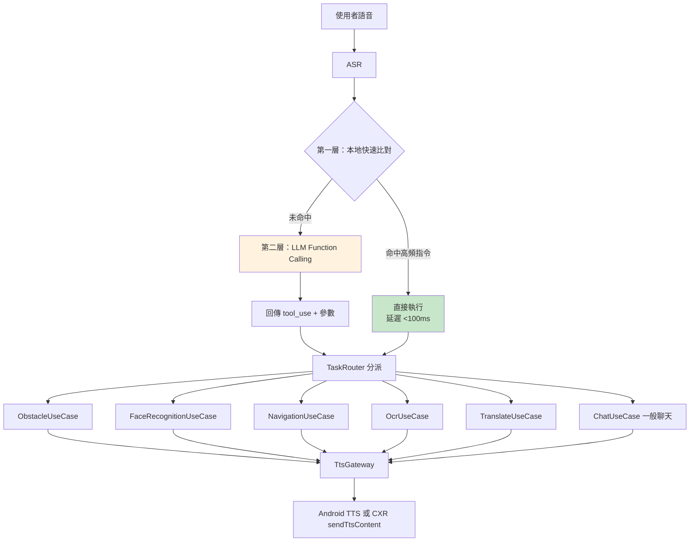
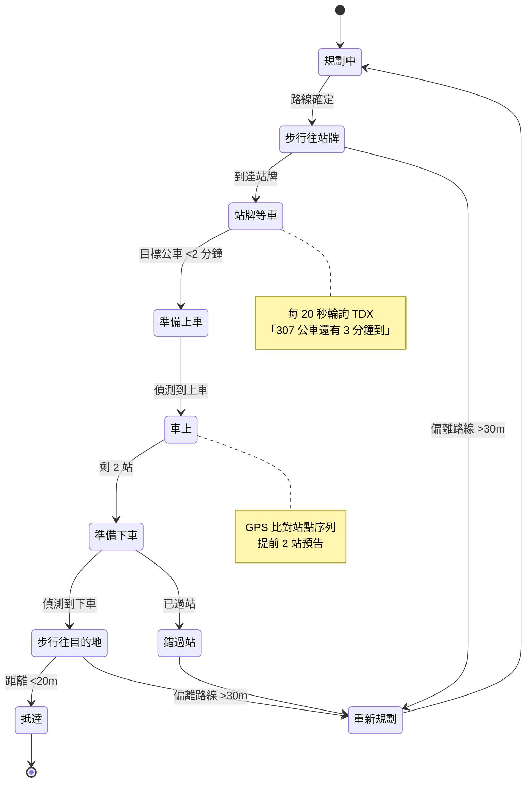
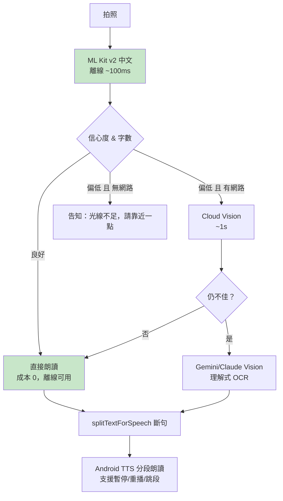

# 第三部：六大核心功能逐項分析

> ⚠️ **本文件部分結論已被修正。**
> 2026-08-05 依據團隊提供的實際狀況重新分析後，以下結論已不成立：
> 五個獨立專案是刻意的分工、Face_Recognition 已在眼鏡上實機運作、
> App 直接跑在眼鏡上（CameraX 可用）、金鑰已全部重發。
> **請以 [`08_CORRECTIONS_AND_REANALYSIS.md`](08_CORRECTIONS_AND_REANALYSIS.md) 為準。**
> 本文件保留不改寫，僅供分析過程的可追溯性。

---

## 功能一：障礙物偵測

### 現況：約 5%

| 項目 | 狀態 |
|---|---|
| Android 端 | `Obstacle_Recognition/android/MainActivity.kt` 只有 54 行權限檢查，`// TODO` |
| Python 端 | `main.py` **0 bytes** |
| 已有的東西 | `zebra/main.py`（`yolo-seg.pt`）、`trafficlight/main.py`（`trafficlight.pt`）兩支桌面單張推論腳本，**權重檔不在 repo** |
| 缺什麼 | 串流、距離估計、方位判斷、危險分級、TTS 播報策略、與眼鏡的整合 —— 全部 |

### 模型選型分析

你列的候選逐一評估（**2026 年 8 月的現況**）：

| 模型 | 速度（手機 NPU） | 準確率 | 可 Edge | 建議 |
|---|---|---|---|---|
| **YOLO26-n** ⭐ | **最快**（CPU 較 YOLO11-n 快約 43%） | 40.9 mAP | ✅ 原生 TFLite / INT8 / NNAPI | **✅ 首選** |
| YOLO26-s | 快 | 47.2 mAP | ✅ | 準確度不足時的升級選項 |
| YOLO11-n/s | 快 | 39.5 / 47.0 mAP | ✅ 成熟穩定 | 🟡 備案，生態最成熟 |
| YOLOv12 | 中（Area Attention） | 高 | ⚠️ **量化後掉點嚴重** | ❌ 不建議上手機 |
| RT-DETR / RT-DETRv2 | 慢 | 高 | ❌ **INT8 量化崩壞**（attention 對低精度極敏感） | ❌ 不建議 |
| MediaPipe Object Detector | 很快 | 低（COCO 通用類別） | ✅ | 🟡 只適合當 fallback |
| GroundingDINO | **極慢**（秒級） | 極高、開放詞彙 | ❌ | ❌ 即時場景不可用。可考慮**離線用來自動標註訓練資料** |
| MobileSAM | 中 | 分割優秀 | 🟡 | ❌ 導盲不需要精細分割，浪費算力 |
| **Depth Anything V2-small** | 中（~50-100ms） | 相對深度佳 | 🟡 勉強 | ⚠️ **見下方距離估計討論** |

> 依據：[YOLO26 架構論文](https://arxiv.org/html/2509.25164v4)、[Ultralytics 模型比較](https://docs.ultralytics.com/compare)、[Roboflow 2026 物件偵測模型評比](https://blog.roboflow.com/best-object-detection-models/)

**結論：YOLO26-n，INT8 量化，透過 TFLite + NNAPI/GPU delegate 跑在手機上。**

### 你要偵測的類別怎麼來

COCO 預訓練有：人、汽車、機車、腳踏車、公車、卡車、紅綠燈、停車標誌 → **直接可用**。

COCO **沒有**：導盲磚、斑馬線、人行道邊界、電線桿、路障、地面高低差 → **必須自行標註訓練**。

建議做法：
1. **兩階段部署** —— Phase A 先用 COCO 預訓練 YOLO26-n 上線（人／車／機車／腳踏車，這些已經涵蓋最高危險度）；Phase B 再補臺灣本地類別。
2. **本地資料集** —— 用眼鏡在台北實地錄製，人工標註導盲磚／斑馬線／路障。約需 2,000–5,000 張。
3. **GroundingDINO 當標註機**（不上線）—— 用文字 prompt（"tactile paving", "zebra crossing"）先自動標，人工修正，可省 60–70% 標註工時。這是 GroundingDINO 在本專案唯一合理的用途。
4. **斑馬線／導盲磚建議用分割（seg）而非框（box）** —— 它們是長條狀地面區域，bbox 表達力不足。`zebra/main.py` 已經用 `yolo-seg.pt`，方向是對的。

### 🔴 距離估計 —— 這是最容易被低估的難題

「前方有車」對視障者幫助有限，「**前方三公尺有車**」才有用。但：

- 眼鏡是**單目相機**，沒有深度感測器（規格中無 ToF/LiDAR）
- **Depth Anything 給的是「相對深度」不是「絕對距離」** —— 它能告訴你 A 比 B 近，不能直接告訴你「3.2 公尺」

可行方案（依推薦度）：

| 方案 | 原理 | 誤差 | 成本 |
|---|---|---|---|
| **① 已知物體尺寸反推** ⭐ | 人肩寬≈45cm、汽車寬≈1.8m，用 bbox 像素寬 + 相機焦距反推距離 | ±20–30%，對「人／車」夠用 | 低，純幾何 |
| **② 地平面假設** ⭐ | 相機高度固定（配戴在頭上約 1.6m），bbox 底邊在畫面中的 y 座標 → 地面距離 | ±15%（平地），坡道會失準 | 低 |
| ③ Depth Anything + 尺度校準 | 用①②的結果去校準相對深度圖的尺度 | ±25% | 中，多一個模型 ~80ms |
| ④ 雙目／ToF | 硬體不支援 | — | ❌ |

**建議：①+② 組合，先不要上 Depth Anything。** 省一個模型的算力與延遲，準確度對導盲場景已足夠。等 Phase 3 有餘裕再評估 ③。

### 🔴 最大風險：怎麼拿到連續影像

如第二部 §3.3 所述，**CXR-M 官方文件只有 `takeGlassPhoto()` 單張拍照，沒有連續串流 API。**

三條路，必須在 Phase 0 實測決定：

| 路線 | 說明 | 風險 |
|---|---|---|
| **A. 高頻 `takeGlassPhoto()` 輪詢** | 每 500ms～1s 拍一張 | 需實測拍照往返延遲。若 >800ms 則無法用於「行進中」偵測，只能做「停下來問一下前面有什麼」 |
| **B. 自訂 Wi-Fi Direct 串流** | 走 `initWifiP2P()` 建立的高頻寬通道自行傳影像 | 可能需要眼鏡端 App（CXR-S），需要 Rokid 開發者資格 |
| **C. 手機相機（掛在胸前）** | 完全繞過眼鏡相機 | 使用體驗差，但**技術上 100% 可行，是最保險的 fallback** |

> **產品層面的重要提醒：** 若最終只能做到 1 fps，「即時障礙物偵測」就必須重新定位為「**主動查詢式環境描述**」（使用者按鍵問「前面有什麼」→ 拍一張 → 描述）。這仍然非常有價值，但與「邊走邊即時警示」是兩種不同的產品。**請及早決定要做哪一種。**

### Edge / Cloud 判定

| 項目 | 判定 |
|---|---|
| Edge or Cloud | **必須 Edge（手機）。** 障礙物警示的延遲預算是 <300ms，雲端往返 + 影像上傳做不到，而且斷網就等於失明 |
| 需要 Cloud 嗎 | **不需要。** 唯一例外：使用者主動要求「詳細描述前方場景」時，可送一張圖給 VLM |
| 建議 | ❌ 完全不要用現有的「上傳到 FastAPI」模式 |

---

## 功能二：人臉辨識（辨識「這是誰」）

### 現況：約 50%（但架構方向需要改）

已經做到的（`AI_Assistant/python/face_engine.py` + `FaceRecognitionFragment.kt`）：
- ✅ InsightFace `buffalo_l` 抽 embedding
- ✅ cosine similarity 比對，閾值 0.4
- ✅ 5 人的測試資料庫
- ✅ 播報冷卻 10 秒（UX 判斷正確）
- ✅ `/admin` 網頁註冊介面

問題：
- ❌ 每 3 秒把一張 JPEG 上傳到區網 FastAPI，**離開那個網路就完全失效**
- ❌ **人臉生物特徵離開裝置**上傳到伺服器 —— 這是最敏感的個資
- ❌ `debug.jpg` 把路人臉存到磁碟
- ❌ 只播報「你面前的人是X」，**沒有方位資訊**（你要的是「右前方是王老師」）
- ❌ `/admin` 無認證
- ❌ O(n) 線性掃描

### 建議架構：全部搬到手機端，人臉資料永不離開裝置

```
眼鏡拍照 / 手機相機
      ↓
MediaPipe Face Detector（偵測 + 對齊裁切）   ← Google 官方，~5ms
      ↓
MobileFaceNet TFLite（抽 192/512 維 embedding）  ← ~10-15ms
      ↓
ObjectBox HNSW 向量索引（本地，加密）          ← O(log n)，~1ms
      ↓
閾值判定 + bbox 位置 → 方位（左前/正前/右前）
      ↓
Android TextToSpeech：「右前方是王老師」
```

### 各層選型理由

| 層 | 選擇 | 為什麼不選別的 |
|---|---|---|
| Face Detection | **MediaPipe Face Detector** | ML Kit Face Detection 也可以，但 MediaPipe 提供 6 個關鍵點方便做對齊，且是 Google 官方持續維護。SDK（A 線）不提供此能力 |
| Face Embedding | **MobileFaceNet TFLite**（或 FaceNet-512） | InsightFace `buffalo_l` 是 ONNX，模型大（~300MB 全套）、需要 onnxruntime，不適合手機。MobileFaceNet 約 5MB，準確度對「認識的 10–50 人」場景綽綽有餘 |
| 向量庫 | **ObjectBox（內建 HNSW 向量搜尋）** | 見下表 |
| TTS | **Android TextToSpeech** | 本機、零延遲、零成本、離線可用 |

### 資料庫該放哪（你問的重點）

| 選項 | 評估 |
|---|---|
| 手機 SQLite 裸用 | 🟡 可行但要自己寫向量搜尋、自己管 migration |
| **Room + ObjectBox HNSW** ⭐ | ✅ **建議。** Room 管結構化資料（姓名、關係、照片路徑），ObjectBox 管向量索引（O(log n)）。都在本地，離線可用 |
| Room 單獨 + 記憶體向量比對 | ✅ 也可以。**若人數 <100，直接把 embedding 載入記憶體線性比對只要 <1ms**，連 ObjectBox 都不必。這是最簡方案 |
| Cloud（Firestore / Pinecone） | ❌ **強烈不建議。** 人臉是生物特徵，屬於《個人資料保護法》特種個資。上雲會帶來法遵責任、離線失效、延遲增加 —— 三個缺點，零個優點 |

**最終建議（依人數規模）：**
- **≤100 人 → Room + 記憶體內線性比對。** 最簡單，效能綽綽有餘，零額外依賴。**先做這個。**
- **>100 人 → 加上 ObjectBox HNSW。**
- 想跨裝置同步 → **只同步「加密後的 embedding」**，絕不同步原始照片，且需明確取得被辨識者同意。

### 方位播報（目前缺少的關鍵）

```
bbox 中心 x / 畫面寬度：
  < 0.33  → 「左前方」
  0.33-0.67 → 「正前方」
  > 0.67  → 「右前方」

再結合功能一的距離估計：
  「右前方三公尺，是王老師」
```

### 🔴 隱私與法遵（必須正視）

人臉辨識會拍到**未同意的路人**。建議設計：
1. **只在本機比對，比對不到就立刻丟棄影像**，絕不落地、絕不上傳
2. 註冊新面孔必須**當事人在場並明確同意**（App 內留同意紀錄）
3. 資料庫用 Android Keystore 加密
4. `android:allowBackup="false"`，避免人臉資料進入雲端備份
5. 提供「一鍵刪除所有人臉資料」

### Edge / Cloud 判定

| 項目 | 判定 |
|---|---|
| SDK 能直接做嗎 | **A 線不能。** 企業版 Glass 3 有 `IOnlineRecService.recognizeFace()`，但那是另一條產品線 |
| Edge or Cloud | **必須 Edge（手機）。** 隱私 + 延遲 + 離線，三個理由都指向 Edge |
| 現有後端 | 保留為「**離線批次註冊工具**」（在電腦上用 InsightFace 產生高品質 embedding 再匯入手機），但**即時辨識路徑要全部移到手機端** |

---

## 功能三：AI 語音助理（系統中樞）

### 現況：約 30%，且架構方向錯誤

現在的做法（`ChatFragment.kt:480`）：

```kotlin
private fun shouldSwitchToFaceRecognition(replyText: String, userText: String): Boolean {
    val keywords = listOf("人臉辨識", "臉部識別", "啟用人臉", "開啟人臉", "face recognition", "recognize")
    return keywords.any { combined.contains(it) }
}
```

**這是字串比對，不是意圖理解。** 問題：
- 使用者說「這個人是誰？」→ 不含任何關鍵字 → **不會觸發**
- AI 回覆裡剛好提到「人臉辨識」三個字 → **誤觸發**
- 每加一個功能就要加一批關鍵字 → **無法擴展到 6 個功能**
- 無法處理參數（「帶我去台北101」要抽出目的地）

### 建議架構：LLM Function Calling / Tool Use 作為 Task Router

你問「LLM Agent / Function Calling / MCP / Tool Calling / Agent Workflow 哪種最適合」——

| 方案 | 適合本專案嗎 | 理由 |
|---|---|---|
| **Function Calling / Tool Use** ⭐ | ✅ **最適合** | 意圖 + 參數一次抽出，新增功能只要加一個 tool schema。延遲可控（一次 LLM 呼叫） |
| 完整 Agent Workflow（多步規劃、自主迴圈） | 🟡 部分適合 | 只有「導航」需要多步（規劃→等公車→上車→下車）。但那個多步流程是**確定性的狀態機**，用 LLM 自主規劃只會增加不確定性與成本 |
| MCP | ❌ 不適合 | MCP 是給「AI 應用連外部工具伺服器」用的協定。你的工具全都在同一個 App 內，多一層 IPC 只是增加延遲與複雜度 |
| 純規則 / NLU 分類器 | 🟡 作為 fallback | 見下方「雙層路由」 |

### 建議：雙層路由（延遲與可靠性的平衡）



**第一層（本地，<100ms）**：「前面有什麼」「這是誰」「唸給我聽」「停」「重複」—— 這些高頻、救命的指令**絕不能等雲端**。用本地片語比對直接執行。
**「停」這個指令尤其重要，必須永遠是本地、永遠最優先。**

**第二層（LLM，300–1500ms）**：複雜或未預期的說法交給 LLM 抽意圖與參數。

### Tool Schema 設計

```kotlin
// 概念示意（實作時用各家 SDK 的 schema 格式）
tools = [
  Tool("detect_obstacles",  "偵測並描述前方障礙物", params = { detail_level: "brief"|"full" }),
  Tool("identify_person",   "辨識前方的人是誰",     params = {}),
  Tool("navigate_to",       "導航到指定地點",       params = { destination: String, mode: "walk"|"transit" }),
  Tool("read_text",         "朗讀鏡頭前的文字",     params = { mode: "document"|"sign"|"label" }),
  Tool("translate",         "翻譯",                params = { text: String, target_lang: String }),
  Tool("register_face",     "把眼前的人記起來",     params = { name: String, relation: String? }),
  Tool("repeat_last",       "重複剛剛說的話",       params = {}),
  Tool("stop",              "停止目前所有播報",     params = {}),
]
```

### LLM 選型

| 模型 | 延遲 | 成本 | 中文 | Function Calling | 建議 |
|---|---|---|---|---|---|
| **Claude Haiku 4.5** ⭐ | 低 | 低 | 優 | 優 | **意圖路由首選** |
| Claude Sonnet 5 | 中 | 中 | 極優 | 極優 | 複雜對話 / 場景描述 |
| Gemini Flash | 低 | 極低 | 優 | 優 | 成本敏感時的替代 |
| GPT-4o-mini（現況） | 低 | 低 | 良 | 良 | 可用，但中文與 tool use 品質略遜 |

**建議：路由與短回應用 Haiku 4.5；需要「描述整個街景」這類視覺理解時再切到 Sonnet 5（帶圖）。**
把現有 `main.py` 的 `ConversationChain` 換掉 —— 它不支援 function calling，且全域共用 memory。

### 🔴 一個必須做的產品決策：中斷機制

視障使用者正在聽 TTS 唸一段文字時，如果前方突然出現車輛 —— **障礙物警示必須能立刻打斷正在播報的內容**。

建議的播報優先級（必須實作成一個統一的 `AudioFocusManager`）：

| 優先級 | 類型 | 行為 |
|---|---|---|
| P0 | 立即危險（<2m 的車／人／落差） | **打斷一切**，短促提示音 + 最短語句 |
| P1 | 使用者主動查詢的回應 | 打斷 P2、P3 |
| P2 | 導航轉彎／到站提醒 | 打斷 P3 |
| P3 | 一般對話、OCR 長文朗讀 | 可被任何上位打斷，之後可續播 |

**目前 repo 的 `ChatFragment` 有 `localMediaPlayer` 與 `audioPlayer` 兩套播放器互相打架，`FaceRecognitionFragment` 又有第三套 —— 這在多功能同時運作時一定會亂。統一的音訊仲裁層是必須的。**

---

## 功能四：智慧導航

### 現況：0%

`Audio_Navigation/android` 是空樣板，`python/main.py` 是 0 bytes。

### 你要的流程

```
步行 → 公車站 → 等即時公車 → 上車 → 車上 → 下車提醒 → 步行 → 目的地
```

這**不是** Google Maps 導航能直接給你的。Google Directions API 的 transit 模式會給你路線規劃，但：

> **關鍵限制：Google Directions API 的 transit 模式不回傳公車即時到站時間。** Google Maps App 網頁版會顯示紅色誤點標記，但 API 不提供這個資料。

→ **所以必須雙來源。**

### 建議 API 組合

| 需求 | API | 說明 |
|---|---|---|
| 步行路線 | **Google Directions API**（`mode=walking`） | 台灣覆蓋良好 |
| 大眾運輸路線規劃 | **Google Directions API**（`mode=transit`） | 給你「搭哪班公車、在哪上下車」 |
| **公車即時到站** | **TDX 運輸資料流通服務**（交通部） | Google API 給不了。TDX 提供「臺北市市區公車預估到站資料服務（N1）」，保留每條路線最近 2 小時的預估到站資料 |
| 站牌 / 路線靜態資料 | **TDX 基礎服務 / GTFS 服務（Beta）** | 可離線快取 |
| 目的地搜尋 | **Google Places API** | 「台北101」→ 座標 |
| 即時定位 | **Android FusedLocationProvider** | 手機 GPS（眼鏡規格中無 GPS） |

> TDX 需先申請會員取得 `Client Id` + `Client Secret`，每個會員最多 3 組金鑰。
> 資料來源：[TDX 公車 API 使用注意事項](https://motc-ptx.gitbook.io/tdx-zi-liao-shi-yong-kui-hua-bao-dian/data_notice/public_transportation_data/bus_dynamic_data)、[TDX 介接指南](https://bookdown.org/chiajungyeh/TDX_Guide/)

### 導航狀態機（這是核心，不是 LLM 該做的事）



### 各階段的播報設計

| 事件 | 播報內容 | 觸發條件 |
|---|---|---|
| 出發 | 「往民生東路方向直走約 200 公尺，前方有 3 個路口」 | 路線確定 |
| 轉彎預告 | 「前方 30 公尺右轉」 | 距轉彎點 30m |
| 轉彎執行 | 「現在右轉」 | 距轉彎點 5m |
| 抵達站牌 | 「已到達民生東路口站，等候 307 公車」 | 距站牌 <15m |
| **等車** | 「307 公車還有 3 分鐘」 | TDX 每 20 秒輪詢 |
| **準備上車** | 「307 公車即將進站，請準備」+ 提示音 | TDX 顯示 <1 分鐘 或「進站中」 |
| 已上車 | 「已上車，共 6 站，約 15 分鐘」 | GPS 速度 >15km/h + 沿路線移動 |
| **下車預告** | 「還有 2 站到站」 | 通過倒數第 3 站 |
| **準備下車** | 「下一站下車，請按鈴」+ 提示音 | 通過倒數第 2 站 |
| 已下車 | 「已下車，往東直走 150 公尺」 | GPS 停止 + 位置符合目標站 |
| **迷路** | 「您似乎偏離路線，正在重新規劃」 | 偏離 >30m 持續 10 秒 |
| **錯過站** | 「已過站，正在重新規劃路線」 | GPS 超過目標站 |
| 抵達 | 「已抵達台北101，在您正前方」 | 距目的地 <20m |

### 🔴 誠實的風險提示

| 風險 | 說明 |
|---|---|
| **GPS 精度** | 都市峽谷（台北高樓區）誤差可達 15–30m。「偏離 30m 才重新規劃」的閾值必須實地調校，否則會不停誤報「您偏離路線」，對視障者是災難 |
| **上下車偵測** | GPS + 速度推斷不可靠（塞車時公車速度 = 步行速度）。建議**加上使用者確認**：「請問您上車了嗎？」讓使用者用實體鍵回應。**完全自動偵測是過度設計。** |
| **「哪一輛車進站」** | TDX 告訴你 307 快到了，但站牌可能同時有 5 條路線。**視障者無法看車號。** 這是**本功能最難、也最常被忽略的環節**。可能的解法：(a) 用相機 OCR 辨識公車車頭路線號碼（可行，見功能六）、(b) 引導使用者向司機出聲確認。**建議 (a)+(b) 並用，且不要承諾 100% 可靠** |
| **室內 / 地下** | 捷運站、地下街 GPS 失效。本期建議**明確不支援室內導航**，並在遇到時明確告知使用者 |
| **API 成本** | Google Directions 約 US$5/1000 次。導航中每次重新規劃就是一次呼叫 → **必須加節流**（最短間隔 30 秒） |

**建議把功能四拆成兩期：**
- **4a（Phase 3）**：純步行導航 + 語音轉彎提示。技術風險低，價值高。
- **4b（Phase 5）**：公車整合。技術風險高，先做 4a 驗證整個播報體驗再說。

---

## 功能五：語音辨識與翻譯

### 現況：約 40%

已有：OpenAI `gpt-4o-transcribe`（STT）+ `tts-1`（TTS），**但翻譯完全沒做**。

### STT 選型

| 方案 | 延遲 | 成本 | 離線 | 中文 | 建議 |
|---|---|---|---|---|---|
| **Android `SpeechRecognizer`** ⭐ | **極低**（串流即時） | **免費** | ✅ Android 13+ 可下載離線模型 | 優 | **✅ 首選** |
| Gemini Live API | 低（串流） | 中 | ❌ | 優 | 🟡 需要「邊聽邊回應」時 |
| OpenAI `gpt-4o-transcribe`（現況） | **高**（要先錄完整段再上傳） | 中 | ❌ | 優 | 🟡 保留為 fallback |
| Whisper 本地（whisper.cpp） | 中 | 免費 | ✅ | 良 | 🟡 手機跑 small 模型約 2–3 秒 |
| Azure Speech | 低 | 中 | ❌ | 優 | 🟡 |

**建議：Android `SpeechRecognizer` 為主，OpenAI/Gemini 為 fallback。**

理由不只是成本 —— **現在的做法是「按一下開始錄 → 再按一下停止 → 上傳 → 等」，來回至少 3–5 秒。** 用 `SpeechRecognizer` 可以邊說邊出字，還能自動偵測說完（VAD），體驗差距非常大。

### TTS 選型

| 方案 | 延遲 | 成本 | 離線 | 建議 |
|---|---|---|---|---|
| **Android `TextToSpeech`** ⭐ | **~50ms** | 免費 | ✅ | **✅ 首選**（尤其是障礙物警示這種必須即時的） |
| OpenAI `tts-1`（現況） | **1–3 秒** | 有 | ❌ | ❌ 對警示場景太慢 |
| Google Cloud TTS (WaveNet) | ~500ms | 有 | ❌ | 🟡 需要更自然音質時（例如長篇朗讀） |

**建議：全面改用 Android TTS。**

現在的做法是「文字 → 上傳後端 → OpenAI 合成 mp3 → 下載 → MediaPlayer 播放」。對一句「前方有車」而言，這條路徑要 2–3 秒 —— **車已經撞上了。**

保留現有 `res/raw/*.mp3` 預錄音檔的做法（延遲最低），適用於固定提示音。

### 翻譯選型

| 方案 | 離線 | 品質 | 建議 |
|---|---|---|---|
| **ML Kit Translation** ⭐ | ✅ 下載語言包後完全離線 | 中上 | **✅ 日常短句首選**，免費、離線 |
| LLM（Claude / Gemini）翻譯 | ❌ | 高（懂上下文、語氣） | ✅ 長句、需要語境時 |
| Google Cloud Translation | ❌ | 高 | 🟡 |

**建議：ML Kit 為主（離線、免費），LLM 為輔（品質要求高時）。**

### 整合流程

```
使用者：「翻譯這句：Where is the station?」
  → SpeechRecognizer（中文 + 英文混合辨識）
  → LLM Function Calling → translate(text, target="zh-TW")
  → ML Kit Translation（離線）
  → Android TTS 播報「車站在哪裡？」
```

---

## 功能六：OCR 文字辨識與朗讀

### 現況：約 60%（是完成度最高的功能）

已有：Java App + CameraPreviewActivity + FastAPI + Google Cloud Vision `document_text_detection` + **優秀的斷句朗讀邏輯**。

### OCR 選型

| 方案 | 延遲 | 成本 | 離線 | 繁中準確率 | 建議 |
|---|---|---|---|---|---|
| **ML Kit Text Recognition v2（中文版）** ⭐ | **~100ms** | **免費** | ✅ 完全離線 | 良（印刷體佳） | **✅ 第一層首選** |
| Google Cloud Vision（現況） | 500–1500ms | 有 | ❌ | **優**（複雜排版、手寫） | ✅ 第二層 fallback |
| **Gemini Vision / Claude Vision** | 1–3 秒 | 有 | ❌ | 優，**且能理解內容** | ✅ 第三層：「這是什麼文件？重點是什麼？」 |
| PaddleOCR | 中（手機端需自行整合） | 免費 | ✅ | 優（中文最強的開源） | 🟡 ML Kit 不夠時的離線升級選項，但 Android 整合工程量大 |

> ML Kit 中文需引入 `play-services-mlkit-text-recognition-chinese`。
> 依據：[ML Kit Text Recognition v2 官方文件](https://developers.google.com/ml-kit/vision/text-recognition/v2/android)

### 建議：三層漸進策略



**這樣設計的好處：** 90% 的情況（看藥袋、看菜單、看門牌）ML Kit 就夠了 → **零成本、零延遲、離線可用**。只有 10% 的困難情況才付費上雲。

### 必須改進的部分

1. ❌ **移除 `ocr_doc.py` 的灰階前處理** —— Google Vision 對彩色原圖表現更好，現在的 CLAHE + 灰階反而降低準確率
2. ❌ **修正 `CameraPreviewActivity` 用 Intent 傳 byte[]** —— 改用暫存檔 + URI，避免 `TransactionTooLargeException`
3. ✅ **保留並移植 `splitTextForSpeech()`** —— 這是 repo 中最好的無障礙程式碼
4. ➕ **增加朗讀控制** —— 暫停／繼續／上一段／下一段／加速。長篇文件（例如一整份公文）沒有這些控制是不能用的
5. ➕ **增加 OCR 模式區分** —— 「文件模式」（完整朗讀）vs「招牌模式」（只唸最大的字）vs「標籤模式」（藥袋、商品標示，重點抽取）

### Edge / Cloud 判定

| 項目 | 判定 |
|---|---|
| Edge or Cloud | **Edge 優先，Cloud 補強**。ML Kit 在手機端 |
| 是否需要 Cloud | **需要，但只在 fallback**。約 10% 的請求 |

---

## 六大功能總表

| 功能 | 現況 | SDK 有嗎 | 主要運算位置 | 需要雲端 | 建議重新設計 |
|---|---|---|---|---|---|
| 一、障礙物 | 5% | ❌ | **手機 Edge** | 否 | ✅ 全新開發 |
| 二、人臉 | 50% | ❌（A 線） | **手機 Edge** | **否**（隱私） | ✅ 從後端搬到手機 |
| 三、AI 助理 | 30% | ❌ | 手機 + 雲端 LLM | 是 | ✅ 關鍵字 → Function Calling |
| 四、導航 | **0%** | ❌ | 手機 + 雲端 API | 是 | ✅ 全新開發 |
| 五、語音/翻譯 | 40% | ❌（A 線） | **手機 Edge** | 部分 | ✅ 雲端 STT/TTS → Android 原生 |
| 六、OCR | 60% | ❌ | **手機 Edge** + 雲端 fallback | 部分 | 🟡 改良即可，保留斷句邏輯 |

→ 續讀 [`04_ARCHITECTURE.md`](04_ARCHITECTURE.md)
