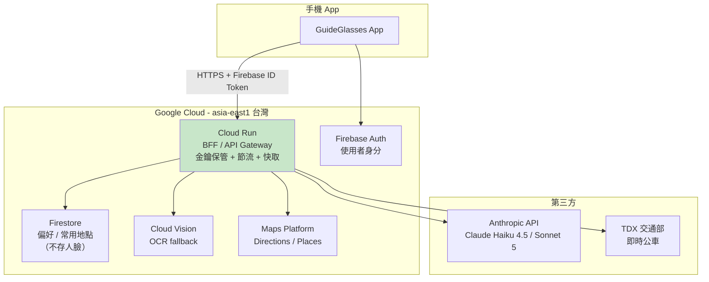
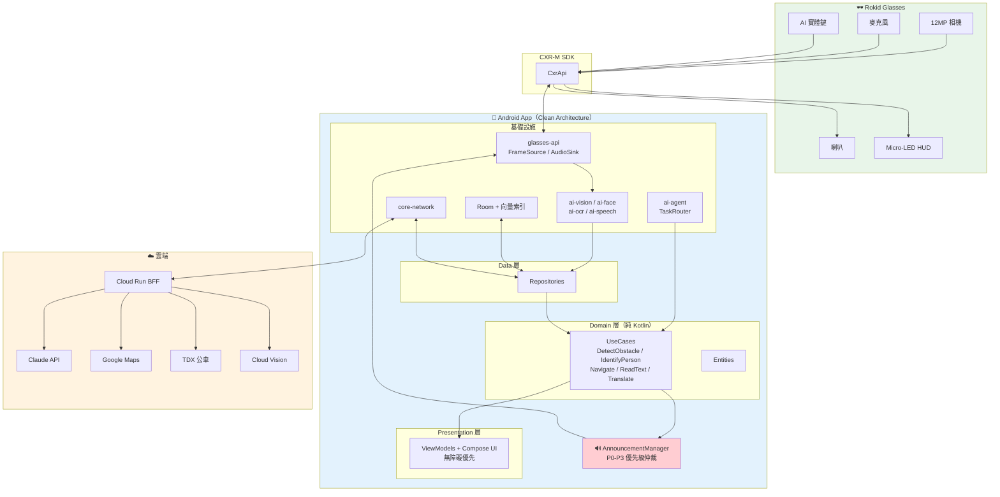
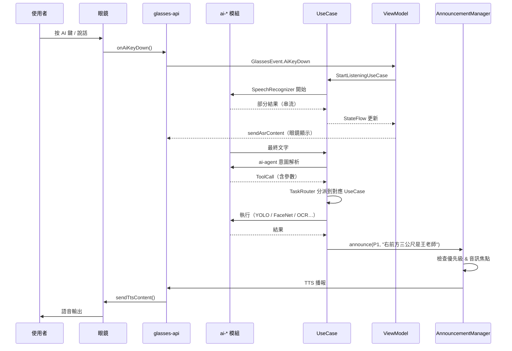
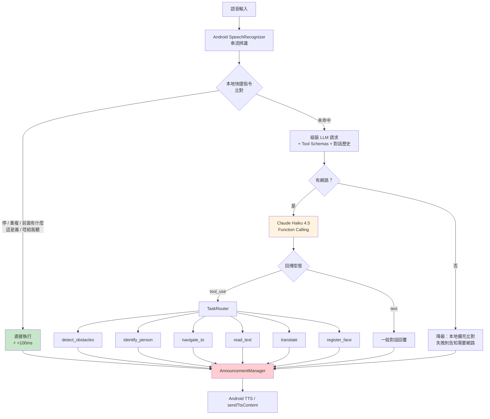
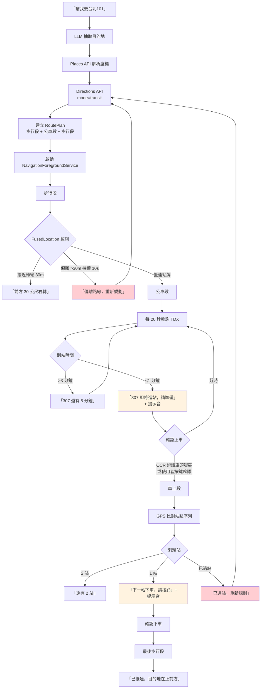
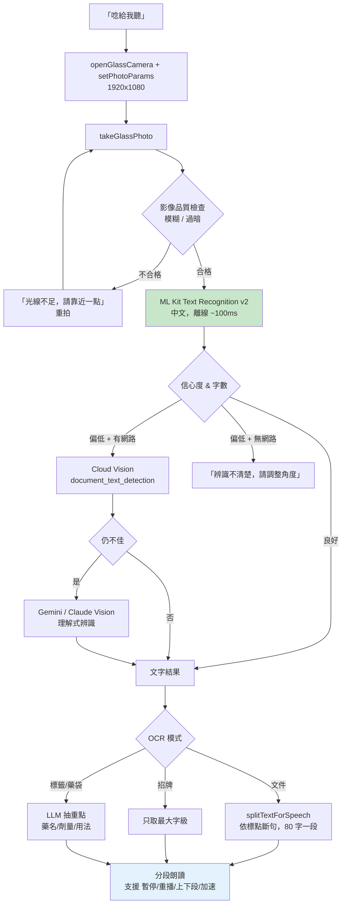
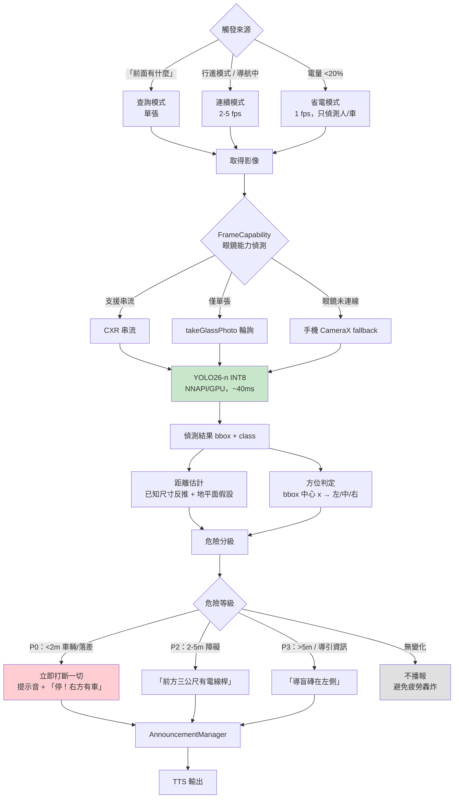
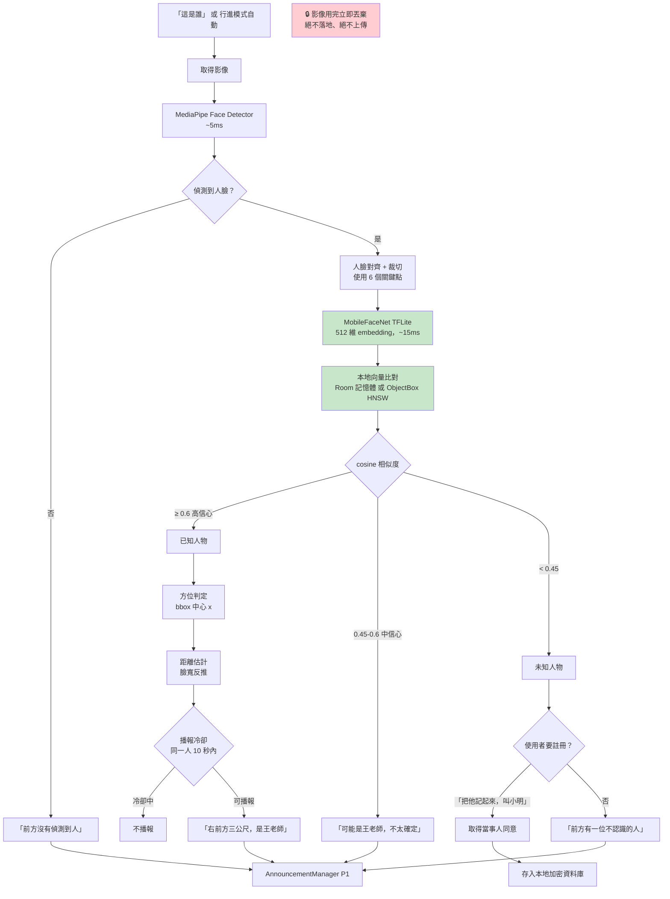

# 第四部：新架構設計 + Edge/Cloud 配置 + 系統流程圖

---

## 1. Edge vs Cloud 配置決策

### 1.1 三層配置總表

| 功能 | 眼鏡 | 手機 | 雲端 | 理由 |
|---|---|---|---|---|
| 相機拍攝 | ✅ | (fallback) | — | 唯一的第一人稱視角 |
| 麥克風收音 | ✅ | (fallback) | — | 靠近嘴部，收音品質好 |
| 語音播報輸出 | ✅ | (fallback) | — | 不佔用耳朵（骨傳導 / 開放式） |
| HUD 顯示 | ✅ 低優先 | — | — | 視障者無用，僅供陪同者 |
| **障礙物偵測** | ❌ | ✅ **必須** | ❌ | 延遲 <300ms；斷網不能失效 |
| **人臉辨識** | ❌ | ✅ **必須** | ❌ | 生物特徵不得離開裝置 |
| **ASR** | ❌ | ✅ | 🟡 fallback | 本機免費、低延遲 |
| **TTS** | ❌ | ✅ | 🟡 高品質時 | 本機 ~50ms |
| **OCR** | ❌ | ✅ 90% | 🟡 10% | ML Kit 離線可用 |
| **翻譯** | ❌ | ✅ ML Kit | 🟡 長句 | 離線可用 |
| **意圖理解 (LLM)** | ❌ | 🟡 本地快捷指令 | ✅ **主要** | 手機跑不動夠好的 LLM |
| **路線規劃** | ❌ | 🟡 快取 | ✅ **必須** | 需要即時路網資料 |
| **即時公車** | ❌ | ❌ | ✅ **必須** | TDX 資料只在雲端 |
| **人臉資料庫** | ❌ | ✅ **必須** | ❌ | 隱私 |
| 使用者偏好 / 常用地點 | ❌ | ✅ | 🟡 選擇性同步 | — |

### 1.2 為什麼「不要全部 Cloud」（你的直覺是對的）

| 面向 | 全 Cloud 的問題 | Edge 優先的結果 |
|---|---|---|
| **延遲** | 影像上傳 (200-500ms) + 推論 (100ms) + 下載 (50ms) = **350–650ms**。障礙物警示需要 <300ms | 手機端 YOLO26-n **30–60ms** |
| **離線** | 地下道、電梯、山區、國外漫遊 → **系統完全失效**。對導盲產品這是安全問題 | 核心安全功能永遠可用 |
| **成本** | 連續 5fps 影像上傳 × 8 小時/天 = 每人每月數十美元。**規模化後無法承擔** | 邊緣運算成本 = 0 |
| **隱私** | 使用者一整天的第一人稱影像上傳到伺服器 —— 包含所有路人的臉、住家、醫院診間 | 影像不離開裝置 |
| **行動網路** | 上傳頻寬受限、費用高、走在路上訊號不穩 | 大幅減少流量 |
| **耗電** | 持續 4G/5G 上傳非常耗電 | 本地推論 + NPU 更省電 |

### 1.3 資源預算（手機端）

| 資源 | 預算 | 說明 |
|---|---|---|
| **RAM** | < 500 MB | YOLO26-n INT8 ~10MB + MobileFaceNet ~5MB + ML Kit ~30MB + App |
| **CPU/NPU** | 障礙物 5fps → NPU 佔用 ~25% | 透過 NNAPI/GPU delegate |
| **耗電** | 目標：手機 <15%/小時 | 需實測。**用「事件驅動」而非「常時偵測」大幅降低** |
| **儲存** | < 200 MB | 模型 + 離線地圖快取 + 人臉庫 |
| **流量** | < 50 MB/天 | 只有 LLM 文字 + 導航 API + 少量 OCR |

### 1.4 🔴 耗電是真正的產品限制

- **眼鏡：210 mAh / 4 小時**（不開相機）。持續拍照傳輸下**可能 <1.5 小時**
- **手機：** 持續 NPU 推論 + GPS + 藍牙 + 螢幕關閉，樂觀估計 6–8 小時

**必須設計「省電模式」：**

| 模式 | 相機 | 觸發 |
|---|---|---|
| **待命** | 關閉 | 預設。只等語音指令與 AI 鍵 |
| **查詢** | 單張拍照 | 使用者問「前面有什麼」 |
| **行進** | 2–5 fps | 使用者說「開始走路模式」或導航中 |
| **省電** | 1 fps + 只偵測人/車 | 電量 <20% 自動切換 |

**絕不要預設常時 30fps 偵測。**

---

## 2. Cloud 供應商比較

### 2.1 你列的選項評估

| 供應商 | 成本 | 延遲（台灣） | 可靠性 | 可維護性 | 適合本專案 |
|---|---|---|---|---|---|
| **Firebase**（Auth + Firestore + Functions） | 免費額度大 | 中（asia-east1 台灣機房） | 高 | **極高**（Android SDK 原生整合） | ⭐ **推薦：Auth + 遠端設定** |
| **Cloud Run** | 用多少付多少，可縮到 0 | **低**（asia-east1） | 高 | 高（容器化） | ⭐ **推薦：主要 API Gateway** |
| Cloud Functions | 冷啟動較慢 | 中 | 高 | 高 | 🟡 輕量事件用 |
| Google Cloud（Maps / Vision / TTS） | 依用量 | 低 | 極高 | 高 | ⭐ **必用**（Maps 無替代品） |
| **Supabase** | 免費額度佳 | **中高**（最近區域為新加坡） | 中高 | 高（Postgres 直覺） | 🟡 適合快速原型 |
| Azure | 中 | 中 | 高 | 中 | 🟡 已用 Google 生態則無必要 |
| AWS | 中 | 低（ap-northeast-1） | 極高 | 中（設定複雜） | 🟡 團隊已熟悉才選 |

### 2.2 建議組合



**為什麼要一個 BFF（Backend For Frontend）而不是 App 直連各家 API：**

1. 🔴 **金鑰安全** —— 目前 `.env` 已經外洩過一次。App 內嵌 API Key 是**必然被反編譯取出**的。所有金鑰只能放在後端。
2. **節流與配額** —— Google Maps 每次呼叫都要錢，需要在後端控管
3. **快取** —— 同一路線、同一站牌的查詢可共用快取，大幅降低成本
4. **供應商可替換** —— 換 LLM 或換 OCR 供應商不需要發新版 App
5. **可觀測性** —— 集中記錄、追蹤成本

**選 Cloud Run 而非 Cloud Functions 的理由：** Cloud Run 可以維持常駐執行個體（避免冷啟動），支援 gRPC/串流，且同一個容器可以本地開發測試 —— 對延遲敏感的導盲應用比較安全。可縮到 0 個執行個體，沒人用時不花錢。

**明確不建議：** 目前這種「跑在開發者筆電上的 FastAPI + 區網 IP」的模式，**不能上正式產品**。

---

## 3. 新架構：Clean Architecture + MVVM

### 3.1 為什麼選這個組合

| 決策 | 理由 |
|---|---|
| **Clean Architecture** | 你有 6 個功能、多個資料來源（眼鏡 SDK / 手機感測器 / 雲端 API / 本地 DB）、且 SDK 有不確定性（第二部 §3.3 的待驗證項目）。**分層讓你可以在不知道 `takeGlassPhoto()` 到底多快之前，就先把 domain 層寫完**，之後換資料來源不影響上層 |
| **MVVM** | Android 官方推薦，`ViewModel` 撐過設定變更（旋轉、深色模式），與 `StateFlow` 搭配自然 |
| **Repository Pattern** | 障礙物偵測要能在「眼鏡相機」與「手機相機」間切換，OCR 要能在「ML Kit」與「Cloud Vision」間切換 —— 這正是 Repository 存在的意義 |
| **Hilt（DI）** | 沒有 DI 就無法把 SDK 換成假物件測試。**眼鏡不在手邊時要能開發**，這是務實的必要條件 |
| **多 module Gradle** | 5 個獨立專案 → 1 個專案多模組。編譯加速、強制邊界、功能可獨立開發 |

### 3.2 模組拆分

```
guide-glasses/                          ← 單一 Gradle 專案
├── app/                                ← 組裝層：Application, MainActivity, Hilt Modules, Navigation
│
├── core/
│   ├── core-common/                    ← Result, DispatcherProvider, 擴充函式
│   ├── core-domain/                    ← 【純 Kotlin】跨功能的 Entity 與 UseCase 介面
│   ├── core-data/                      ← Repository 實作基底、DataStore
│   ├── core-database/                  ← Room + 向量索引
│   ├── core-network/                   ← Retrofit / OkHttp / 攔截器
│   ├── core-ui/                        ← 無障礙元件、放大字體主題、Compose 基礎
│   └── core-testing/                   ← 測試工具
│
├── glasses/                            ← 【隔離 Rokid SDK 的關鍵層】
│   ├── glasses-api/                    ← 純介面：GlassesGateway, CameraSource, AudioSink…
│   ├── glasses-cxr/                    ← CXR-M SDK 實作（唯一 import com.rokid.cxr 的地方）
│   └── glasses-fallback/               ← 手機 CameraX / 手機 TTS 實作（無眼鏡時可開發、可 demo）
│
├── ai/
│   ├── ai-vision/                      ← YOLO26 TFLite, MediaPipe, 距離估計
│   ├── ai-face/                        ← MobileFaceNet, 向量比對
│   ├── ai-ocr/                         ← ML Kit + Cloud fallback
│   ├── ai-speech/                      ← SpeechRecognizer, TextToSpeech, ML Kit Translate
│   └── ai-agent/                       ← LLM Function Calling, TaskRouter, ToolRegistry
│
├── feature/
│   ├── feature-assistant/              ← 功能三：AI 助理（主入口）
│   ├── feature-obstacle/               ← 功能一
│   ├── feature-face/                   ← 功能二
│   ├── feature-navigation/             ← 功能四
│   ├── feature-translate/              ← 功能五
│   └── feature-ocr/                    ← 功能六
│
└── announce/                           ← 【全域播報仲裁】
    └── AnnouncementManager             ← P0-P3 優先級、打斷、佇列、音訊焦點
```

### 3.3 為什麼要有 `glasses-api` / `glasses-cxr` / `glasses-fallback` 三層

這是**針對本專案最大風險的直接對策**。

第二部 §3.3 列出六個「待驗證」的 SDK 能力。如果把 `CxrApi` 直接寫進 feature 層，一旦驗證結果是「連續影像串流做不到」，你要改的地方會遍布整個專案。

有了這層抽象：

```kotlin
// glasses-api（純介面，無任何 Rokid 依賴）
interface FrameSource {
    fun frames(config: CaptureConfig): Flow<CameraFrame>
    suspend fun captureOnce(): CameraFrame
    val capability: FrameCapability   // 回報實際能力：單張? 串流? 最高 fps?
}

// glasses-cxr（實作 A：真眼鏡）
class CxrFrameSource @Inject constructor(...) : FrameSource { ... }

// glasses-fallback（實作 B：手機相機，眼鏡不在手邊時用）
class PhoneCameraFrameSource @Inject constructor(...) : FrameSource { ... }
```

**好處：**
1. 眼鏡還沒到／借給同學了 → 用 `glasses-fallback` 照常開發
2. `takeGlassPhoto()` 實測太慢 → 只改 `glasses-cxr`，上層零改動
3. `FrameCapability` 讓上層**動態降級**：串流可用就跑 5fps 行進模式，只有單張就自動切成查詢模式
4. 未來換成 Glass 3 企業版 → 新增一個 `glasses-sprite` 模組即可

### 3.4 資料流原則

```
UI (Compose/View)
   ↕ StateFlow / Event
ViewModel
   ↕ UseCase（suspend fun / Flow）
Domain（純 Kotlin，無 Android 依賴）
   ↕ Repository 介面
Data（Repository 實作）
   ↕
DataSource（Local: Room/TFLite ／ Remote: Retrofit ／ Glasses: CXR）
```

**鐵則：**
- Domain 層**不得** import `android.*` 或 `com.rokid.*`
- DTO 只存在於 data 層，跨層一律用 domain model（解決現況「DTO 洩漏到 UI」的問題）
- ViewModel 只依賴 UseCase，不直接碰 Repository
- 所有錯誤用 `Result<T>` 包裝，不讓 exception 穿透層級

---

## 4. 系統流程圖

### 4.1 整體架構圖



### 4.2 資料流程圖



### 4.3 AI 助理（意圖路由）流程



### 4.4 導航流程



### 4.5 OCR 流程



### 4.6 障礙物偵測流程



### 4.7 人臉辨識流程



→ 續讀 [`05_ROADMAP_AND_FEASIBILITY.md`](05_ROADMAP_AND_FEASIBILITY.md)
