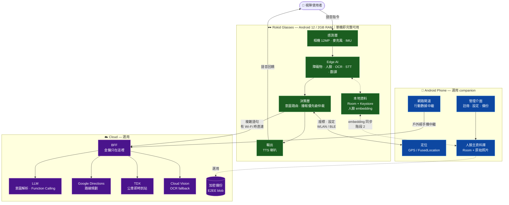
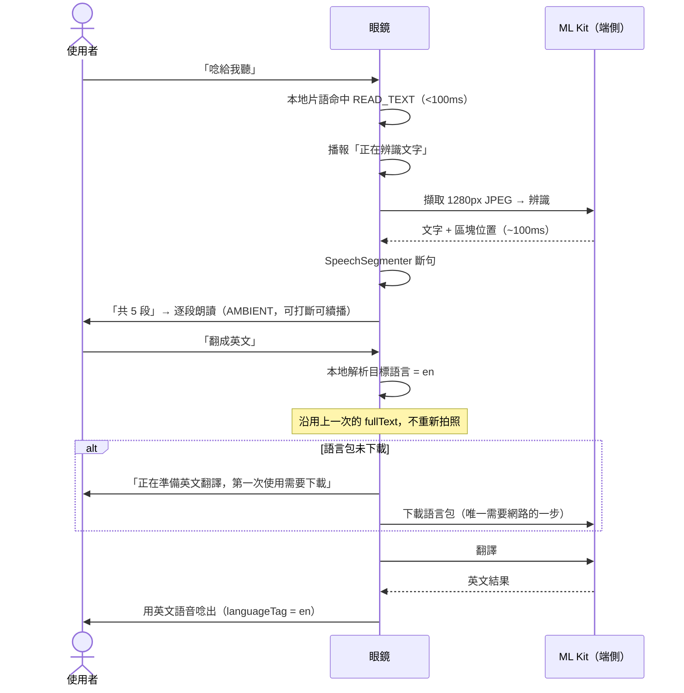
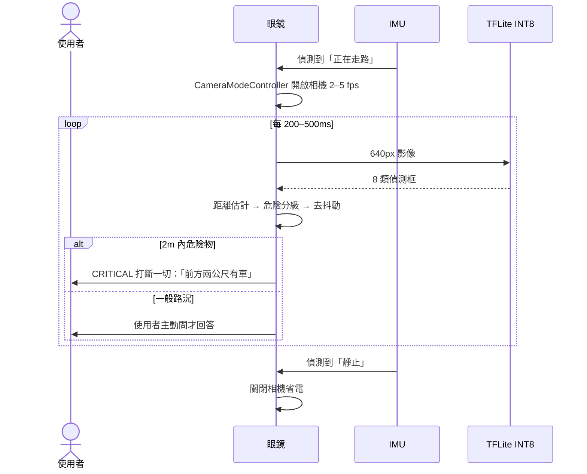
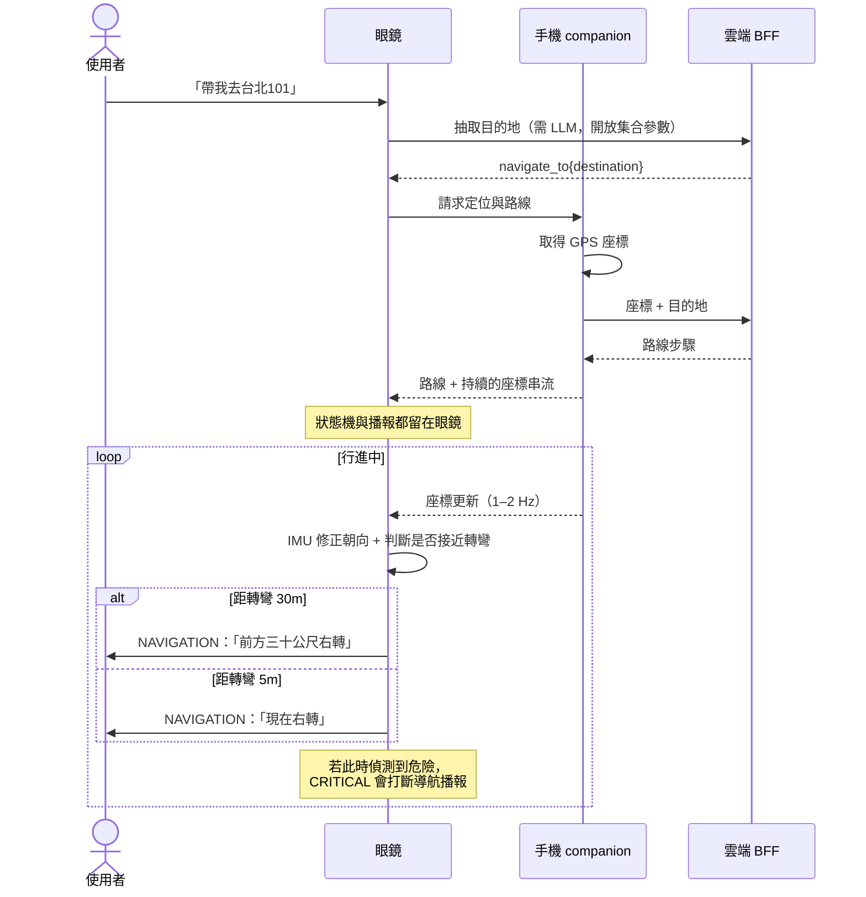
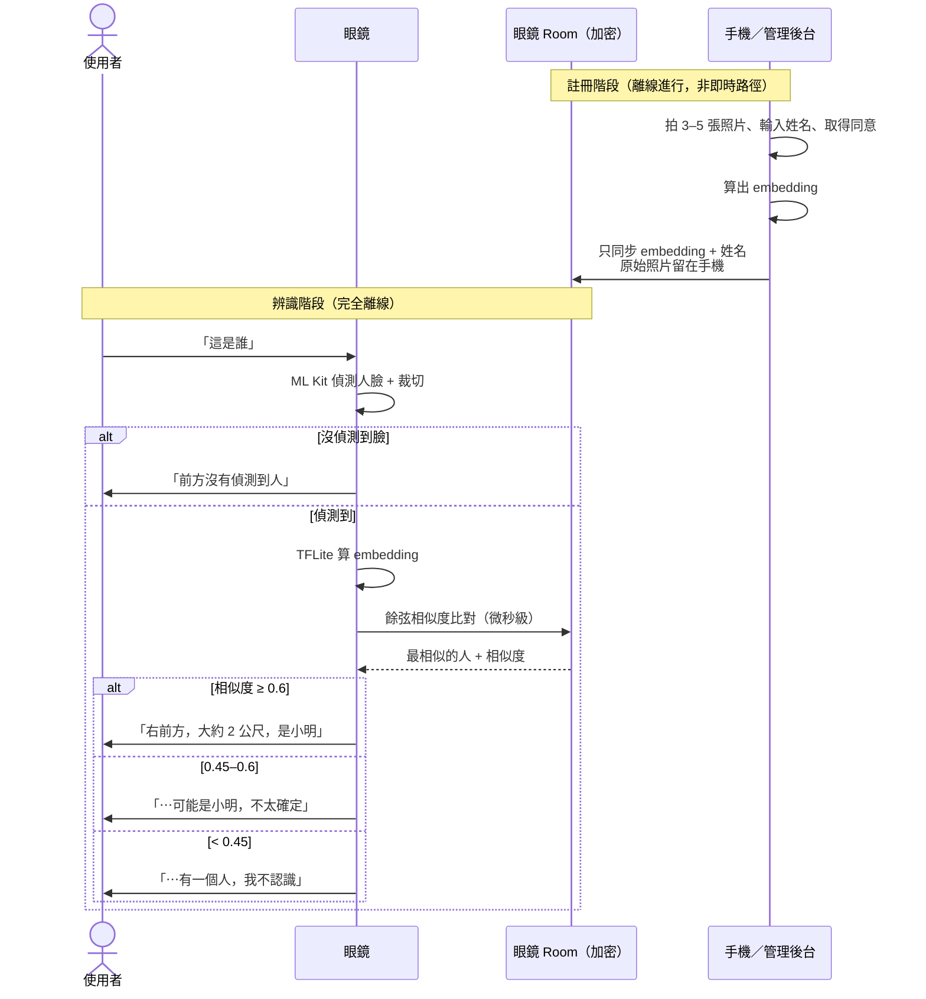
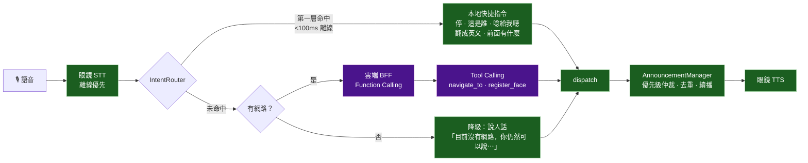
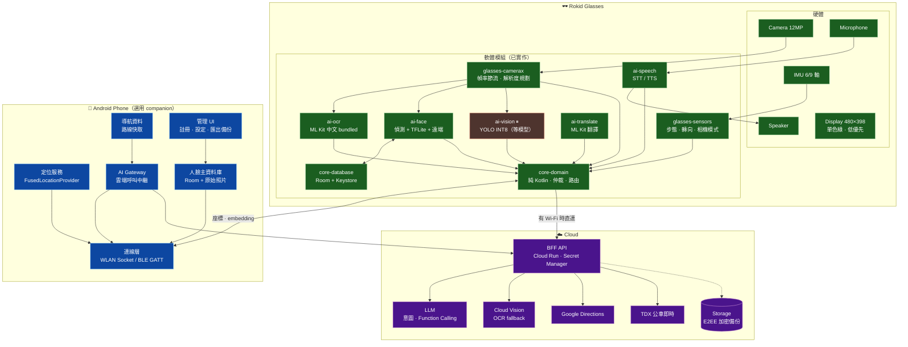

# Guide Glasses 分層架構決策

> 這份文件回答一個問題：**每個功能該放在眼鏡、手機、還是雲端？**
> 結論不是「全部都經過三層」—— 多數功能只需要眼鏡。
>
> 最後更新：2026-08-06 ｜ 相關：[`STATUS.md`](STATUS.md)、[`ROADMAP.md`](ROADMAP.md)

---

## 0. 先講結論

**架構原則：眼鏡自主，手機增強，雲端可選。**

```
眼鏡單機 = 完整可用的導盲系統（含所有安全功能）
+ 手機    = 解鎖導航（GPS）、更好的管理介面、備份
+ 雲端    = 解鎖複雜語句理解、路線規劃、公車即時資訊
```

關鍵約束是**降級而非依賴**（degradation, not dependency）：
手機或雲端不在時，眼鏡不會失去任何**安全相關**能力，只會失去便利功能。

理由很簡單 —— 對使用者而言，**斷網不能等於失明**。

### 三個推翻直覺的發現

| 直覺 | 實際 |
|---|---|
| 「眼鏡算力弱，視覺推論該卸載到手機」 | ❌ 影像必須從眼鏡送出，**Wi-Fi 傳輸的耗電可能高於本地 INT8 推論**。而且相機本身的耗電無法卸載 |
| 「手機比較強，功能放手機比較好」 | ❌ 沒有任何功能「只需要手機」。手機提供的是**能力**（GPS、行動網路、螢幕），不是功能的家 |
| 「導航該跑在手機上」 | ❌ 那會把播報仲裁拆成跨裝置，重新引入已經解掉的蓋台問題。手機只該當 GPS 感測器 |

---

## 1. 硬體事實（決策的前提）

| 項目 | Rokid Glasses | 一般 Android 手機 |
|---|---|---|
| 系統 | YodaOS-Sprite = **Android 12 / API 32**，APK 直接安裝 | Android |
| RAM | **2 GB**（端側模型總量須 <400MB） | 6–12 GB |
| 電池 | **210 mAh ≈ 4 小時**；開相機可能 **<1.5 小時** | 4000–5000 mAh |
| 相機 | **12MP（唯一的影像來源）** | 有，但視角不對 |
| GPS | ⚠️ **規格書未載明，推定沒有** | 有 |
| 行動網路 | ❌ 無 SIM，只有 Wi-Fi / BT | 有 |
| 螢幕 | 單色綠 480×398 / 23° FOV，對全盲使用者無意義 | 完整可用 |
| IMU | 有（6 軸或 9 軸待確認） | 有 |

**兩個不對稱決定了整個架構**：

1. **相機只在眼鏡上** → 任何視覺功能的影像來源都是眼鏡，這不可協商
2. **GPS 與行動網路只在手機上** → 導航與戶外的雲端呼叫必須有手機

> ⚠️ **最高槓桿的未知數：眼鏡到底有沒有 GPS**（[`TASKS.md`](TASKS.md) A10）。
> 若實測 `LocationManager` 有可用的 `GPS_PROVIDER`，**手機就完全不需要了**。
> 因此本文件的設計把定位來源抽象化（見 §5.3），實測結果只決定選哪個實作，
> 不影響上層架構。

---

## 2. 功能分層表（Task 2）

✅ = 主要位置｜🟡 = 選用增強｜❌ = 不應放這裡

| 功能 | Glasses | Phone | Cloud | 原因 |
|---|:---:|:---:|:---:|---|
| **障礙物偵測** | ✅ | ❌ | ❌ | 延遲預算 <300ms（1.4 m/s 下 = 42cm）。雲端往返 1–3 秒等於車已經到了。卸載到手機技術上可行（Wi-Fi ~120ms）但**耗電未必更省**，且為安全功能增加一個失效點 |
| **人臉辨識（偵測＋特徵）** | ✅ | ❌ | ❌ | 生物特徵不該離開裝置。MobileFaceNet INT8 ~5MB，比對 1000 人只需微秒 |
| **人臉主資料庫＋註冊** | 🟡 快取 | ✅ | 🟡 加密備份 | 註冊需要**螢幕**確認照片品質、輸入姓名、取得同意 —— 眼鏡做不到好的管理介面。詳見 §3 |
| **AI 助理：本地快捷指令** | ✅ | ❌ | ❌ | <100ms、離線。「停」不該先跑一趟雲端 |
| **AI 助理：複雜語句理解** | 🟡 客戶端 | 🟡 網路中繼 | ✅ LLM | 需要 function calling 抽開放集合參數。金鑰只能在 BFF |
| **播報仲裁（TTS）** | ✅ | ❌ | ❌ | **絕對不可跨裝置**。使用者只有一雙耳朵，仲裁必須在單一節點。詳見 §5.2 |
| **語音辨識 STT** | ✅ | ❌ | 🟡 fallback | 麥克風在頭上。Android 原生離線優先 |
| **翻譯** | ✅ | 🟡 網路中繼 | 🟡 長句 | ML Kit 語言包下載後完全離線。目標語言是封閉集合，本地可解析 |
| **文字辨識 OCR（第一層）** | ✅ | ❌ | ❌ | ML Kit bundled ~100ms 離線，涵蓋 90% 情境（藥袋、菜單、門牌） |
| **OCR 第二層 fallback** | 🟡 客戶端 | 🟡 網路中繼 | ✅ | 只在第一層結果不可靠時才呼叫，控制成本 |
| **GPS 定位** | ❌ **沒有硬體** | ✅ | ❌ | 硬體限制，無法用軟體解決 |
| **IMU 動作感測** | ✅ | ❌ | ❌ | 感測器在頭上。步態、轉向、相機模式切換 |
| **導航：路線規劃** | ❌ | 🟡 中繼＋快取 | ✅ | 地圖路網資料本身在雲端 |
| **導航：狀態機＋轉彎播報** | ✅ | ❌ | ❌ | 放眼鏡才能讓播報仲裁留在本地。手機只餵座標 |
| **公車即時到站** | ❌ | 🟡 中繼 | ✅ TDX | 即時資料在雲端 |
| **設定／註冊管理介面** | ❌ | ✅ | ❌ | 需要螢幕。全盲使用者的陪同者也需要可視介面 |

### 分類總結（Task 2 要求）

| 分類 | 功能 |
|---|---|
| **只需要眼鏡** | 障礙物偵測、播報仲裁、STT、TTS、翻譯、OCR 第一層、IMU 感測、本地快捷指令、人臉推論 |
| **只需要手機** | **無** —— 手機提供的是能力（GPS／行動網路／螢幕），不是任何功能的家 |
| **只需要雲端** | **無** —— 雲端能力都需要客戶端觸發與播報 |
| **Glasses + Phone** | 人臉資料庫管理（推論在眼鏡、主庫與註冊在手機）、設定 |
| **Phone + Cloud** | 路線規劃、公車即時資料（但結果一定要回眼鏡播報，所以嚴格說是三層） |
| **三者一起** | **即時語音導航**、AI 助理第二層、OCR 雲端 fallback |

**只有三個功能真正需要三層**，其餘九個功能眼鏡單機就能完整運作。這是刻意的。

### 為什麼把視覺推論卸載到手機不划算

這是最容易做錯的決定，值得展開：

```
方案 A｜眼鏡本地推論
  相機擷取 → 眼鏡 TFLite INT8 推論 → 播報
  眼鏡耗電 = 相機 + NPU/CPU
  延遲 ≈ 擷取 + 30–80ms

方案 B｜卸載到手機
  相機擷取 → JPEG 編碼 → Wi-Fi 傳輸 → 手機推論 → Wi-Fi 回傳 → 播報
  眼鏡耗電 = 相機 + JPEG 編碼 + Wi-Fi 持續發射
  延遲 ≈ 擷取 + 編碼 + 30–80ms 傳輸 + 推論 + 回傳
```

方案 B 在眼鏡端**沒有省掉相機**（最大的耗電項），卻**多了 Wi-Fi 持續發射**。
以量級論，持續 Wi-Fi 發射的功耗與小型 INT8 模型推論同級甚至更高，
所以方案 B 很可能**更耗電、更慢、還多一個失效點**。

> ⚠️ 上面是量級推理，**不是實測**。若要在論文裡主張這一點，
> 必須實測兩種方案的眼鏡端耗電（[`TASKS.md`](TASKS.md) A12 的延伸）。
> 但即使數字接近，「安全功能不該依賴另一台裝置」這個理由已經足夠。

---

## 3. 人臉資料庫該放哪裡（Task 3）

### 3.1 先分清楚要存什麼

這是這一題的關鍵 —— **三種資料的性質完全不同**：

| 資料 | 大小 | 洩漏傷害 | 誰需要它 |
|---|---|---|---|
| **特徵向量 embedding** | 128–512 float ≈ **0.5–2 KB／人** | 中（不可逆推回人臉，但可用於比對追蹤） | 眼鏡（每次辨識） |
| **姓名／關係** | < 100 B | 中 | 眼鏡（播報用） |
| **原始照片** | ~100 KB × 3–5 張 = **300–500 KB／人** | **高**（可直接識別、可再訓練） | 只有「換模型要重算 embedding」時 |

**推論：眼鏡上只需要 embedding + 姓名，完全不需要原始照片。**
1000 人的 embedding 只有約 2 MB，而 1000 人的照片是 300–500 MB ——
後者在 2GB RAM／有限儲存的眼鏡上不合理，而且洩漏傷害高得多。

### 3.2 「資料庫放手機、眼鏡只負責拍照與播報」值得單獨討論

這是最直覺的想法。撰寫本節時它還是唯一能跑的路徑（端側缺模型檔），
**但那個前提已於 2026-08-06 消失** —— 端側模型已隨 repo 附上，
`OnDeviceFaceIdentification` 現在是預設路徑，遠端退為備援。

以下的比較仍然成立，而且結論被實作驗證了：

但兩條流程的差距很大。注意**偵測與裁切一定在眼鏡做**（現在就是這樣），
差別只在「算特徵 + 比對」放哪：

| 步驟 | 遠端比對 | 眼鏡比對 |
|---|---|---|
| 偵測 + 裁切 | 眼鏡 ~50ms | 眼鏡 ~50ms |
| 算 embedding | 手機／PC ~100–300ms | 眼鏡 TFLite ~20ms |
| 比對資料庫 | 手機／PC | 眼鏡 **<1ms** |
| 傳輸 | 一來一回 3–8KB | **零** |
| **總延遲** | **~300–800ms** | **~100ms** |
| 手機不在 | ❌ 不能認人 | ✅ 照常 |

**而且資料庫本身放手機沒有任何技術好處**：

| | 大小 | 比對成本 |
|---|---|---|
| 一人的 embedding | 512 float × 4B = **2 KB** | — |
| **100 人的資料庫** | **200 KB** | 100 × 512 次乘加 ≈ **微秒級** |

200 KB 與微秒級計算，放哪都不是問題 —— 放手機只是多了延遲與依賴。
導盲的人臉庫是「我認識的人」＝幾十到低百人，不是幾萬人的規模。
（若規模真的到上萬人，或要用遠大於 400MB 預算的模型，結論才會反轉。）

**結論**：短期照遠端跑（能動），拿到 `.tflite` 後把比對搬回眼鏡，
手機／PC 退回去只做註冊與備份。

### 3.3 五個方案比較

| 角度 | A 全在眼鏡 | B 全在手機 | C 全在雲端 | D 手機＋雲端同步 | E 眼鏡快取＋手機主庫＋雲端備份 |
|---|---|---|---|---|---|
| **辨識速度** | ✅ 最快 | 🟡 加一趟傳輸 | ❌ 最慢 | 🟡 加一趟傳輸 | ✅ 最快（本地比對） |
| **延遲** | ✅ ~30ms | 🟡 +50–150ms | ❌ +1–3s | 🟡 +50–150ms | ✅ ~30ms |
| **網路需求** | ✅ 零 | 🟡 需配對連線 | ❌ 常時連線 | ❌ 常時連線 | ✅ 辨識零，同步才需要 |
| **離線能力** | ✅ 完整 | ❌ 手機不在＝不能認人 | ❌ 完全不能 | ❌ 同上 | ✅ 完整 |
| **隱私** | ✅ 最好 | 🟡 影像需傳輸 | ❌ **最差**，特種個資上公網 | ❌ 差 | ✅ 好（雲端只放加密 blob） |
| **容量** | 🟡 只存 embedding 就沒問題 | ✅ 充裕 | ✅ 無限 | ✅ 充裕 | ✅ 分層剛好 |
| **Backup** | ❌ **無。眼鏡遺失／reset＝全丟** | 🟡 靠手機備份 | ✅ | ✅ | ✅ |
| **同步** | N/A | N/A | N/A | 🟡 兩方 | ❌ **三方，最複雜** |
| **註冊 UX** | ❌ **差** —— 無螢幕確認照片品質，人名需 BFF 才能抽 | ✅ 有螢幕 | ✅ 網頁 | ✅ | ✅ 手機註冊 |
| **維護** | ✅ 簡單 | 🟡 通訊層 | 🟡 伺服器 | ❌ 兩套＋同步 | ❌ 三套＋同步 |
| **Android 開發難度** | ✅ **低（已完成）** | 🟡 中 | 🟡 中 | ❌ 高 | ❌ **最高** |

C 與 D 直接否決：**生物特徵常時上雲，在台灣屬《個資法》特種個資**，
而且離線就完全失效 —— 對導盲系統是三個缺點換零個優點。

### 3.4 推薦：分階段走向 E

**E 是正確的終局，但現在直接做 E 不划算。** 三方同步（衝突解決、刪除傳播、
金鑰管理）是整份架構裡最貴的一塊，而它解決的問題只有「備份」與「註冊體驗」。

#### 階段 1（現在～畢專展示）：`A′` = 眼鏡為主 ＋ 現成工具當管理介面

| 做什麼 | 成本 |
|---|---|
| embedding ＋ 姓名存眼鏡 Room，Keystore AES/GCM 加密 | ✅ **已完成** |
| 註冊用**已經存在的** `Face_Recognition/Python` 的 `/admin` 網頁 | ✅ **零開發** |
| 原始照片留在後端 `face_database/` 資料夾，不進眼鏡 | ✅ 零開發 |
| **新增：加密匯出／匯入一個備份檔** | 🟡 小（~1 天） |

這個組合用最低成本補掉 A 唯一不可接受的缺點（無備份），
而且**完全不需要寫手機 App**。

#### 階段 2（若要做成產品）：升級成 E

| 做什麼 | 為什麼那時才做 |
|---|---|
| 手機 companion 當主庫＋註冊 UI | 需要有人維護第二個 App |
| 眼鏡只保留 embedding 快取，可隨時重建 | 讓眼鏡成為無狀態的推論節點 |
| 雲端只存**端到端加密**的 blob，金鑰不上雲 | 有備份需求且接受法遵責任時 |

**為什麼不是「全部放手機」（B／D）**：因為那會讓**眼鏡單機不能認人**。
「這是誰」是使用者在社交場合最需要的功能，它不該因為手機在包包裡沒連上就失效。
這與障礙物偵測是同一個原則 —— 核心能力不外包。

---

## 4. 架構圖（Task 4）

### 4.1 整體系統架構



**讀圖重點**：實線是必要路徑，虛線是選用。
**眼鏡那個框自己就是一個完整系統** —— 拿掉手機與雲端兩個框，
障礙物、人臉、OCR、翻譯、語音全部照常運作。

### 4.2 功能資料流

#### (a) OCR 朗讀 ＋ 翻譯 —— 全程在眼鏡，不經手機也不經雲端



> 對照使用者原本的設計：舊流程是
> `相機 → 手機 → Cloud Vision → 回傳 → TTS`，每次都要網路、都要錢、都要 1 秒以上。
> 現在是 `相機 → 端側 → TTS`，約 100ms、零成本、離線可用。
> **雲端 OCR 只在端側結果不可靠時才啟用**（第二層 fallback）。

#### (b) 障礙物偵測 —— 純眼鏡，安全功能不外包



#### (c) 即時語音導航 —— 唯一真正需要三層的功能



**關鍵設計**：手機**只提供座標**，不負責播報。狀態機與 TTS 都在眼鏡上，
所以播報仲裁仍然在單一節點 —— 危險警示能正確打斷導航提示。

#### (d) 人臉辨識 —— 推論在眼鏡，管理在手機



#### (e) AI 助理 —— 雙層路由，第一層不出眼鏡



### 4.3 Component Diagram



---

## 5. 架構師建議（Task 5）

### 5.1 如果這是畢業專題，我會這樣做

**最重要的一句：現在不要寫手機 App。**

單一 APK 的眼鏡版本已經有 60% 完成度、228 個測試、能跑。手機 companion 是
2–3 週的工作量，而它**唯一無法替代的價值是 GPS**。如果導航不在展示範圍內，
手機這一層對畢專是純負債 —— 多一個要維護的 App、多一條會斷的通訊管道、
多一個 demo 當場失敗的風險。

**建議的階段順序：**

| 階段 | 做什麼 | 為什麼是這個順序 |
|---|---|---|
| **0** | **實機驗證**（`TASKS.md` A1–A14） | 5 分鐘消掉最多未知數。**特別是 A10：眼鏡有沒有 GPS** —— 這一項的答案可能讓手機層直接消失 |
| **1** | 障礙物偵測純 domain 部分 | 不需模型、可純 JVM 測試。模型到了只剩前後處理 |
| **2** | 人臉備份匯出／匯入 | 1 天，補掉「眼鏡遺失＝資料全丟」 |
| **3** | `FollowHeadingUseCase`（純 IMU 跟著走） | 不需 GPS 就能做的導航子集，可先驗證播報體驗 |
| **4** | BFF（最小版：只做意圖解析） | 解鎖「帶我去⋯」「把他記起來，他叫⋯」 |
| **5** | 手機 companion —— **只有 A10 確認沒有 GPS 才做** | 範圍嚴格限制在「定位 + 網路中繼 + 註冊 UI」 |

### 5.2 不可妥協的一條線：播報仲裁留在眼鏡

這是整份架構最重要的約束，值得單獨說。

使用者只有**一雙耳朵**。六個功能都想說話，所以必須有單一仲裁點決定
「現在該播哪一則、誰能打斷誰」。目前 `AnnouncementManager` 用四級優先級
＋ `dedupeKey` 去重 ＋ `speakingToken` 防跳號，把這件事解對了。

**如果把導航播報搬到手機**，就會有兩個節點各自決定要不要出聲 ——
手機正在唸「前方三十公尺右轉」時，眼鏡偵測到兩公尺內有車，
**兩個聲音會同時播**。這正是舊專案 `ChatFragment` 三套播放器互相蓋台的問題，
已經花了不少力氣解掉，不該用架構把它請回來。

所以：**手機可以提供資料，永遠不能直接發聲。**

### 5.3 定位來源要抽象化，不要寫死

`ROADMAP.md` §3 把導航列成 A/B/C 三案等實測。更好的做法是**現在就定介面**，
讓實測結果只決定挑哪個實作：

```kotlin
// core-domain（純 Kotlin，可測）
interface LocationProvider {
    val isAvailable: Boolean
    val accuracyMeters: Float?
    fun locations(): Flow<Coordinate>
}
```

| 實作 | 何時用 |
|---|---|
| `GlassesGpsLocationProvider` | A10 實測發現眼鏡有 `GPS_PROVIDER` → **手機層直接不需要** |
| `PhoneCompanionLocationProvider` | 眼鏡確認無 GPS（推定情形） |
| `NetworkLocationProvider` | 只當降級，20–100m 精度對步行導航不足 |

上層的導航狀態機完全不知道座標從哪來。這讓「眼鏡有沒有 GPS」從
**架構問題**降級成**一個 DI 綁定**。

### 5.4 眼鏡與手機怎麼連接

**選哪種連線方式，取決於要傳什麼。** 這也是「embedding 放眼鏡」的附帶好處 ——
它讓連線需求從「常時高頻寬」降到「偶發低頻寬」。

| 方式 | 實務頻寬 | 耗電 | 適合 |
|---|---|---|---|
| **同一個 Wi-Fi + HTTP** | 數十 Mbps | 中 | 影像、任何東西。**零開發，`RemoteFaceIdentification` 已在用** |
| **手機開熱點** | 同上 | 高（兩邊） | **戶外唯一能讓眼鏡上雲的方式**（眼鏡沒有 SIM） |
| **BLE GATT** | **10–100 KB/s** | **低** | GPS 座標、指令、embedding 同步 |
| Bluetooth Classic | ~100–300 KB/s | 中 | 小圖勉強可以 |
| Wi-Fi Direct / P2P | 高 | 中高 | 不需 AP，但 `WifiP2pManager` 難用、配對體驗差 |
| Rokid CXR-M SDK | — | — | ❌ 會綁死 Rokid 生態；專案已判定用不到 CXR |

**BLE 傳不動影像**：40KB 的 JPEG 要 0.5–4 秒。對「這是誰」勉強，
對 2fps 連續障礙物偵測（80 KB/s）完全不可行 ——
這是 §2 「視覺推論不該卸載」的另一個獨立證據。

但 GPS 座標每秒只有幾十 bytes，BLE 綽綽有餘，而導航要連續跑幾十分鐘，
**省電才是重點**。

#### 按階段建議

| 階段 | 用什麼 | 理由 |
|---|---|---|
| 現在（室內開發／展示） | 同一個 Wi-Fi + HTTP | 零開發，已在跑 |
| 導航（長時間連續） | BLE GATT，只傳座標 | 省電。權限已宣告 |
| 戶外呼叫雲端 | 手機開熱點 | 眼鏡無 SIM，唯一途徑 |

#### 連線層要抽象化

和 §5.3 的 `LocationProvider` 同一個思路，別讓連線方式滲進上層：

```kotlin
interface CompanionLink {
    val isConnected: Boolean
    fun locations(): Flow<Coordinate>          // 導航用
    suspend fun syncPeople(): AppResult<Int>   // 人臉同步
}
```

先用 `HttpCompanionLink` 把功能做對，之後為省電換成 `BleCompanionLink`，
導航狀態機不用改。

#### 兩個必踩的坑

1. **斷線必須有聲音** —— 眼鏡要播報「手機連線中斷，導航暫停」。
   靜默失敗對看不見畫面的使用者等於系統當掉。
2. **手機端需要 Foreground Service** —— 持續送座標會被 Android 省電機制殺掉，
   需要 `FOREGROUND_SERVICE_LOCATION` ＋ 電池最佳化白名單引導。
   手機同時開熱點＋GPS＋App 很耗電，續航需實測。

### 5.5 AI 放哪裡

| 放 Local（眼鏡） | 理由 |
|---|---|
| 障礙物偵測 YOLO INT8 | 安全 · <300ms · 斷網不能失效 |
| 人臉偵測 + 特徵抽取 | 生物特徵不離開裝置 |
| OCR 第一層 ML Kit | 100ms · 涵蓋 90% 情境 |
| STT / TTS | 50ms vs 雲端 2–3s |
| 翻譯 ML Kit | 語言包下載後離線 |
| 意圖路由第一層 | 「停」不該等雲端 |

| 放 Cloud | 理由 |
|---|---|
| LLM 意圖解析 + Function Calling | 2GB RAM 跑不動夠好的模型；金鑰只能在後端 |
| Google Directions 路線規劃 | 地圖路網資料本身在雲端 |
| TDX 公車即時到站 | 即時資料在雲端 |
| Cloud Vision OCR | **只當第二層 fallback**，控制成本 |

**判準很簡單**：安全相關或高頻的 → Local。資料本身在雲端、或本機算力做不到的 → Cloud。
其餘一律 Local。

### 5.6 資料放哪裡

| 放 Phone | 放 Cloud | 永遠不放 Cloud |
|---|---|---|
| 人臉主資料庫（embedding + 姓名） | 端到端加密的備份 blob | ❌ **明文人臉照片** |
| **原始照片**（換模型時重算用） | 路線／地點查詢快取 | ❌ **明文 embedding** |
| 使用者設定 | 匿名化的使用統計 | ❌ 位置歷史軌跡 |
| 診斷 log | | ❌ 對話原文 |

眼鏡上只放 **embedding + 姓名**（~2KB／人），可隨時從手機重建。
這讓眼鏡接近無狀態 —— 遺失或 reset 的損失是可接受的。

### 5.7 哪些功能必須避免依賴網路

**判準：如果斷網會讓使用者不安全或失去核心能力，就必須離線可用。**

| 必須離線 | 為什麼 |
|---|---|
| 🔴 障礙物偵測 | 斷網等於失明 |
| 🔴 「停」指令 | 使用者要立刻安靜時不該等網路 |
| 🔴 TTS 播報 | 沒有聲音等於系統當掉 |
| 🔴 STT 第一層 | 地下道、騎樓收訊差 |
| 🟡 人臉辨識 | 社交場合最需要，不該因手機在包裡就失效 |
| 🟡 OCR 第一層 | 藥袋、菜單是日常需求 |
| 🟡 翻譯（語言包下載後） | 下載一次，永久離線 |

可以依賴網路的只有：複雜語句理解、路線規劃、公車即時、OCR 第二層 ——
**全部都是「有更好、沒有也不會出事」的功能**。

### 5.8 未來可擴充方向

| 方向 | 價值 | 前置條件 |
|---|---|---|
| **IMU → 方位修正** | 轉頭後「右前方」的意義會變，這是目前最明顯的正確性缺口 | 無，可立刻做 |
| 語言偵測取代來源啟發式 | 「日文菜單翻成英文」目前會判錯 | `com.google.mlkit:language-id` |
| 障礙物 → 導航 | 偵測斑馬線、盲磚輔助定位 | 障礙物模型 |
| 人臉 → 主動提示 | 「你認識的人在附近」 | 需設計不擾人的觸發策略 |
| OCR → 公車車頭號碼 | 部分解決「哪一輛車進站」 | 成功率有限，需實測 |
| Vision LLM 第三層 | 「這是什麼」的理解式回答而非唸字 | BFF + 成本控制 |
| 眼鏡 AI 實體鍵 + 喚醒詞 | 目前必須手動觸發，戴在頭上不方便 | 按鍵事件接線 |
| 多張照片註冊 | 提升人臉穩定度 | 註冊 UI |

**刻意不建議的方向**：
- ❌ 把視覺推論搬到手機 —— 見 §2 的耗電分析
- ❌ HUD 顯示 —— 對全盲使用者無意義，對低視力使用者 23° FOV 單色綠效益也有限
- ❌ 常時人臉辨識 —— 隱私與耗電都不划算，維持「使用者問才認」

---

## 6. 這份文件的不確定性

誠實標注哪些是實測、哪些是推理：

| 主張 | 依據 |
|---|---|
| 眼鏡跑 Android 12、APK 直接安裝 | ✅ **2026-08-08 本專案親自實證** |
| 眼鏡沒有 Google Play Services | ✅ **實機確認**（`DEVICE_FINDINGS.md` §2） |
| 眼鏡沒有任何語音辨識服務 | ✅ **實機確認**（§3） |
| 眼鏡上 Android TTS 可用 | 🔴 **實機推翻**（§4） |
| 端側 OCR / 人臉 / 翻譯可運作 | 🟡 **小米手機已驗證**；Rokid Glasses 從未執行過 |
| 眼鏡沒有 GPS | ⚠️ **推定** —— 規格書未載明，待 A10 實測 |
| Wi-Fi 卸載比本地推論耗電 | ⚠️ **量級推理，非實測** |
| 2GB RAM 夠跑所有端側模型 | 🟡 依模型大小估算（<400MB 預算），未實測 |
| 開相機續航 <1.5 小時 | ⚠️ 估算，待 A12 實測 |

> 任何要寫進論文的效能主張，都必須先實測。
> 目前這份架構的**設計理由**站得住腳，但**數字**還沒有。
