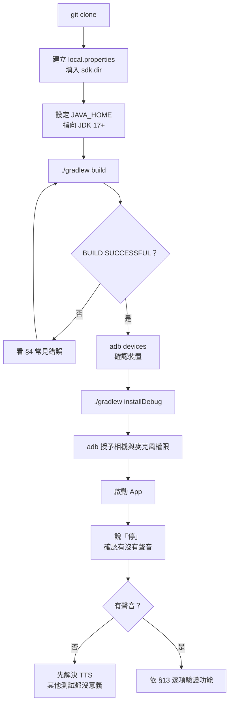
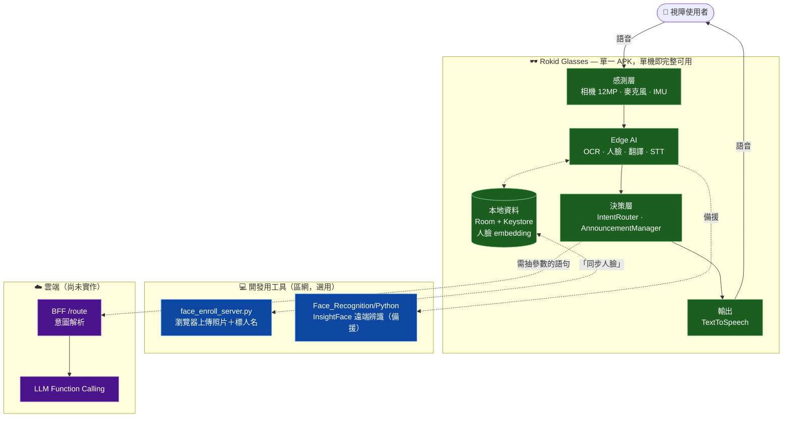
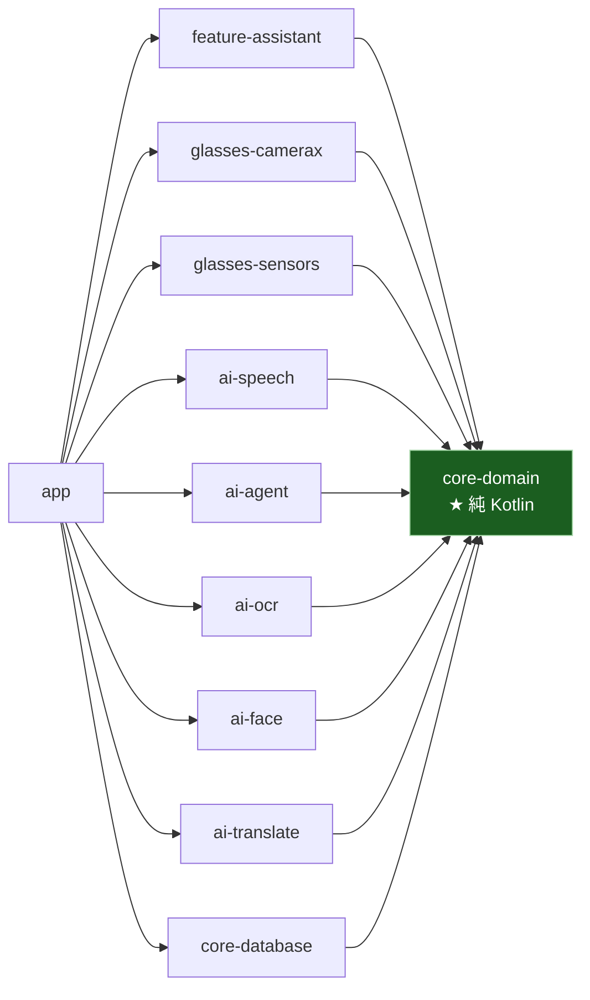
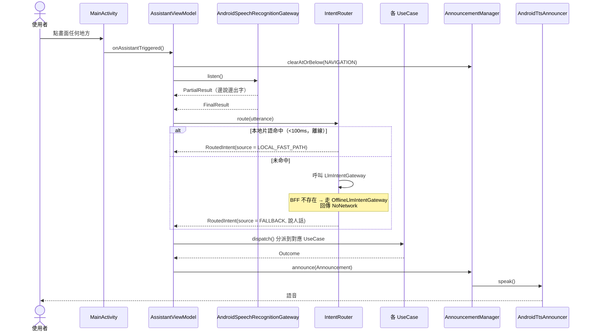
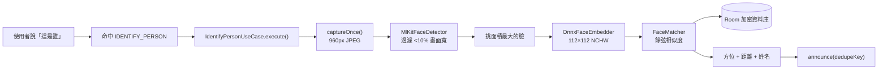
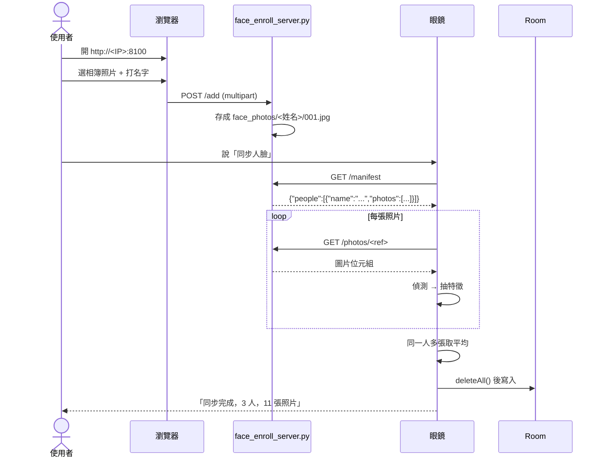
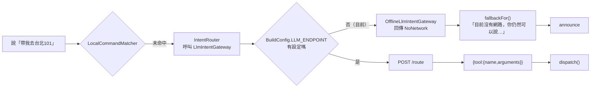
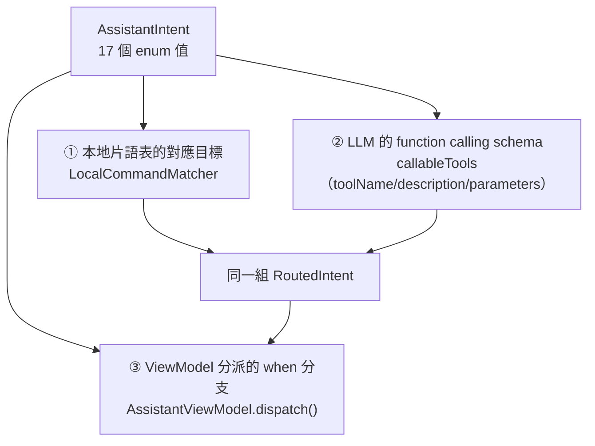
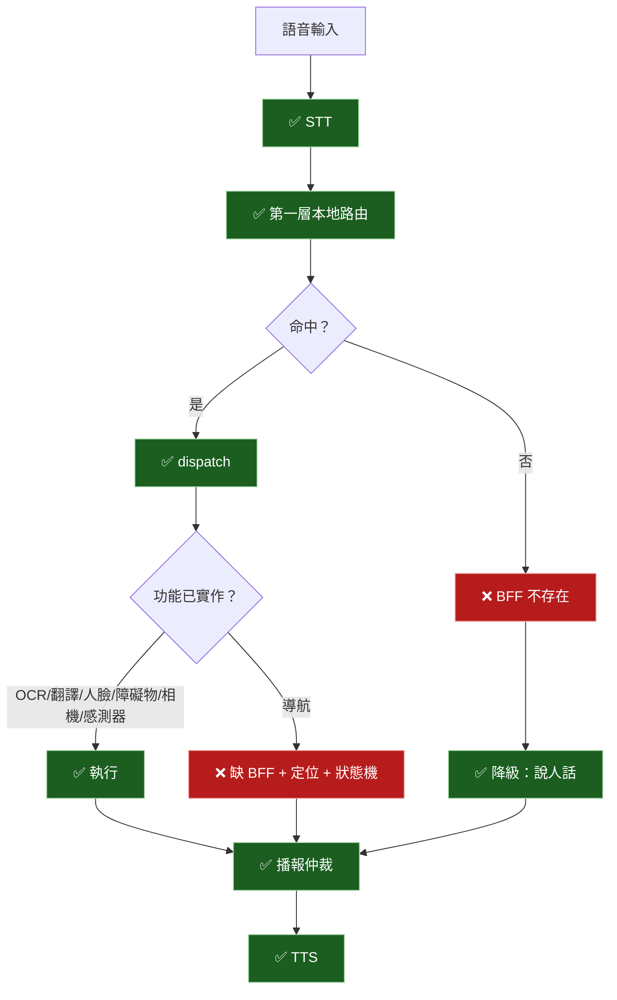

# Guide Glasses 開發者指南

> **這份文件寫給第一次接手本專案的工程師。** 假設你沒有 Android 開發經驗，
> 也完全不了解這個專案。照著做就能建置、執行、理解架構、測試功能並接手開發。
>
> 內容全部依照 **2026-08-06 的實際程式碼**產生。文件與程式碼衝突時以程式碼為準。

---

## 目錄

1. [專案介紹](#1-專案介紹)
2. [系統需求](#2-系統需求)
3. [從零開始環境建置](#3-從零開始環境建置)
4. [如何成功執行整個專案](#4-如何成功執行整個專案)
5. [專案目錄介紹](#5-專案目錄介紹)
6. [完整系統架構](#6-完整系統架構)
7. [所有功能詳細介紹](#7-所有功能詳細介紹)
8. [每個功能如何呼叫](#8-每個功能如何呼叫)
9. [AI 助理整合分析](#9-ai-助理整合分析)
10. [AI 助理與各功能整合程度](#10-ai-助理與各功能整合程度)
11. [功能完成度](#11-功能完成度)
12. [目前已知問題](#12-目前已知問題)
13. [Debug 教學](#13-debug-教學)
14. [FAQ](#14-faq)
15. [Roadmap](#15-roadmap)
16. [文件與程式碼不一致之處](#16-文件與程式碼不一致之處)

---

# 1. 專案介紹

## Guide Glasses 是什麼

一套跑在 **Rokid Glasses** 上的智慧導盲系統。使用者用語音下指令，系統用語音回答。

**它是一個單一 Android APK，直接安裝在眼鏡上執行。** 眼鏡執行 YodaOS-Sprite
（Android 12 / API 32），標準 CameraX、TextToSpeech、SensorManager 全部可用。

> ⚠️ **手機目前不在必要路徑上。** 專案沒有手機 App，也沒有必須配對的裝置。
> 未來導航功能可能需要手機提供 GPS，設計已預留（見 [`ARCHITECTURE.md`](ARCHITECTURE.md)）。

## 設計目的

給視障使用者一套「聽得懂、答得快、斷網也能用」的輔助系統。三個核心原則：

| 原則 | 具體表現 |
|---|---|
| **斷網不能等於失明** | 障礙物、OCR、人臉、翻譯全部端側運算，離線可用 |
| **沒有聲音等於系統當掉** | 未實作的功能明確播報「開發中」，錯誤翻成人話而非唸出 exception |
| **使用者只有一雙耳朵** | 所有播報經過單一仲裁點排序，絕不互相蓋台 |

## 主要功能

| 功能 | 一句話說明 |
|---|---|
| AI 語音助理 | 系統入口，所有功能由它分派 |
| OCR 朗讀 | 唸出鏡頭前的文字，支援文件／招牌兩種模式與分段控制 |
| 翻譯 | 把 OCR 讀到的內容翻成十種語言，離線 |
| 人臉辨識 | 認出眼前的人，播報方位、距離與姓名 |
| 播報仲裁 | 四級優先級，危險警示能打斷任何內容 |
| IMU 動作感測 | 步態、轉向、相機模式自動切換 |
| 障礙物偵測 | ✅ YOLOv8 八類已接上 |
| 導航 | 🟡 定位抽象與幾何完成，等實機驗證 GPS |

## 整體架構

多模組 Gradle 專案，共 **13 個模組**。核心約束：

```
app  →  feature  →  core-domain  ←  glasses/* + ai/* + core-database
```

`core-domain` **只套用 `kotlin.jvm`，不是 Android 模組**。任何 `android.*`
的 import 都會編譯失敗 —— 這是建置層面強制的架構約束，也是為什麼
3,799 行測試能純 JVM 秒級跑完，不需要模擬器。

## 適合閱讀對象

- 第一次接手本專案的工程師
- 想了解某個功能怎麼運作的組員
- 要接續實作障礙物或導航的人

---

# 2. 系統需求

## 必要工具

| 工具 | 版本 | 說明 |
|---|---|---|
| **作業系統** | Windows / macOS / Linux | 本文以 Windows 為例 |
| **JDK** | **17 或以上** | **JDK 11 無法建置**。建議直接用 Android Studio 內附的 JBR |
| **Android Studio** | Ladybug 或更新 | 內附 JBR 21，可省下自己裝 JDK |
| **Android SDK Platform** | **36** | |
| **Android SDK Build-Tools** | 36.x | |
| **Android SDK Platform-Tools** | 最新 | 提供 `adb` |
| **Git** | 任意版本 | |
| **Python** | 3.9+ | **只有人臉註冊工具需要**，且不需 `pip install` 任何套件 |

## 專案鎖定的版本

這些寫在 [`gradle/libs.versions.toml`](../guide-glasses/gradle/libs.versions.toml)，
**請勿隨意升級**：

| 元件 | 版本 |
|---|---|
| Gradle | **9.5.0** |
| Android Gradle Plugin | **9.3.1** |
| Kotlin | 2.2.10 |
| KSP | 2.3.6 |
| Hilt | 2.57.1 |
| compileSdk / targetSdk | 36 |
| **minSdk** | **28**（Android 9） |
| jvmTarget | 17 |

### 關於 AGP 9.x（本節已於 2026-08-07 更新）

**先前的結論是「不能升到 9.x」，現在已經升上去而且可以建置。**

當初實測 AGP 9.1.0 有兩個阻斷問題：

1. AGP 9 內建 Kotlin 支援，與 `org.jetbrains.kotlin.android` 衝突
   （`Cannot add extension with name 'kotlin'`）
2. AGP 9 移除了 `BaseExtension`，Hilt Gradle plugin（至 2.57.1）無法套用
   （`Android BaseExtension not found`）

AGP 9.3.1 靠 `gradle.properties` 的相容性開關解掉了這兩點：

```properties
android.builtInKotlin=false   # 讓出 kotlin extension 給 kotlin.android plugin
android.newDsl=false          # 保留舊 DSL，Hilt plugin 才找得到
```

該檔案裡其他 `android.*` 旗標是 Android Studio 升級助手一併加入的，
用途是把新預設值鎖回舊行為，避免升級同時改變建置語意。

> ⚠️ **這些開關是過渡措施。** 它們終究會被移除，屆時必須等 Hilt 正式支援
> AGP 9 的新 DSL。升級 AGP 之前先確認 Hilt 的相容性，不要只看能不能 sync。

## 關於 Rokid SDK

**本專案不使用 Rokid CXR SDK。**

眼鏡就是一台 Android 12 裝置，標準 Android API 就足夠。`AndroidManifest.xml`
裡的藍牙與定位權限是早期為 CXR-M 預留的，目前程式碼**沒有任何一處使用它們**。
`minSdk = 28` 也是當初 CXR-M 的要求留下來的。

---

# 3. 從零開始環境建置

## Step 1 — 安裝 Git

前往 <https://git-scm.com/downloads> 下載安裝。安裝時全部用預設值即可。

驗證：

```bash
git --version
```

看到版本號就成功。

## Step 2 — 安裝 Android Studio（同時解決 JDK）

前往 <https://developer.android.com/studio> 下載安裝。

**不需要另外安裝 JDK** —— Android Studio 內附 JBR（JetBrains Runtime），
本專案實測使用 JBR 21。它的位置通常是：

```
C:\Program Files\Android\Android Studio\jbr
```

## Step 3 — 安裝 Android SDK

開啟 Android Studio → 右下角 **More Actions** → **SDK Manager**：

**SDK Platforms** 分頁，勾選：
- ☑ Android API 36

**SDK Tools** 分頁，勾選：
- ☑ Android SDK Build-Tools 36.x
- ☑ Android SDK Platform-Tools（提供 `adb`）

按 **Apply** 下載。記下畫面上方的 **Android SDK Location**，下一步要用。
通常是：

```
C:\Users\<你的帳號>\AppData\Local\Android\Sdk
```

## Step 4 — Clone 專案

```bash
git clone https://github.com/mato1321/guide_glasses_project_.git
```

```bash
cd guide_glasses_project_
```

## Step 5 — 建立 `local.properties`

**這是唯一需要你自己補的檔案**（因為 SDK 路徑每台機器不同，所以它不進版控）。

在 `guide-glasses/` 資料夾下建立 `local.properties`：

```
sdk.dir=C\:\\Users\\<你的帳號>\\AppData\\Local\\Android\\Sdk
```

> ⚠️ **反斜線與磁碟機冒號都必須跳脫**。寫成 `C:\Users\...` 會建置失敗。
>
> macOS：`sdk.dir=/Users/<帳號>/Library/Android/sdk`
> Linux：`sdk.dir=/home/<帳號>/Android/Sdk`
>
> 或者設定 `ANDROID_HOME` 環境變數也可以，AGP 會自動找到。

## Step 6 — 設定 JAVA_HOME

若系統預設不是 JDK 17+：

Windows Git Bash：
```bash
export JAVA_HOME="/c/Program Files/Android/Android Studio/jbr"
```

Windows PowerShell：
```powershell
$env:JAVA_HOME = "$env:ProgramFiles\Android\Android Studio\jbr"
```

macOS / Linux：
```bash
export JAVA_HOME=$(/usr/libexec/java_home -v 17)
```

## Step 7 — 建置

```bash
cd guide-glasses && ./gradlew build
```

第一次約 3–5 分鐘（要下載 Gradle 與所有依賴），之後約 10 秒。

看到 `BUILD SUCCESSFUL` 就完成環境建置。這一步也會跑完 **306 個單元測試**。

> 首次建置會下載 Gradle 9.5.0 與所有依賴，網路慢的話可能要 10 分鐘以上。
> 中途看起來卡住是正常的，讓它跑完。

## Step 8 — 連接 Rokid Glasses

眼鏡是 Android 裝置，用 `adb` 連接：

```bash
adb devices
```

看不到裝置時：

1. 在眼鏡上開啟**開發者模式**與 **USB 偵錯**
   （具體選單路徑請查 Rokid 官方文件或裝置設定）
2. 用 USB 連接
3. 眼鏡上會跳出授權對話框，確認允許

> 沒有眼鏡也可以先裝在一般 Android 手機上測試 —— 除了視角與續航之外，
> 所有功能都能跑。

## Step 9 — 安裝與授權

```bash
cd guide-glasses && ./gradlew installDebug
```

首次啟動會請求麥克風與相機權限。眼鏡上不好操作對話框，建議先用 adb 授予：

```bash
adb shell pm grant com.guideglasses android.permission.RECORD_AUDIO && adb shell pm grant com.guideglasses android.permission.CAMERA
```

## Step 10 — 執行

```bash
adb shell am start -n com.guideglasses/.MainActivity
```

或在眼鏡的應用程式列表中找「**導盲眼鏡**」。

## Step 11 — 建議：加入電池最佳化白名單

長時間執行需要，否則系統可能殺掉 App：

```bash
adb shell dumpsys deviceidle whitelist +com.guideglasses
```

## Step 12 — 看 Log

```bash
adb logcat -s TtsAnnouncer:* SpeechGateway:* MlKitOcr:* OnnxFaceEmbedder:* AndroidRuntime:E
```

---

# 4. 如何成功執行整個專案

## 完整流程



## 每一步可能的錯誤與解法

### 建置階段

| 錯誤訊息 | 原因 | 解法 |
|---|---|---|
| `SDK location not found` | 沒有 `local.properties` 或路徑錯 | 見 Step 5。注意跳脫字元 |
| `Invalid file path` | `sdk.dir` 的反斜線沒跳脫 | 寫成 `C\:\\Users\\...` |
| `Unsupported class file major version` | JDK 版本太舊 | 設定 `JAVA_HOME` 指向 JDK 17+ |
| `Could not resolve com.microsoft.onnxruntime...` | 沒有網路或防火牆擋住 | 確認能連 Maven Central |
| `Cannot add extension with name 'kotlin'` | `android.builtInKotlin` 沒設成 false | 見 §2 的 AGP 9.x 說明 |
| `Android BaseExtension not found` | `android.newDsl` 沒設成 false | 同上 |
| KSP 找不到剛新增的 class | 增量編譯快取過期 | `./gradlew :feature:feature-assistant:clean` 後重建 |

### 安裝階段

| 錯誤 | 原因 | 解法 |
|---|---|---|
| `adb devices` 沒有裝置 | USB 偵錯未開，或線材只能供電 | 開發者模式 → USB 偵錯；換一條資料線 |
| `INSTALL_FAILED_UPDATE_INCOMPATIBLE` | 已裝過簽章不同的版本 | `adb uninstall com.guideglasses` 後重裝 |
| `INSTALL_FAILED_INSUFFICIENT_STORAGE` | 眼鏡空間不足（APK 約 95MB） | 清理空間 |
| `INSTALL_FAILED_NO_MATCHING_ABIS` | 裝置不是 arm64 | 專案只打包 `arm64-v8a`，模擬器需用 arm64 image |

### 執行階段

| 現象 | 原因 | 解法 |
|---|---|---|
| 完全沒聲音 | TTS 未就緒或缺中文語音資料 | 看 logcat 的 `TtsAnnouncer`；到系統設定安裝中文語音 |
| 點畫面沒反應 | 麥克風權限未授予 | 用 adb 授予，或看畫面上的提示文字 |
| 說話後聽到「這台裝置沒有可用的語音辨識服務」 | 缺 `SpeechRecognizer` 實作 | 眼鏡可能沒有 Google App，需確認（`TASKS.md` A9） |
| App 一啟動就閃退 | Hilt 注入失敗 | `adb logcat -s AndroidRuntime:E` 看 stack trace |

---

# 5. 專案目錄介紹

## Repository 最上層

```
guide_glasses_project_/
├── guide-glasses/          ★ 最終整合系統，只在這裡開發
├── docs/                   專案文件
├── AI_Assistant/           組員工作區 —— 不可修改
├── Face_Recognition/       組員工作區 —— 不可修改
├── Obstacle_Recognition/   組員工作區 —— 不可修改
├── Audio_Navigation/       組員工作區 —— 不可修改
└── Text_Recognition/       組員工作區 —— 不可修改
```

> ⚠️ **五個組員資料夾是刻意的團隊分工，絕對不要修改。**
> 需要引用他們的程式碼時**複製過來重構**，原資料夾保持可供他們繼續開發。

## `guide-glasses/` 模組結構

| 模組 | 行數 | 用途 | 重要 Class |
|---|---:|---|---|
| `app/` | 447 | 組裝層：Application、Activity、Hilt 接線 | `MainActivity`、`AssistantModule` |
| `core/core-domain/` | **3,811** | ★ **純 Kotlin**，全部業務邏輯 | 見下方細分 |
| `core/core-common/` | 25 | Dispatcher 抽象 | `DispatcherProvider` |
| `core/core-database/` | 317 | Room + Keystore 加密 | `PersonStorage`、`EmbeddingCipher` |
| `glasses/glasses-camerax/` | 364 | CameraX 影像來源 | `CameraXFrameSource` |
| `glasses/glasses-sensors/` | 214 | IMU 感測 | `AndroidMotionSensorGateway` |
| `ai/ai-speech/` | 385 | STT / TTS | `AndroidTtsAnnouncer`、`AndroidSpeechRecognitionGateway` |
| `ai/ai-agent/` | 243 | LLM BFF 協定 | `RemoteLlmIntentGateway`、`AgentProtocol` |
| `ai/ai-ocr/` | 124 | ML Kit 中文 OCR | `MlKitTextRecognizer` |
| `ai/ai-face/` | 860 | 人臉偵測／特徵／遠端／同步 | `OnnxFaceEmbedder`、`HttpPhotoSource` |
| `ai/ai-translate/` | 166 | ML Kit 翻譯 | `MlKitTranslator` |
| `feature/feature-assistant/` | 555 | 助理中樞 | `AssistantViewModel` |
| `tools/` | — | 開發工具，**不進 APK** | `face_enroll_server.py` |

### `core-domain` 的套件細分

**這是整個專案的核心。** 純 Kotlin，可用單元測試完整驗證。

| 套件 | 負責什麼 | 重要 Class |
|---|---|---|
| `announce/` | 播報優先級仲裁 | `AnnouncementManager`、`AnnouncementQueue`、`Announcement` |
| `assistant/` | 意圖路由、對話歷史 | `IntentRouter`、`LocalCommandMatcher`、`AssistantIntent` |
| `glasses/` | 影像來源抽象、幀率節流 | `FrameSource`、`FrameRateLimiter`、`CameraSelfTestUseCase` |
| `ocr/` | 文字辨識、斷句、朗讀進度 | `ReadTextUseCase`、`SpeechSegmenter`、`ReadingSession` |
| `face/` | 比對、方位、距離、同步 | `IdentifyPersonUseCase`、`FaceMatcher`、`SyncPeopleUseCase` |
| `translate/` | 語言解析、翻譯、預下載 | `TranslateUseCase`、`TargetLanguage`、`PrepareLanguagesUseCase` |
| `motion/` | 步態、轉向、相機模式 | `MotionSensorGateway`、`CameraModeController`、`HeadingGuidance` |
| `obstacle/` | ⏸ 障礙物框架 | `ObstacleClass`、`DangerClassifier`、`ObstacleDebouncer` |
| `navigation/` | 🟡 導航框架 | `LocationProvider`、`Geo` |
| `readiness/` | 出門前檢查 | `ReadinessCheckUseCase` |
| `speech/` | ASR 介面 | `SpeechRecognitionGateway` |
| `text/` | ASR 文字正規化（共用） | `SpokenText` |
| （根） | 型別化結果與錯誤 | `AppResult`、`AppError` |

### ⚠️ 這些資料夾**不存在**

常被誤以為存在，實際上沒有：

`library/`、`ocr/`、`assistant/`、`face/`、`navigation/`、`camera/`、
`tts/`、`stt/`、`utils/`、`settings/`、`notification/`

功能是以**模組**（`ai/ai-ocr`）與 **domain 套件**（`core-domain/.../ocr/`）
組織的，不是頂層資料夾。

---

# 6. 完整系統架構

## 6.1 分層架構



**每一層負責什麼：**

| 層 | 負責 | 現況 |
|---|---|---|
| **Rokid Glasses** | 全部感測、全部 AI 推論、全部決策與播報 | ✅ 已實作 |
| **開發工具（PC）** | 人臉註冊介面、照片供應 | ✅ 已實作，僅同步時需要 |
| **雲端 BFF** | 從自由語句抽開放集合參數 | ❌ **不存在** |
| **手機** | 未來提供 GPS 與行動網路 | ❌ 不在必要路徑上 |

> **實線是必要路徑，虛線是選用。** 拿掉工具與雲端兩個框，
> OCR、人臉、翻譯、語音全部照常運作。

## 6.2 模組依賴



**關鍵：所有實作模組都依賴 `core-domain`，而 `core-domain` 不依賴任何人。**
它只套用 `kotlin.jvm`，寫進任何 `android.*` 的 import 都會編譯失敗。

## 6.3 一句話指令的完整資料流



---

# 7. 所有功能詳細介紹

## 7.1 AI 語音助理（系統中樞）

| 項目 | 內容 |
|---|---|
| **用途** | 所有功能的唯一入口，把語音轉成動作 |
| **完成度** | 🟢 **85%** |
| **主要 Class** | `IntentRouter`、`LocalCommandMatcher`、`AssistantIntent`、`ConversationHistory` |
| **ViewModel** | `AssistantViewModel`（**全專案唯一的 ViewModel**） |
| **Repository** | 無 |
| **API** | `POST /route`（BFF，尚未存在） |
| **Service** | 無（**全專案沒有任何 Android Service**） |

### 主要流程：雙層意圖路由

| 層 | 機制 | 延遲 | 離線 | 處理什麼 |
|---|---|---|---|---|
| 第一層 | `LocalCommandMatcher` 片語比對 | <100ms | ✅ | 14 種高頻指令 |
| 第二層 | LLM Function Calling（BFF） | 300–1500ms | ❌ | 需抽開放集合參數 |

**比對順序即優先級**（`LocalCommandMatcher.ORDERED_RULES` 的實際順序）：

```
1  STOP              7  SYNC_PEOPLE        13 READ_TEXT
2  SENSOR_TEST       8  IDENTIFY_PERSON    14 DETECT_OBSTACLES
3  CAMERA_TEST       9  READING_NEXT
4  REPEAT_LAST       10 READING_PREVIOUS
5  READINESS_CHECK   11 TRANSLATE
6  PREPARE_TRANSLATION  12 READ_SIGN
```

順序不是隨意排的，每一條都有理由：

- **STOP 必須第一** —— 否則「停，前面有什麼」會被判成障礙物查詢而繼續播報
- **「停」這個單字放在該組最後** —— 避免比長片語更早命中吃掉語意
- **SYNC_PEOPLE 在 IDENTIFY_PERSON 之前** —— 「同步人臉」含有「人臉」
- **READING_NEXT 在 READ_TEXT 之前** —— 「唸下一段」同時含有兩者的片語
- **TRANSLATE 在 READ_SIGN / READ_TEXT 之前** —— 「翻譯這上面寫什麼」

### 限制

- **BFF 不存在**，所有需抽開放集合參數的指令走不通
- 沒有喚醒詞，每次都要手動觸發
- 眼鏡 AI 實體鍵未接線（`onAssistantTriggered()` 已預留位置）

### 如何測試

```bash
./gradlew :core:core-domain:test --tests "*LocalCommandMatcher*" --tests "*IntentRouter*"
```

實機：點畫面 → 說「停」。

---

## 7.2 播報仲裁

| 項目 | 內容 |
|---|---|
| **用途** | 全系統唯一的語音出口，決定誰能說話、誰能打斷誰 |
| **完成度** | 🟢 **100%** |
| **主要 Class** | `AnnouncementManager`、`AnnouncementQueue`、`Announcement` |
| **測試** | 42 個 |

**這是整個系統最重要的一個領域概念。** 六個功能都想說話，使用者只有一雙耳朵。

| 優先級 | 用途 | 行為 |
|---|---|---|
| `CRITICAL` | 2m 內的車、地面落差 | 打斷一切 |
| `USER_RESPONSE` | 使用者主動查詢的回應 | 打斷導航與一般內容 |
| `NAVIGATION` | 轉彎、到站提醒 | 打斷一般內容 |
| `AMBIENT` | OCR 長文朗讀 | 可被任何上位打斷，支援續播 |

三個防呆機制：

1. **`dedupeKey`** —— 相同 key 在時間窗內（預設 10 秒）只播一次
2. **`speakingToken`** —— 已被打斷的 TTS 回呼遲到送達時，不會讓佇列跳號漏播
3. **`languageTag`** —— 翻譯結果用該語言的語音唸，否則中文腔英文聽不懂

> **任何模組都不該自己持有 `TextToSpeech` 或 `MediaPlayer`。**
> 那正是舊專案三套播放器互相蓋台的成因。

---

## 7.3 OCR 朗讀

| 項目 | 內容 |
|---|---|
| **用途** | 唸出鏡頭前的文字 |
| **完成度** | 🟢 **75%** |
| **主要 Class** | `ReadTextUseCase`、`SpeechSegmenter`、`ReadingSession`、`MlKitTextRecognizer` |
| **API** | 無（完全端側） |
| **測試** | 57 個 |

### 兩種模式

| 模式 | 語音指令 | 行為 |
|---|---|---|
| `DOCUMENT` | 唸給我聽／上面寫什麼 | 完整朗讀，分段 |
| `SIGN` | 這是哪裡／招牌寫什麼 | **只唸畫面中最大的那塊字** |

招牌模式存在的理由：站在路口時畫面裡可能同時有店招、廣告、車牌、告示。
全部唸出來只會更困惑，使用者要的是「這裡是哪裡」。

### 擷取參數

`longEdgePixels = 1280`、`jpegQuality = 90` —— 比障礙物（640）高很多，
因為文字比車輛小得多，640 會讓小字糊掉；JPEG 壓縮痕跡也會直接傷害 OCR。

### 朗讀控制

`ReadingSession` 管理進度。「上一段」刻意**退兩格再取** ——
實測使用者說「上一段」時，意思幾乎都是「剛才那段沒聽清楚」。

### 限制與 TODO

- 雲端 fallback 未實作（`cloudRecognizer = null`），依賴 BFF
- 第三層 Vision LLM 未實作
- 朗讀速度不可調（`applyRateFor()` 已實作但沒被呼叫）

---

## 7.4 翻譯

| 項目 | 內容 |
|---|---|
| **用途** | 把 OCR 讀到的內容翻成外語 |
| **完成度** | 🟢 **80%** |
| **主要 Class** | `TranslateUseCase`、`TargetLanguage`、`MlKitTranslator`、`PrepareLanguagesUseCase` |
| **測試** | 16 個 |

### 支援語言（10 種）

英文、日文、韓文、中文、越南文、泰文、印尼文、西班牙文、法文、德文。

清單刻意不是「ML Kit 支援的全部 50 幾種」，而是導盲情境實際會用到的：
觀光客問路（英日韓）、外籍移工溝通（越泰印）、少數常見歐語。

### 為什麼翻譯不需要 BFF

導航的目的地是**開放集合**（值域無限），但目標語言是**封閉集合**。
`TargetLanguage.fromSpoken()` 在本地解析，取**最後出現**的語言 ——
中文語序把目標放在「翻成」之後，「把這句英文翻成日文」要的是日文。

### 與 OCR 的串接

`AssistantViewModel.lastReadText` 記住上一次 OCR 的完整內容。
說「唸給我聽」再說「翻成英文」，**不必重新拍照**。

### 限制

- **語言包必須執行期下載**（每種約 30MB），ML Kit 沒有 bundled 版
- 來源語言是啟發式判斷（目標中文→來源當英文，否則來源當中文），
  「日文菜單翻成英文」會判錯
- 超過 1000 字截斷

---

## 7.5 人臉辨識

| 項目 | 內容 |
|---|---|
| **用途** | 認出眼前的人，播報方位、距離、姓名 |
| **完成度** | 🟢 **95%** |
| **主要 Class** | `IdentifyPersonUseCase`、`FaceMatcher`、`SyncPeopleUseCase`、`OnnxFaceEmbedder` |
| **Repository** | `PersonRepository`（介面）→ `RoomPersonRepository`（實作） |
| **資料庫** | Room `guide-glasses.db`，特徵以 Keystore AES/GCM 加密 |
| **測試** | 43 個 |

### 播報格式

| 相似度 | 播報 |
|---|---|
| ≥ 0.6 | 「右前方，大約 2 公尺，是小明」 |
| 0.45–0.6 | 「⋯可能是小明，不太確定」 |
| < 0.45 | 「⋯有一個人，我不認識」 |

三段式而非單一閾值：舊後端閾值 0.4，相似度 0.41 時會信誓旦旦喊錯名字。
認錯人對使用者是很尷尬的事，系統寧可表達不確定。

### 兩條辨識路徑（自動切換）

```kotlin
CompositeFaceIdentification(listOfNotNull(
    OnDeviceFaceIdentification(embedder, repository),   // 端側優先
    FACE_ENDPOINT.takeIf { isNotBlank() }?.let { RemoteFaceIdentification(it) },
))
```

| 路徑 | 延遲 | 離線 | 需要什麼 |
|---|---|---|---|
| **端側**（預設） | ~100ms | ✅ | `assets/w600k_mbf.onnx`（**已隨 repo 附上**） |
| 遠端（備援） | ~300–800ms | ❌ | `faceEndpoint` 指向 InsightFace 後端 |

### 人臉資料怎麼進資料庫

**眼鏡無法自行註冊** —— 語音「把他記起來，他叫小明」要抽人名，需要 BFF。
所以人是在**瀏覽器**上建檔的：


**同步的是照片不是特徵**，因為不同模型的特徵在不同向量空間 ——
直接搬特徵不會報錯，但比對結果是隨機的。

### 模型是否正確的自我檢測

同步時每個人有多張照片可互相比對，因此會算「同一人照片間的平均相似度」：

> 正常：「同步完成，3 人，11 張照片」
> 異常：「⋯但同一個人的照片相似度只有 8 %，人臉模型可能不正確」

**這是驗證模型的唯一實用方式** —— 前處理不符時模型照樣輸出向量，
不會有任何錯誤訊息，只是誰都認不出來。

### 限制

- 語音註冊需 BFF（已用瀏覽器取代，且瀏覽器體驗更好）
- 相機水平視角未校正（預設 66°），距離估計可能不準
- 只處理畫面中**最大的一張臉**

---

## 7.6 相機

| 項目 | 內容 |
|---|---|
| **用途** | 所有視覺功能的影像來源 |
| **完成度** | 🟢 **80%** |
| **主要 Class** | `FrameSource`（介面）→ `CameraXFrameSource`、`FrameRateLimiter` |
| **測試** | 22 個 |

- 自管 `LifecycleOwner`：相機生命週期 = Flow 生命週期
- `FrameRateLimiter` **在轉檔前就丟棄**多餘的幀，省下昂貴的編碼
- 支援 JPEG / RGBA 雙格式，旋轉統一處理
- `CameraSelfTestUseCase`：說「測試相機」會播報解析度、位元組數、耗時 ——
  眼鏡戴在頭上拿不到 logcat，這是用聽的就能確認相機通不通的方式

---

## 7.7 STT / TTS

| 項目 | STT | TTS |
|---|---|---|
| **Class** | `AndroidSpeechRecognitionGateway` | `AndroidTtsAnnouncer` |
| **完成度** | 🟢 90% | 🟢 90% |
| **特性** | 串流、`EXTRA_PREFER_OFFLINE = true` | 約 50ms、無障礙音訊通道 |

**TTS 的三個關鍵設計：**

1. 走 `USAGE_ASSISTANCE_ACCESSIBILITY` 音訊通道 —— 使用者把媒體音量調低，
   導盲提示仍然聽得見
2. **契約保證 `onDone` 一定被呼叫一次**（即使失敗），否則播報佇列會卡死，
   使用者從此聽不到任何提示
3. 逐句切換語言（`languageTag`），找不到該語言的語音資料時**退回中文照樣唸出去**

---

## 7.8 IMU 動作感測

| 項目 | 內容 |
|---|---|
| **完成度** | 🟢 **75%** |
| **主要 Class** | `MotionSensorGateway`、`CameraModeController`、`HeadingGuidance` |
| **測試** | 39 個 |

`SensorCapabilities` 會探測實際可用的感測器（加速度計、陀螺儀、磁力計、
計步器、旋轉向量），說「測試感測器」會把結果唸出來。

**`CameraModeController` 已完成但尚未接線** —— 走路才開相機的省電邏輯
寫好了，但 `AssistantViewModel` 沒有使用它。這是明確的技術債。

---

## 7.9 障礙物偵測

| 項目 | 內容 |
|---|---|
| **完成度** | 🟢 **80%**（已接上，待 Rokid 實測） |
| **主要 Class** | `YoloObstacleDetector`、`DetectObstaclesUseCase`、`DangerClassifier`、`ObstacleDebouncer` |
| **模型** | `ai-vision/src/main/assets/obstacle_yolov8.onnx`（13MB，已進版控） |
| **測試** | 22 個 domain ＋ 8 個類別對照 |
| **缺什麼** | Rokid 實機的偵測率、誤報率、延遲；接上 `CameraModeController` |

### ⚠️ 類別索引不能用 ordinal 對照

`data.yaml` 的順序與 `ObstacleClass` 的 enum 順序**八類裡有六類不同**：

| 模型索引 | data.yaml | 若按 ordinal 會變成 |
|---:|---|---|
| 0 | bicycle | ❌ PERSON |
| 6 | people | ❌ GUIDE_BRICK |

按 ordinal 對照**不會有任何錯誤訊息**，只會把腳踏車唸成行人。
因此一律按**名稱**對照，並由 `ObstacleClassMappingTest` 鎖住 ——
其中一個測試專門斷言「不一致的數量正好是 6」。

八類分成兩種 kind：

| Kind | 類別 | 播報策略 |
|---|---|---|
| `HAZARD` | 行人、車輛、機車、腳踏車、柱子 | 2m 內 CRITICAL、5m 內 NAVIGATION |
| `GUIDE` | 斑馬線、導盲磚、人行道 | 永遠 AMBIENT，**不打斷** |

> ⚠️ **八類的順序與名稱必須與模型交付時的類別索引校對。**
> 索引對錯不會報錯，只會把車唸成盲磚。

`ObstacleDebouncer` 用「類別 + 大致方位」當鍵而非精確座標 ——
座標在連續影格間會抖動，用精確值等於沒有去抖動。

---

## 7.10 導航 🟡

| 項目 | 內容 |
|---|---|
| **完成度** | 🟡 **15%**（定位抽象與幾何完成） |
| **主要 Class** | `LocationProvider`（介面）、`Coordinate`、`Geo` |
| **測試** | 19 個 |
| **缺什麼** | 狀態機、路線來源、定位實作 |

`Geo` 提供 Haversine 距離、方位角、**跨零度最短轉向**、口語轉向。

`LocationProvider` 把「眼鏡到底有沒有 GPS」從架構問題降級成一個 DI 綁定。

---

## 7.11 出門前檢查

| 項目 | 內容 |
|---|---|
| **用途** | 回答「現在拔掉網路，還有哪些功能能用」 |
| **完成度** | 🟢 **100%** |
| **主要 Class** | `ReadinessCheckUseCase` |
| **測試** | 7 個 |

眼鏡沒有 SIM，出門就沒網路。人臉同步與語言包下載**必須事前用網路做完**，
而實測最常見的失敗就是忘記做。這個檢查把它變成出門前 10 秒的一句話。

**刻意只報告不修復** —— 修復需要網路，而使用者可能正好在沒網路的地方。

---

## 7.12 ⚠️ 不存在的功能

以下功能**目前完全沒有實作**，程式碼裡找不到任何相關類別：

| 功能 | 狀態 |
|---|---|
| **設定畫面** | ❌ 沒有 Settings Activity/Fragment，所有設定走建置期 `BuildConfig` |
| **通知** | ❌ 沒有任何 `NotificationManager` 呼叫 |
| **Android Service** | ❌ 全專案 0 個 Service |
| **登入／帳號** | ❌ 無 |
| **刪除／更新人臉（眼鏡端）** | ❌ 只能在瀏覽器工具上做 |
| **公車整合** | ❌ 無 |
| **HUD 顯示** | ❌ 無（眼鏡顯示對全盲使用者無意義，列為低優先） |

---

# 8. 每個功能如何呼叫

## 通用觸發方式

**所有功能都用同一種方式觸發：點畫面任何地方 → 說話。**

`activity_main.xml` 的 `btnTalk` 是一個佔滿畫面的大按鈕，字級 36sp ——
看不見的人不必尋找按鈕在哪。聆聽中再點一次等於取消。

## 8.1 OCR 朗讀 ＋ 翻譯

```mermaid
flowchart LR
    U["使用者<br/>點畫面"] --> S["說「唸給我聽」"]
    S --> M["LocalCommandMatcher<br/>命中 READ_TEXT"]
    M --> VM["AssistantViewModel<br/>startReading(DOCUMENT)"]
    VM --> UC["ReadTextUseCase.execute()"]
    UC --> CAM["FrameSource.captureOnce()<br/>1280px JPEG"]
    CAM --> ML["MlKitTextRecognizer<br/>端側中文辨識"]
    ML --> SEG["SpeechSegmenter<br/>斷句"]
    SEG --> RS["ReadingSession"]
    RS --> AM["AnnouncementManager<br/>AMBIENT + resumable"]
    AM --> TTS["TextToSpeech"]

    TTS -.->|"接著說「翻成英文」"| T["TranslateUseCase<br/>用 lastReadText"]
    T --> AM2["announce(languageTag = en)"]
```



**沒有任何 API 呼叫，全程端側。**

## 8.2 人臉辨識



## 8.3 人臉同步



## 8.4 AI 助理（需參數的指令）



---

# 9. AI 助理整合分析

> **這是本文件最重要的章節。**

## 9.1 目前的整合機制

整個系統的樞紐是 `AssistantIntent` 這個 enum。它**同時扮演三個角色**：



**所以兩條路徑不會分岔** —— 不管是本地片語命中還是 LLM 抽出來的，
最後都落到同一個 `when`。這也是為什麼加功能是機械式的三步。

## 9.2 目前有哪些 Tool

`AssistantIntent.callableTools` = 全部 17 個減去 `CHAT` = **16 個工具**。

| Tool | 參數 | 本地可命中 | 已接實作 |
|---|---|:---:|:---:|
| `stop` | — | ✅ | ✅ |
| `repeat_last` | — | ✅ | ✅ |
| `camera_test` | — | ✅ | ✅ |
| `sensor_test` | — | ✅ | ✅ |
| `read_text` | — | ✅ | ✅ |
| `read_sign` | — | ✅ | ✅ |
| `reading_next` | — | ✅ | ✅ |
| `reading_previous` | — | ✅ | ✅ |
| `identify_person` | — | ✅ | ✅ |
| `sync_people` | — | ✅ | ✅ |
| `readiness_check` | — | ✅ | ✅ |
| `prepare_translation` | — | ✅ | ✅ |
| `translate` | `text`, `target_language` | ✅ 部分 | ✅ |
| `detect_obstacles` | — | ✅ | ❌ 播報「開發中」 |
| `navigate_to` | `destination` | ❌ | ❌ 播報「開發中」 |
| `register_face` | `name` | ❌ | ✅ 但需 BFF 才到得了 |

## 9.3 逐功能分析：AI 助理如何呼叫它

### OCR

**如何呼叫**：`LocalCommandMatcher` 命中 `READ_TEXT` / `READ_SIGN`
→ `dispatch()` → `startReading(mode)` → `ReadTextUseCase.execute(mode)`

**完整整合**。助理能控制：開始朗讀、切換文件／招牌模式、下一段、上一段。

**缺什麼**：無法用語音調整朗讀速度（`applyRateFor()` 沒被呼叫）。

### 翻譯

**如何呼叫**：命中 `TRANSLATE` → `IntentRouter.localArguments()` 用
`TargetLanguage.fromSpoken()` 抽出語言 → `dispatch()` → `translate(text, lang)`

**這是唯一「需要參數但仍留在本地」的例外**，因為目標語言是封閉集合。

**缺什麼**：指定任意文字翻譯（「把『謝謝』翻成日文」）需要 BFF 抽 `text`。

### 人臉辨識

**如何呼叫**：命中 `IDENTIFY_PERSON` → `identifyPersonAhead()`
→ `IdentifyPersonUseCase.execute()`

**同步**：命中 `SYNC_PEOPLE` → `syncPeople()` → `SyncPeopleUseCase.execute()`

**缺什麼**：**新增／刪除／更新人臉都不能用語音做。**
`REGISTER_FACE` 的分派存在，但它是 LLM-only intent（要抽 `name`），
BFF 不存在所以到不了。刪除與更新則連 intent 都沒有。

### 導航

**如何呼叫**：`NAVIGATE` 是 LLM-only（要抽 `destination`）。目前
`dispatch()` 落到「開發中」分支。

**缺什麼**：BFF、定位實作、狀態機、路線來源 —— 四樣全缺。

### 障礙物

**如何呼叫**：命中 `DETECT_OBSTACLES` → `dispatch()` → `detectObstacles()`
→ `DetectObstaclesUseCase` → `YoloObstacleDetector`（ONNX Runtime）

**已完整整合。** 助理能問「前面有什麼」並得到含方位與距離的回答。

**缺什麼**：Rokid 實機的偵測率與延遲；以及接上 `CameraModeController`
（走路才開相機，眼鏡續航很吃這個）。

### 設定

**完全不存在。** 沒有 Settings 畫面，也沒有對應 intent。所有設定
（`llmEndpoint`、`faceEndpoint`、`photoEndpoint`）都是**建置期**注入的
`BuildConfig` 常數，改了要重新編譯。

**要讓 AI 能改設定，需要**：執行期設定儲存（DataStore）、Settings intent、
以及一組「安全的可改項目」白名單。

### 通知

**完全不存在。** 系統的輸出通道只有語音，沒有任何 `NotificationManager` 呼叫。
對全盲使用者而言通知欄沒有意義，這是合理的設計選擇。

### 相機

**如何呼叫**：`CAMERA_TEST` 只做自我檢測。相機本身由各 UseCase
（OCR、人臉）在需要時透過 `FrameSource.captureOnce()` 取用。

**缺什麼**：助理無法控制相機模式（開／關／幀率）。`CameraModeController`
寫好了但沒接線。

### 資料庫

**如何呼叫**：助理**不直接碰資料庫**。只有 `SyncPeopleUseCase` 與
`IdentifyPersonUseCase` 透過 `PersonRepository` 存取。

**缺什麼**：沒有「刪除所有人臉」的語音指令，雖然
`PersonRepository.deleteAll()` 存在（使用者有權隨時撤回同意，這是個缺口）。

### 雲端

**如何呼叫**：`RemoteLlmIntentGateway` 已實作完整協定，但
`BuildConfig.LLM_ENDPOINT` 為空時 DI 會提供 `OfflineLlmIntentGateway`，
它一律回傳 `NoNetwork`。

**缺什麼**：BFF 後端本身。

## 9.4 整體流程缺少哪些步驟



**兩個缺口**：BFF、導航實作。其餘全部打通（障礙物已於 2026-08-07 接上）。

---

# 10. AI 助理與各功能整合程度

| 功能 | 已完成 | AI 可呼叫 | 完成度 | 備註 |
|---|:---:|:---:|---:|---|
| **OCR 文件朗讀** | ✅ | ✅ | 75% | 缺雲端 fallback |
| **OCR 招牌模式** | ✅ | ✅ | 75% | |
| **OCR 朗讀控制** | ✅ | ✅ | 100% | 下一段／上一段 |
| **OCR 翻譯** | ✅ | ✅ | 80% | 串接 `lastReadText`，不需重拍 |
| **翻譯語言包預下載** | ✅ | ✅ | 100% | |
| **人臉辨識** | ✅ | ✅ | 95% | 端側，離線可用 |
| **人臉同步** | ✅ | ✅ | 100% | 從瀏覽器工具 |
| **人臉新增** | 🟡 | ❌ | 60% | **只能在瀏覽器做**，語音需 BFF |
| **人臉刪除** | 🟡 | ❌ | 50% | 只能在瀏覽器做，無 intent |
| **人臉更新／改名** | 🟡 | ❌ | 50% | 同上 |
| **障礙物偵測** | ✅ | ✅ | 80% | YOLOv8 八類已接上，待 Rokid 實測 |
| **導航** | ❌ | ❌ | 15% | 缺 BFF + 定位 + 狀態機 |
| **相機自我檢測** | ✅ | ✅ | 100% | |
| **相機模式控制** | 🟡 | ❌ | 70% | Controller 完成但未接線 |
| **感測器自我檢測** | ✅ | ✅ | 100% | |
| **出門前檢查** | ✅ | ✅ | 100% | |
| **STT** | ✅ | — | 90% | 待實機驗證 |
| **TTS** | ✅ | — | 90% | 待實機驗證 |
| **播報仲裁** | ✅ | ✅ | 100% | 「停」指令 |
| **重複上一則** | ✅ | ✅ | 100% | |
| **雲端 AI（BFF）** | ❌ | ❌ | 0% | 客戶端協定完成，後端不存在 |
| **設定** | ❌ | ❌ | 0% | **完全不存在** |
| **通知** | ❌ | ❌ | — | **完全不存在**（設計上不需要） |
| **資料庫清空** | 🟡 | ❌ | 50% | API 存在但無語音指令 |

---

# 11. 功能完成度

## 🟢 已完成（可實測）

| 功能 | 完成度 | 測試數 |
|---|---:|---:|
| 播報優先級仲裁 | 100% | 42 |
| 出門前檢查 | 100% | 7 |
| 人臉辨識 | 95% | 43 |
| STT / TTS | 90% | — |
| AI 助理雙層路由 | 85% | 36 |
| 相機（CameraX） | 80% | 22 |
| 翻譯 | 80% | 16 |
| OCR 朗讀 | 75% | 57 |
| IMU 動作感測 | 75% | 39 |

## 🟡 部分完成

| 功能 | 完成度 | 缺什麼 |
|---|---:|---|

| 導航 | 15% | 定位抽象與幾何完成，缺狀態機與實作 |
| 相機模式自動切換 | 70% | `CameraModeController` 未接線 |
| 人臉新增／刪除／更新 | 50–60% | 只能在瀏覽器做，眼鏡端無法 |

## 🔴 尚未完成

| 功能 | 完成度 | 阻塞原因 |
|---|---:|---|
| BFF 後端 | 0% | 需雲端帳號或自架 |
| 設定畫面 | 0% | 未規劃 |
| 公車整合 | 0% | 需 TDX 金鑰 |
| CI | 0% | 未設定 |
| Instrumented test | 0% | 目前只有純 JVM 測試 |

## 整體：約 78%

## 驗證狀態（兩個平台要分開看）

| 平台 | 狀態 |
|---|---|
| **小米 Android 手機** | 🟡 **已實際執行過**，並因此找出三個真實 bug |
| **Rokid Glasses** | ❌ **從未執行過** |

手機上找出的三個 bug，全部是**只有實跑才會發現**、單元測試抓不到的：

| # | 症狀 | 根因 |
|---|---|---|
| 1 | 按下說話一律回「我現在無法處理」，App 等於不能用 | 裝置沒有 zh-TW 離線語音包，`SpeechRecognizer` 回 error 12，而 `mapError()` 沒涵蓋該碼 |
| 2 | 一張藥袋被唸成「標題，標題，標題…」 | ML Kit 的 `getText()` 是逐**行**用 `
` 串接，不是逐**段**，斷句器把每行都當成一段 |
| 3 | 中翻英 100% 失敗，拋 `Translation model files not found` | ML Kit 以英文為樞紐，英文模型永遠回報已下載，`isReady()` 只檢查目標語言就誤判為就緒 |

**手機通過不代表眼鏡會通過。** 兩者差異最大的地方：

| 項目 | 手機 | Rokid Glasses |
|---|---|---|
| 相機視角 | 一般廣角 | **官方未載明**，距離估計靠它 |
| 續航 | 4000mAh+ | **210mAh，開相機可能 <1.5 小時** |
| RAM | 6–12 GB | **2 GB**，三個 ONNX 模型同時載入未驗證 |
| Google App / Play Services | 有 | **未知**，STT 與 ML Kit 都可能受影響 |
| GPS | 有 | **推定沒有** |

> ⚠️ 完成度指的是「程式碼與單元測試完成度」加上「手機驗證」，
> **不包含 Rokid Glasses 驗證**。請把第一次裝上眼鏡當成探勘而不是驗收。

---

# 12. 目前已知問題

## 12.1 Bug

**目前沒有已知的 Bug。** 306 個單元測試全過，lint 無錯誤。

先前在小米手機上找出的三個 bug 都已修正（見 §11 驗證狀態）。

但這只代表**邏輯正確**，不代表**實機可用**。所有硬體相關行為都未驗證。

## 12.2 TODO

**程式碼中 0 個 `TODO` / `FIXME` / `HACK` 註解。**

待辦事項集中管理在 [`TASKS.md`](TASKS.md)（199 項，已完成 92 項），
不散落在程式碼裡。

## 12.3 Hardcode 與待校正的常數

這些值是**估算或預設值，需要實機校正**：

| 常數 | 位置 | 目前值 | 問題 |
|---|---|---|---|
| `DEFAULT_HORIZONTAL_FOV_DEGREES` | `SpatialDescriber.kt`、`DangerClassifier.kt` | **66°** | Rokid 相機實際視角官方未載明。**兩處要一起改** |
| `MIN_FACE_SIZE_RATIO` | `MlKitFaceDetector.kt` | 0.1 | 未實測是否合適 |
| `DEFAULT_CONFIDENT_THRESHOLD` | `FaceMatcher.kt` | 0.6 | 換模型後可能要調 |
| `CRITICAL_METERS` | `DangerClassifier.kt` | 2m | 依 1.4 m/s 步速估算 |
| `DEFAULT_WINDOW_MILLIS` | `ObstacleDebouncer.kt` | 5000ms | 未實地驗證 |
| `MAX_CHARS` | `TranslateUseCase.kt` | 1000 | |

## 12.4 技術債

| # | 項目 | 影響 |
|---|---|---|
| 1 | **`CameraModeController` 已完成但未接線** | 走路才開相機的省電邏輯沒生效。眼鏡只有 210mAh，這很重要 |
| 2 | **`AndroidTtsAnnouncer.applyRateFor()` 已實作但未呼叫** | 無法依優先級調整語速 |
| 3 | **視角常數重複** | `SpatialDescriber` 與 `DangerClassifier` 各有一份 66°，校正時容易漏改 |
| 4 | 沒有 CI | 每次都要手動跑測試 |
| 5 | 沒有 instrumented test | Android 層（CameraX、TTS、Room）零測試覆蓋 |
| 6 | `Turbine` 已宣告依賴但未使用 | 多餘的依賴 |
| 7 | APK 95MB | ML Kit bundled + ONNX Runtime + 模型 |
| 8 | 沒有 `core-ui` 共用模組 | 目前只有一個畫面，還不痛 |
| 9 | 沒有 `core-network` 共用 HTTP 設定 | 三處各自建立 `OkHttpClient` |

## 12.5 需要重構的地方

- **`AssistantViewModel` 已 555 行**，隨功能增加會持續膨脹。
  建議在加入障礙物與導航之前拆分成多個 feature 模組。
- **三個 `OkHttpClient` 各自建立**（`RemoteLlmIntentGateway`、
  `RemoteFaceIdentification`、`HttpPhotoSource`），逾時設定不一致是刻意的
  （辨識要快、同步可以慢），但連線池沒有共用。

## 12.6 文件需要補充的地方

見 [§16](#16-文件與程式碼不一致之處)。

---

# 13. Debug 教學

## 13.1 看 Logcat

```bash
adb logcat
```

太多雜訊時，只看本專案的 tag：

```bash
adb logcat -s TtsAnnouncer:* SpeechGateway:* MlKitOcr:* MlKitFace:* OnnxFaceEmbedder:* RemoteFaceId:* HttpPhotoSource:* MlKitTranslate:* PersonRepository:* AndroidRuntime:E
```

專案實際使用的 TAG（全部來自程式碼）：

| TAG | 來源 |
|---|---|
| `TtsAnnouncer` | `AndroidTtsAnnouncer` |
| `SpeechGateway` | `AndroidSpeechRecognitionGateway` |
| `MlKitOcr` | `MlKitTextRecognizer` |
| `MlKitFace` | `MlKitFaceDetector` |
| `OnnxFaceEmbedder` | `OnnxFaceEmbedder` |
| `TfLiteFaceEmbedder` | `TfLiteFaceEmbedder` |
| `RemoteFaceId` | `RemoteFaceIdentification` |
| `HttpPhotoSource` | `HttpPhotoSource` |
| `MlKitTranslate` | `MlKitTranslator` |
| `PersonRepository` | `RoomPersonRepository` |

## 13.2 常用 ADB 指令

```bash
adb devices
```

```bash
adb install -r guide-glasses/app/build/outputs/apk/debug/app-debug.apk
```

```bash
adb uninstall com.guideglasses
```

```bash
adb shell dumpsys package com.guideglasses | grep -A 20 "runtime permissions"
```

```bash
adb shell am start -n com.guideglasses/.MainActivity
```

```bash
adb shell am force-stop com.guideglasses
```

## 13.3 抓 Crash

```bash
adb logcat -c && adb logcat -s AndroidRuntime:E
```

先 `-c` 清空，再重現問題。看 `FATAL EXCEPTION` 之後的 stack trace。

**最常見的 crash 是 Hilt 注入失敗** —— 通常是新增了建構子參數但忘記在
`AssistantModule` 加對應的 `@Provides`。

## 13.4 如何知道網路請求有沒有成功

本專案有三個 HTTP 呼叫點，全部會在失敗時寫 log：

| 功能 | 失敗時的播報 | Log TAG |
|---|---|---|
| 人臉遠端辨識 | 「目前沒有網路」 | `RemoteFaceId` |
| 人臉同步 | 「還沒設定註冊工具的位址」 | `HttpPhotoSource` |
| LLM 意圖 | 「目前沒有網路，你仍然可以說…」 | — |

**用聽的就能判斷**：這是刻意的設計，眼鏡戴在頭上拿不到 logcat。

驗證註冊工具是否可達：

```bash
adb shell curl -s http://192.168.1.23:8100/manifest
```

## 13.5 如何測試每個功能

### 純 JVM 單元測試（不需裝置，秒級）

```bash
cd guide-glasses && ./gradlew test
```

只跑某個模組：

```bash
./gradlew :core:core-domain:test
```

只跑某個測試類：

```bash
./gradlew :core:core-domain:test --tests "*FaceMatcherTest*"
```

測試報告：`core/core-domain/build/reports/tests/test/index.html`

### 實機測試順序

**先確認基礎再測功能**，否則出問題不知道是哪一層：

| # | 說 | 預期 | 失敗代表 |
|---|---|---|---|
| 1 | 「停」 | 安靜 | **沒聲音就先解這個**，後面全部沒意義 |
| 2 | 「測試相機」 | 「相機正常。解析度⋯耗時 145 毫秒」 | 相機權限或 CameraX 問題 |
| 3 | 「測試感測器」 | 唸出可用的感測能力 | 記下整句，決定導航設計 |
| 4 | 「出門前檢查」 | 回報離線可用狀態 | — |
| 5 | 對藥袋說「唸給我聽」 | 唸出內容 | OCR 或解析度問題 |
| 6 | 「下一段」 | 唸下一段 | 朗讀控制 |
| 7 | 「準備翻譯」 | 「語言包下載完成」 | 網路問題 |
| 8 | 「翻成英文」 | 英文翻譯（**用英文語音**） | 中文腔＝缺英文 TTS 語音資料 |
| 9 | 「同步人臉」 | 「同步完成，N 人」 | **記下相似度百分比** |
| 10 | 「這是誰」 | 「右前方，大約 2 公尺，是⋯」 | 距離不準＝相機視角要校正 |

第 9 步的百分比最關鍵 —— 低於 35% 代表模型或前處理有問題，
那是**唯一**能發現該問題的方式。

---

# 14. FAQ

### Q: `SDK location not found`

`guide-glasses/local.properties` 不存在或路徑錯。見 [§3 Step 5](#step-5--建立-localproperties)。

### Q: `Invalid file path`

`sdk.dir` 的反斜線沒跳脫。必須寫成 `C\:\\Users\\...` 而不是 `C:\Users\...`。

### Q: Gradle 建置失敗，`Unsupported class file major version`

JDK 版本太舊。**JDK 11 無法建置**，需要 17+。設定 `JAVA_HOME`。

### Q: 我把 AGP 升級了，現在建置失敗

專案已在 AGP 9.3.1 / Gradle 9.5.0。若出現 kotlin extension 或 Hilt `BaseExtension`
的錯誤，是 `guide-glasses/gradle.properties` 的 `android.builtInKotlin=false`
與 `android.newDsl=false` 被移除了。見 [§2](#關於-agp-9x本節已於-2026-08-07-更新)。

### Q: 我改了 `local.properties` 的 `faceEndpoint`，但沒有生效

**設定是編譯期注入的**（`BuildConfig`），改完**一定要重新 build**，
光重裝 APK 沒用。

### Q: KSP 說找不到我剛新增的 class

增量編譯快取過期：

```bash
./gradlew :feature:feature-assistant:clean && ./gradlew build
```

### Q: `adb devices` 看不到眼鏡

1. 眼鏡上開發者模式與 USB 偵錯是否開啟
2. 換一條**資料線**（有些線只供電）
3. 眼鏡上是否跳出授權對話框並按了允許

### Q: `INSTALL_FAILED_UPDATE_INCOMPATIBLE`

已安裝過簽章不同的版本：

```bash
adb uninstall com.guideglasses
```

### Q: App 完全沒有聲音

1. 先看 `adb logcat -s TtsAnnouncer:*`
2. 常見原因是**眼鏡沒有中文語音資料**。到系統設定 → 文字轉語音 安裝
3. `AndroidTtsAnnouncer.configureLanguage()` 會依序嘗試
   `TAIWAN` → `TRADITIONAL_CHINESE` → `SIMPLIFIED_CHINESE`

### Q: 說話沒反應

1. 麥克風權限：`adb shell pm grant com.guideglasses android.permission.RECORD_AUDIO`
2. 聽到「這台裝置沒有可用的語音辨識服務」代表缺 `SpeechRecognizer`
   實作，眼鏡可能沒有 Google App

### Q: OCR 沒反應／唸不出東西

1. 相機權限是否授予
2. 先說「測試相機」確認相機通不通
3. 聽到「沒有看到文字，請調整角度或靠近一點」是正常的回饋，不是 bug
4. 光線不足或角度太斜會大幅降低辨識率

### Q: 「這是誰」聽到「人臉辨識不可用」

端側缺模型**且**沒設遠端後端。模型應該已隨 repo 附上於
`ai/ai-face/src/main/assets/w600k_mbf.onnx`，確認它存在。

### Q: 人臉一律認成「我不認識」

1. 資料庫是空的 → 先說「同步人臉」
2. 說「出門前檢查」確認認得幾個人
3. 若同步時播報的相似度低於 35%，是**模型或前處理有問題**

### Q: 翻譯出來是中文腔的英文

眼鏡缺英文 TTS 語音資料。程式已處理成「退回中文發音但照樣唸出去」
（不會靜默失敗），需到系統設定安裝英文語音。

### Q: AI 沒回答／說「目前沒有網路」

需要抽參數的指令（「帶我去…」）需要 BFF，而 **BFF 目前不存在**。
這是預期行為，不是 bug。本地指令不受影響。

### Q: 藍牙 / Rokid 連線問題

**本專案不使用藍牙，也不使用 Rokid CXR SDK。**
App 直接跑在眼鏡上，不需要配對。Manifest 裡的藍牙權限是早期預留的，
程式碼沒有任何一處使用。

### Q: 註冊工具的網頁打不開

1. 確認手機與 PC 在**同一個 Wi-Fi**
2. 用伺服器啟動時印出的 IP，不是 `127.0.0.1`
3. 公司／學校網路可能隔離裝置，換成手機熱點試試

### Q: 上傳中文姓名變成亂碼

用**瀏覽器**上傳不會有問題（頁面已宣告 UTF-8）。
用 `curl` 從 Windows 終端機上傳才會，那是終端機編碼（cp950）造成的。

---

# 15. Roadmap

## 目前完成

- 多模組地基、Hilt DI、version catalog
- 播報優先級仲裁（100%）
- AI 助理雙層意圖路由（85%）
- STT / TTS（90%）
- 相機 CameraX（80%）
- OCR 朗讀含分段控制（75%）
- 翻譯含 OCR 串接（80%）
- 人臉辨識端側 + 瀏覽器註冊 + 語音同步（95%）
- IMU 動作感測（75%）
- 出門前檢查（100%）

## 正在開發 / 框架已就緒

| 項目 | 狀態 | 下一步 |
|---|---|---|
| 障礙物偵測 | **已接上（80%）** | 待 Rokid 實測偵測率與延遲；接上 `CameraModeController` |
| 導航 | 定位抽象＋幾何完成（15%） | 實機驗證 GPS（A10）→ 選定 `LocationProvider` 實作 → 狀態機 |

## 規劃中

| 優先 | 項目 | 前置條件 |
|---:|---|---|
| 1 | **實機驗證**（`TASKS.md` A1–A21） | 只需要眼鏡，30 分鐘 |
| 2 | 接上 `CameraModeController` | 無，是現成的技術債 |
| 3 | IMU → 方位修正 | 無。轉頭後「右前方」的意義會變，是目前最明顯的正確性缺口 |
| 4 | BFF 後端 | 需 LLM 金鑰 |
| 5 | 導航（步行） | BFF + 定位決策 |
| 6 | 公車 MVP | TDX 金鑰 |
| 7 | CI（GitHub Actions） | 無 |

## 未來方向

- 語言偵測取代翻譯的來源啟發式
- OCR 雲端 fallback（第二層）
- Vision LLM 第三層（「這是什麼」的理解式回答）
- 眼鏡 AI 實體鍵 + 喚醒詞
- 人臉 → 主動提示（「你認識的人在附近」）
- 障礙物 → 導航（偵測斑馬線輔助定位）

### 刻意不做的方向

| 方向 | 為什麼不做 |
|---|---|
| 把視覺推論卸載到手機 | 影像必須從眼鏡送出，Wi-Fi 持續發射的耗電與本地 INT8 推論同級甚至更高，而相機耗電無法卸載 |
| HUD 顯示 | 對全盲使用者無意義；23° FOV 單色綠對低視力效益也有限 |
| 常時人臉辨識 | 隱私與耗電都不划算，維持「使用者問才認」 |
| 導航播報放手機 | 會讓兩個節點各自決定要不要出聲，重新引入蓋台問題 |

---

# 16. 文件與程式碼不一致之處

撰寫本文件時發現的落差，**已在本文件中依程式碼修正**：

| # | 舊文件說 | 程式碼實際 | 處理 |
|---|---|---|---|
| 1 | `DOCUMENTATION.md` §2.2 列出相機、OCR、人臉為「尚未實作」 | 三者都已完成 | 已於先前修正 |
| 2 | `guide-glasses/README.md` 停在「Phase 2 完成」 | 已到 Phase 5+ | 已於先前修正 |
| 3 | 多處提到「`.tflite` 模型檔缺失是阻塞項」 | 已改用 ONNX，模型隨 repo 附上 | 本文件依程式碼 |
| 4 | `ROADMAP.md` §3 說導航架構待決策 | 已於 2026-08-06 決策（`ARCHITECTURE.md` §5） | 本文件依程式碼 |
| 5 | 部分文件說「需要 Rokid CXR SDK」 | **程式碼零處使用**，Manifest 權限是預留 | 本文件已澄清 |
| 6 | 使用者常以為有 `library/`、`settings/`、`notification/` 等資料夾 | **都不存在** | 本文件 §5 明確列出 |
| 7 | 常以為有多個 Activity/ViewModel/Service | **1 個 Activity、1 個 ViewModel、0 個 Service** | 本文件 §7.1 標注 |

## 本文件的不確定性

誠實標注哪些是實測、哪些是推理：

| 主張 | 依據 |
|---|---|
| 眼鏡跑 Android 12、APK 直接安裝 | ✅ 已由 `Face_Recognition/` 實證 |
| 13 模組、306 測試、行數 | ✅ 本次掃描實際計數 |
| AGP 9.3.1 可建置 | ✅ 實際 `./gradlew build` 通過 |
| STT／OCR／翻譯可運作 | 🟡 **小米手機已驗證**，Rokid Glasses 未驗證 |
| 端側人臉、障礙物可運作 | 🟡 建置與單元測試通過；障礙物前後處理已與 ultralytics 比對 |
| 相機視角 66° | ⚠️ **預設估算值，官方未載明，待實機校正** |
| 眼鏡沒有 GPS | ⚠️ **推定**，待 `TASKS.md` A10 實測 |
| 開相機續航 <1.5 小時 | ⚠️ 估算，待 A12 實測 |
| 2GB RAM 跑得動三個 ONNX 模型 | ⚠️ **未驗證**。人臉 13MB ＋ 障礙物 13MB ＋ ML Kit |
| 各項延遲數字（100ms、50ms 等） | ⚠️ 依函式庫官方數據估算，**未在 Rokid Glasses 上量測** |

> **任何要寫進論文或報告的效能數字，都必須先實測。**
> 目前這份文件的**設計理由**站得住腳，但**數字**還沒有。

---

## 相關文件

| 文件 | 用途 |
|---|---|
| [`STATUS.md`](STATUS.md) | 現況快照，每次有進度就更新 |
| [`TASKS.md`](TASKS.md) | 可勾選的待辦清單（199 項） |
| [`ARCHITECTURE.md`](ARCHITECTURE.md) | 三層分工決策，含 7 張 Mermaid 圖 |
| [`ROADMAP.md`](ROADMAP.md) | 阻塞項目與可行性評估 |
| [`TECHNICAL_NOTES.md`](TECHNICAL_NOTES.md) | 技術選型與硬體限制 |
| [`../guide-glasses/DOCUMENTATION.md`](../guide-glasses/DOCUMENTATION.md) | 完整技術文件 |
| [`../guide-glasses/tools/README.md`](../guide-glasses/tools/README.md) | 人臉註冊工具操作說明 |
