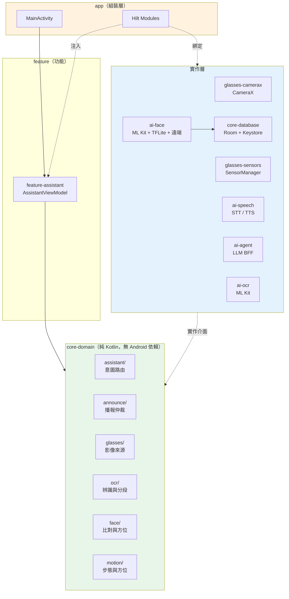
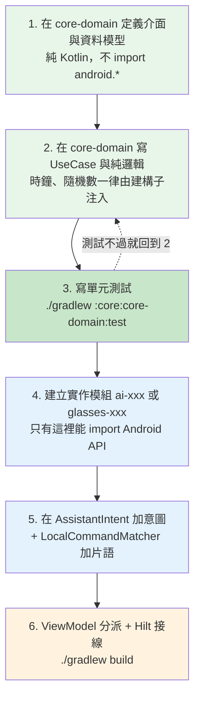
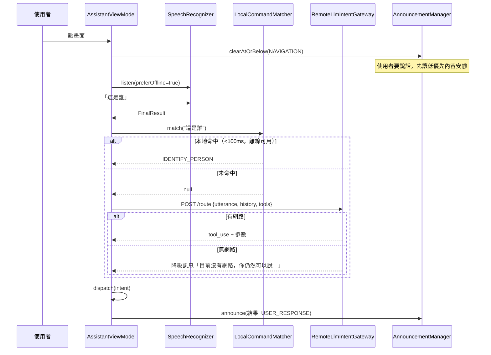
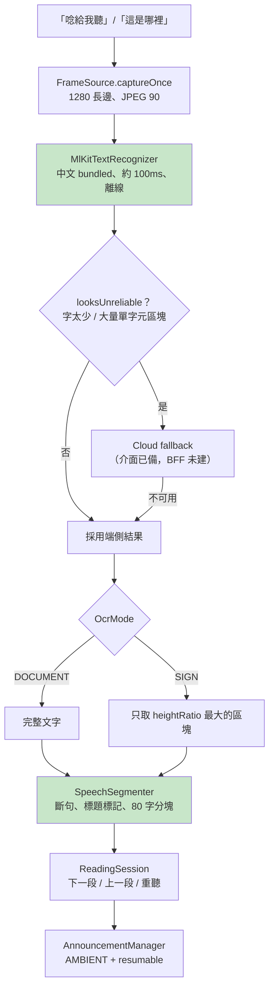
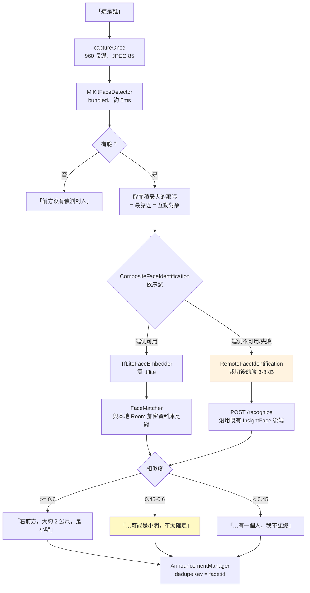
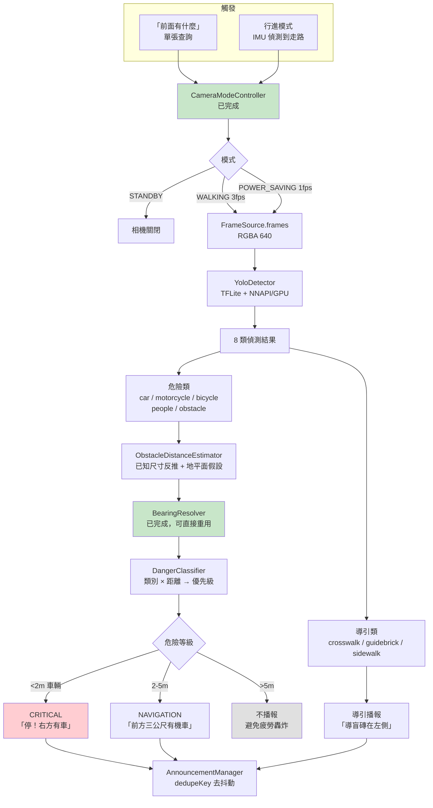
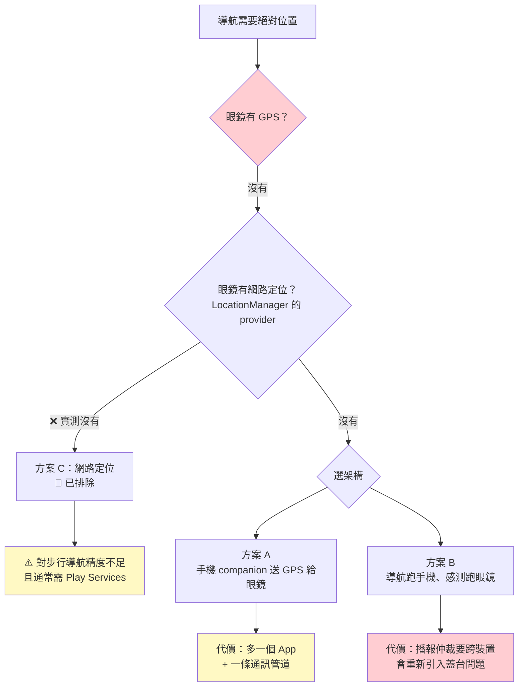
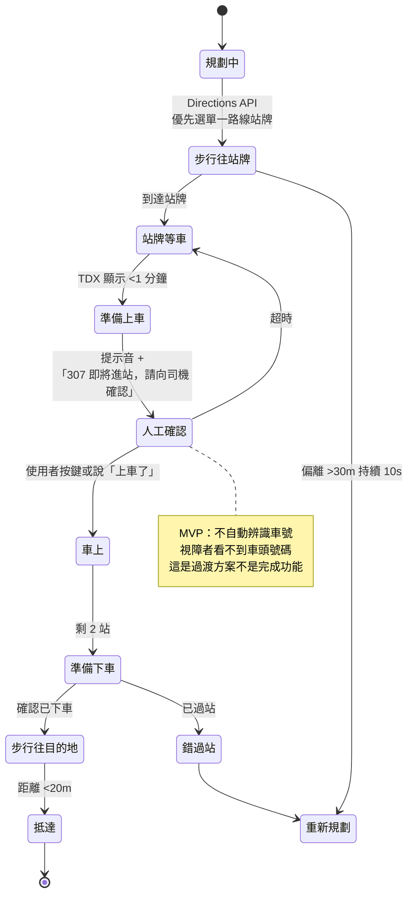
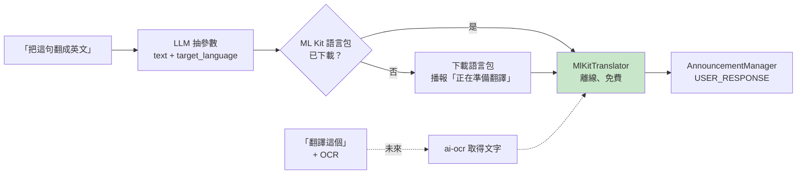
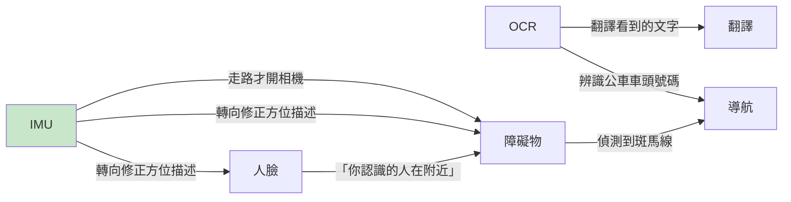

> 🔴 **2026-08-08 更新：本文件的規劃多數已實作完成。**
> 翻譯、障礙物、人臉同步都已完成並（除人臉外）在眼鏡實測通過。
> 現況見 [`STATUS.md`](STATUS.md)，實機限制見 [`DEVICE_FINDINGS.md`](DEVICE_FINDINGS.md)。

# 各功能實作規劃與整合方式

每個功能怎麼做、怎麼接進 guide-glasses。已完成的部分也寫進來 ——
它們是後續功能的範本。

> 目前做到哪裡見 [`STATUS.md`](STATUS.md)，逐項待辦見 [`TASKS.md`](TASKS.md)。

最後更新：2026-08-05

---

## 目錄

| # | 功能 | 狀態 |
|---|---|---|
| 0 | [整體架構與模組關係](#0-整體架構與模組關係) | — |
| 1 | [新增一個功能的通用流程](#1-新增一個功能的通用流程) | 📖 範本 |
| 2 | [AI 語音助理](#2-ai-語音助理已完成) | ✅ |
| 3 | [OCR 朗讀](#3-ocr-朗讀已完成) | ✅ |
| 4 | [人臉辨識](#4-人臉辨識已完成) | ✅ |
| 5 | [障礙物偵測](#5-障礙物偵測規劃中) | ⏸ 等模型 |
| 6 | [導航](#6-導航需先做架構決策) | 🔴 等決策 |
| 7 | [翻譯](#7-翻譯規劃中無阻塞) | ✅ **已完成** |

---

## 0. 整體架構與模組關係



**單向依賴**：`app` → `feature` → `core-domain` ← `實作層`

實作層依賴 domain 的介面，domain 不知道實作的存在。這讓「換掉端側模型」
或「加一條遠端路徑」都不會波及上層。

---

## 1. 新增一個功能的通用流程

**每個功能都照這六步走。** 前三步是純 Kotlin，可以在沒有裝置的情況下完成
並用單元測試驗證；後三步才碰 Android。



### 每一步的具體做法

**Step 1 — Domain 介面**

```kotlin
// core-domain/src/main/kotlin/.../xxx/XxxGateway.kt
interface XxxGateway {
    val isAvailable: Boolean            // 幾乎每個介面都要有這個
    suspend fun doSomething(): AppResult<XxxResult>
}
```

`isAvailable` 不是可有可無 —— 它讓上層能在能力缺失時**播報人話**而不是靜默失敗。
這是這套系統反覆出現的模式（缺模型檔、沒有語音服務、沒有磁力計）。

**Step 2 — UseCase**

```kotlin
class XxxUseCase(
    private val frameSource: FrameSource,
    private val gateway: XxxGateway,
    private val now: () -> Long = System::currentTimeMillis,  // ← 注入時鐘
) {
    suspend fun execute(): Outcome { ... }

    sealed interface Outcome {
        data class Success(...) : Outcome { val spoken: String get() = "..." }
        data object NothingFound : Outcome
        data class Failed(val error: AppError) : Outcome
    }
}
```

**`spoken` 屬性放在 Outcome 裡**，讓「該說什麼話」成為領域決策而不是 UI 決策 ——
這樣播報內容也能被單元測試涵蓋。

**Step 3 — 測試**

```bash
export JAVA_HOME="/c/Program Files/Android/Android Studio/jbr"
cd guide-glasses && ./gradlew :core:core-domain:test
```

**Step 4 — 實作模組**

`settings.gradle.kts` 加 `include(":ai:ai-xxx")`，
`build.gradle.kts` 照抄 `ai-ocr` 的即可。

**Step 5 — 語音指令**

```kotlin
// AssistantIntent.kt
XXX(toolName = "xxx", description = "給 LLM 看的說明"),

// LocalCommandMatcher.kt —— 注意順序即優先級
AssistantIntent.XXX to listOf("片語一", "片語二"),
```

⚠️ **順序很重要。** 「唸下一段」同時含有「唸」與「下一段」，
`READING_NEXT` 必須排在 `READ_TEXT` 之前。加新片語時先想清楚會不會被
既有規則吃掉。

**Step 6 — 接線**

```kotlin
// AssistantViewModel.kt
AssistantIntent.XXX -> runXxx()

// AssistantModule.kt
@Provides @Singleton
fun provideXxxGateway(@ApplicationContext context: Context): XxxGateway = ...
```

### 播報時要選對優先級

| 優先級 | 用在 | 例子 |
|---|---|---|
| `CRITICAL` | 立即危險 | 2m 內的車、地面落差 |
| `USER_RESPONSE` | 使用者主動問的 | 「這是誰」的答案 |
| `NAVIGATION` | 有時效的提示 | 轉彎、到站 |
| `AMBIENT` | 可以被打斷的 | OCR 長文（記得 `resumable = true`） |

**任何模組都不得自己持有 `TextToSpeech` 或 `MediaPlayer`** ——
一律走 `AnnouncementManager`，否則會重演舊專案三套播放器互相蓋台的問題。

---

## 2. AI 語音助理（已完成）

系統中樞。所有功能都由它分派。



**設計要點**

- 雙層路由：「停」不能等雲端，本地比對 <100ms
- 只比對**使用者說的話**，不比對 AI 的回覆（舊專案的誤觸發成因）
- 沒網路時降級成人話，並主動提示還有哪些離線指令可用

**整合方式**：新功能只要在 `AssistantIntent` 加一個 enum、在
`LocalCommandMatcher` 加片語、在 ViewModel 加一個 `when` 分支，就自動接上。

---

## 3. OCR 朗讀（已完成）



**兩個關鍵設計**

`SpeechSegmenter` 移植自 `Text_Recognition` 並修了兩個 bug（標題判斷時機、
超長單句不拆）。它處理的不是「怎麼切字串」而是「怎麼唸才聽得懂」。

`ReadingSession` 是長文能不能用的關鍵 —— 一份公文可能切成三十段，
沒有「上一段」使用者聽漏一句就只能從頭再來，實務上他會放棄這個功能。

**未完成**：Cloud fallback（需 BFF）、Vision LLM 第三層、朗讀速度調整。

---

## 4. 人臉辨識（已完成）



**雙策略是刻意的** —— 端側隱私與延遲較好但需要模型檔；遠端沿用團隊既有後端，
今天就能用。DI 自動挑，兩條都沒有才播報「人臉辨識不可用」。

**三段式信心** 取代舊後端的單一閾值 0.4。0.41 時它會信誓旦旦地喊錯名字 ——
認錯人的代價比漏認高，所以中間那段要帶不確定性。

**未完成**：多張照片註冊（提升穩定度）、相機視角校正、端側模型檔。

---

## 5. 障礙物偵測（規劃中）

### 5.1 需要 Obstacle_Recognition 先交付

| 項目 | 說明 |
|---|---|
| `.tflite` | INT8 量化 |
| 類別索引對照 | `data.yaml` 的 `names`，8 類的順序 |
| 輸入尺寸 | 通常 640×640 |
| 前處理規格 | 正規化方式（`[0,1]` 還是 `[-1,1]`）、RGB 還是 BGR |
| 後處理規格 | 輸出張量形狀、NMS 是否已內建 |
| 驗證集 mAP | 用來設信心閾值 |

⚠️ **前處理規格特別重要。** 弄錯不會有任何錯誤訊息，模型照樣輸出數字，
只是那些數字沒有意義 —— 會安靜地什麼都偵測不到。這個坑在 `ai-face` 的
模型 README 也警告過。

### 5.2 資料流



綠色是**已完成可直接重用**的部分。

### 5.3 實作步驟

**Step 1 — domain（純 Kotlin，可先做）**

```kotlin
// core-domain/.../vision/ObstacleModels.kt
enum class ObstacleClass(val spoken: String, val isHazard: Boolean) {
    CAR("汽車", true), MOTORCYCLE("機車", true), BICYCLE("腳踏車", true),
    PEOPLE("行人", true), OBSTACLE("障礙物", true),
    CROSSWALK("斑馬線", false), GUIDEBRICK("導盲磚", false), SIDEWALK("人行道", false),
}

data class Detection(
    val obstacleClass: ObstacleClass,
    val confidence: Float,
    val left: Float, val top: Float, val width: Float, val height: Float,  // 相對比例
)

interface ObstacleDetector {
    val isAvailable: Boolean
    suspend fun detect(frame: CameraFrame): AppResult<List<Detection>>
}
```

**Step 2 — 距離、分級、播報（純邏輯，全部可測）**

```kotlin
class ObstacleDistanceEstimator(horizontalFovDegrees: Float = 66f) {
    // 已知寬度：汽車 1.8m、機車 0.8m、行人 0.45m
    fun estimateMeters(obstacleClass: ObstacleClass, widthRatio: Float): Float?
}

class DangerClassifier {
    fun classify(detection: Detection, meters: Float?): AnnouncementPriority?
    // 回傳 null 代表不播報
}

class ObstacleAnnouncementComposer {
    // 「右前方三公尺有機車」
    fun compose(detection: Detection, bearing: Bearing, meters: Float?): String
}
```

**這一步就能寫完整的單元測試**，不需要模型也不需要裝置。

**Step 3 — TFLite 實作**

`ai/ai-vision` 模組，照 `ai-face` 的 `TfLiteFaceEmbedder` 寫。
記得 `androidResources { noCompress += "tflite" }`。

**Step 4 — 接上相機模式**

`CameraModeController` 已完成，把 `MotionSensorGateway.walkingState()` 接上去即可
自動切換 STANDBY / WALKING / POWER_SAVING。

**Step 5 — 語音指令**

`DETECT_OBSTACLES` 的 intent 與片語已存在，目前回「開發中」，
把那個分支改成呼叫新的 UseCase 就好。

### 5.4 幾個必須想清楚的取捨

**播報疲勞。** 走在馬路邊每秒都有車。**不能看到什麼就唸什麼。**
建議：只播報「新出現的」與「距離縮短到危險範圍的」，用 `dedupeKey`
（例如 `obstacle:car:right`）搭配時間窗抑制重複。

**導引類與危險類的節奏不同。** 「導盲磚在左側」這種資訊變化慢，
播報頻率應該遠低於車輛警示。

**產品定位。** 導盲杖已經很有效地處理近距離地面障礙。這套系統的增量價值
主要在杖子碰不到的地方 —— 遠距離接近的車輛、頭部高度的障礙。
設計時應該偏重這些。

---

## 6. 導航（需先做架構決策）

### 6.1 🔴 阻塞：眼鏡沒有 GPS（2026-08-08 實測確認），**而且沒有電子羅盤**

> 實測結果：`dumpsys location` 只有 `passive` / `fused`，沒有 `gps` 也沒有
> `network` provider。方案 C（網路定位）因此**也不成立**。
> 更麻煩的是**沒有磁力計** —— 即使手機給了座標，仍算不出朝向。



**先實測 B 那一格**（在眼鏡上列出 `LocationManager.getAllProviders()`），
再決定 A 或 B。**決策之前不要開工。**

### 6.2 IMU 能補什麼、補不了什麼

| IMU 能給（已完成） | IMU 給不了 |
|---|---|
| 相對轉向 `HeadingGuidance` | 我在哪裡 |
| 走了幾步 `StepDistanceEstimator` | 目的地在哪個方向 |
| 有沒有在走 `WalkingStateDebouncer` | 有沒有偏離路線 |

**IMU 可以做「跟著走」，做不到「知道在哪」。**

### 6.3 假設架構決策完成後的流程



### 6.4 實作順序建議

| 階段 | 內容 | 前提 |
|---|---|---|
| **6a** | 純 IMU 的「跟著走」—— 使用者自己知道方向，系統負責提醒偏離與計步 | 無，現在就能做 |
| **6b** | 步行導航（Directions API + 定位） | 架構決策 |
| **6c** | 公車整合（TDX） | 6b 先驗證播報體驗 |

**6a 值得先做** —— 它不需要 GPS，價值也真實：使用者請人指路之後，
系統可以幫他維持方向、告訴他走了幾步。

### 6.5 已知難題

**「哪一輛公車進站」目前沒有可靠解法。** 團隊 MVP 是詢問司機或挑單一路線
站牌。系統仍能提供到站倒數、進站提醒、上下車確認、站數倒數。

一個值得做的：**路線規劃時優先選停靠路線少的站牌** —— 把人工妥協變成產品特性。

**Google Directions 的 transit 模式不回傳即時到站時間**，必須另接 TDX。

**都市 GPS 精度**：台北高樓區誤差 15–30m，「偏離 30m 重新規劃」的閾值
需實地調校，否則會不停誤報 —— 對視障者是災難。

---

## 7. 翻譯（規劃中，無阻塞）

最簡單的一個，約三天。**可以立刻開工。**



### 實作步驟

**Step 1** — domain 介面

```kotlin
// core-domain/.../translate/Translator.kt
interface Translator {
    val isAvailable: Boolean
    suspend fun ensureModel(targetLanguage: String): AppResult<Unit>
    suspend fun translate(text: String, targetLanguage: String): AppResult<String>
}
```

**Step 2** — `ai/ai-translate` 模組，用
`com.google.mlkit:translate`（離線，語言包首次使用時下載）

**Step 3** — `AssistantIntent.TRANSLATE` 已存在，把 ViewModel 那個
「開發中」分支換掉

### 兩個要注意的地方

**語言包下載要有回饋。** 首次翻譯某語言時要下載幾十 MB，
不播報「正在準備翻譯」的話使用者會以為當機了。

**目標語言的抽取交給 LLM。** 「翻成英文」「translate to Japanese」
「這個日文是什麼意思」都要對應到正確的語言代碼，本地規則做不可靠。
因此**沒有 BFF 時翻譯只能用預設語言**（建議英文）。

---

## 8. 交叉整合的機會

功能之間可以互相加值，這些都還沒做：



**已完成的只有 IMU → 相機模式那一條**（`CameraModeController`）。

其中 **IMU → 方位修正**值得早點做：使用者轉頭之後，「右前方」指的方向就變了。
現在的 `BearingResolver` 只看畫面中的 x 座標，沒有考慮頭部姿態。

---

## 9. 開發時的檢查清單

每完成一個功能，確認這些：

- [ ] `core-domain` 沒有 import `android.*`（不會編譯過，但要有意識）
- [ ] UseCase 的時鐘 / 隨機數是注入的，不是直接呼叫 `System.currentTimeMillis()`
- [ ] `Outcome` 有 `spoken` 屬性，播報內容被測試涵蓋
- [ ] 錯誤訊息是人話，不含錯誤碼、例外訊息、英文技術術語
- [ ] 能力缺失時**明確播報**而不是靜默（對看不見畫面的人，沒聲音等於當機）
- [ ] 播報優先級選對，長內容記得 `resumable = true`
- [ ] 有 `dedupeKey`，避免同一件事被播報十次
- [ ] 新片語不會被 `LocalCommandMatcher` 既有規則吃掉
- [ ] `./gradlew build` 通過（含 lint 與全部測試）
- [ ] 只修改了 `guide-glasses/`
