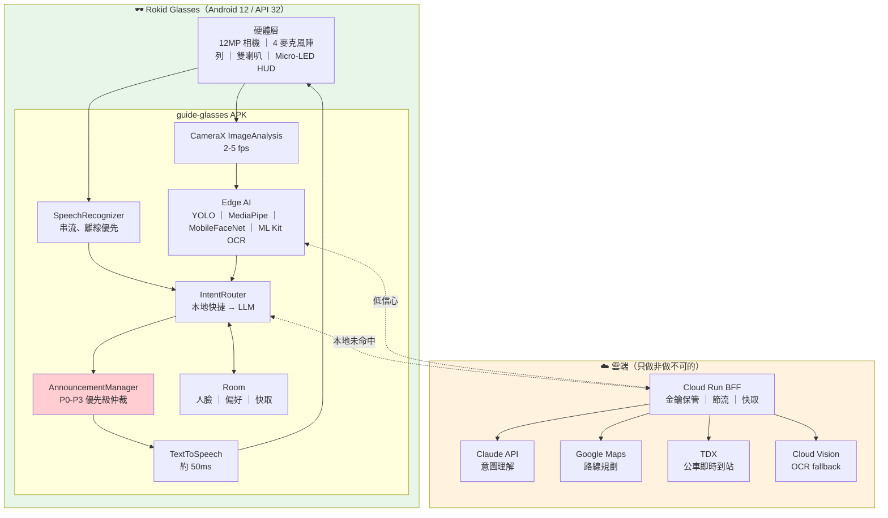
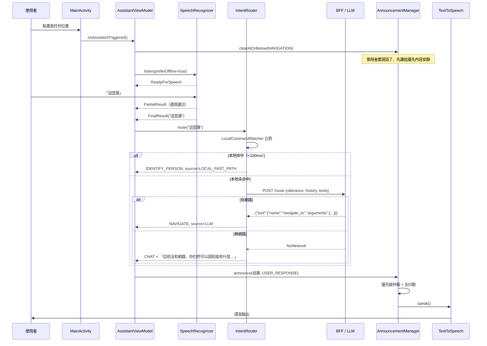
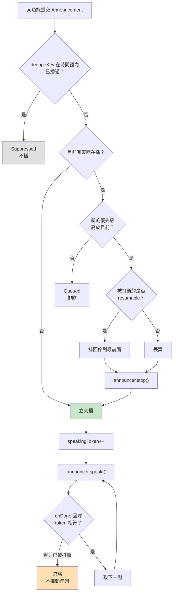
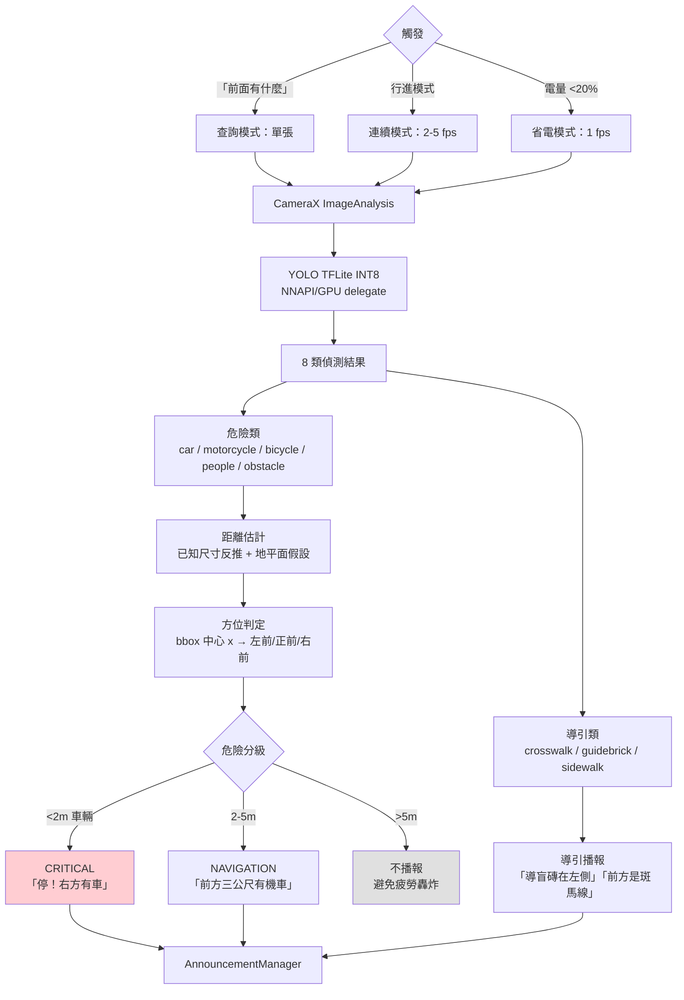
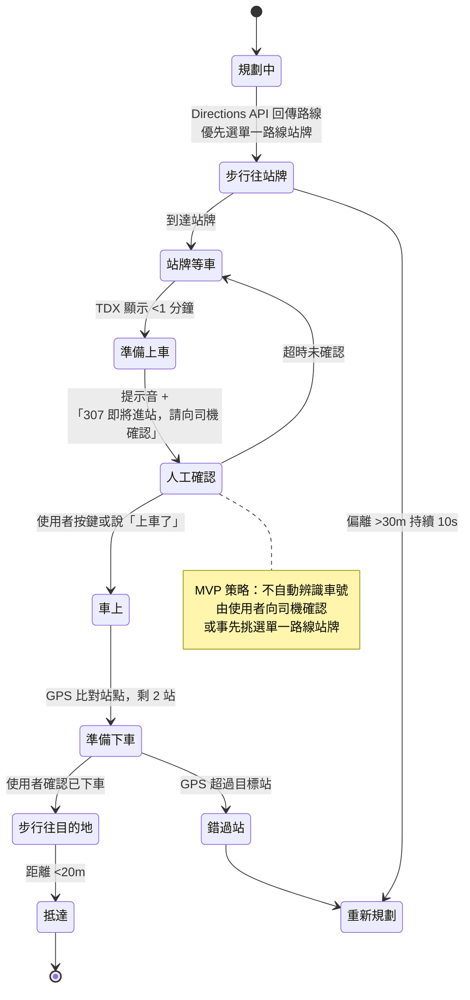

# guide-glasses 技術文件

| | |
|---|---|
| 定位 | **最終的完整導盲系統整合專案** |
| 目標裝置 | Rokid Glasses（YodaOS-Sprite / Android 12 / API 32），APK 直接安裝 |
| 撰寫日期 | 2026-08-05 |
| 目前整體完成度 | **約 48%**（詳見 §8） |

> 相關文件：[分析報告總覽](../docs/00_README.md)｜[前次分析的修正](../docs/08_CORRECTIONS_AND_REANALYSIS.md)｜[專案交接紀錄](../docs/07_HANDOVER.md)

---

## 0. 這個專案在整個 Repository 中的位置

```
guide_glasses_project_/
│
├── AI_Assistant/           ← 組員工作區（AI 助理 + 已整合的人臉辨識）
├── Face_Recognition/       ← 組員工作區（人臉辨識，已在眼鏡實機運作）
├── Obstacle_Recognition/   ← 組員工作區（YOLO 訓練中）
├── Audio_Navigation/       ← 組員工作區（語音導航）
├── Text_Recognition/       ← 組員工作區（OCR）
│
└── guide-glasses/          ← 【本專案】最終整合系統
```

**開發規則**

- 五個功能資料夾是五位成員各自的工作區，**guide-glasses 不修改它們**
- 需要引用時：**複製**程式碼到 guide-glasses 再重新整合，原始資料夾保持可供組員繼續開發
- guide-glasses 最終要成為一套完整、可獨立安裝執行的導盲系統

---

## 1. 專案架構

### 1.1 目錄樹（實際存在的檔案）

```
guide-glasses/
│
├── settings.gradle.kts              模組註冊、repository 設定（含 Rokid maven）
├── build.gradle.kts                 根專案，plugin 宣告
├── gradle.properties                JVM 記憶體、平行建置、configuration cache
├── local.properties                 【不進版控】Android SDK 路徑
├── gradlew / gradlew.bat            Gradle wrapper 啟動腳本
├── README.md                        快速入門
├── DOCUMENTATION.md                 本文件
│
├── gradle/
│   ├── libs.versions.toml           version catalog（集中管理所有依賴版本）
│   └── wrapper/                     Gradle 8.13
│
├── app/                             【組裝層】
│   ├── build.gradle.kts             含 LLM_ENDPOINT buildConfigField
│   ├── proguard-rules.pro
│   └── src/main/
│       ├── AndroidManifest.xml      權限宣告；allowBackup="false"
│       ├── kotlin/com/guideglasses/
│       │   ├── GuideGlassesApplication.kt    @HiltAndroidApp
│       │   ├── MainActivity.kt               單一 Activity
│       │   └── di/
│       │       ├── CoreModule.kt             DispatcherProvider
│       │       └── AssistantModule.kt        助理相關全部接線
│       └── res/
│           ├── layout/activity_main.xml      無障礙版面（整片大按鈕）
│           ├── values/strings.xml            全部使用者可見文字
│           ├── values/themes.xml             高對比深色主題
│           ├── drawable/                     App 圖示
│           └── mipmap-*/                     launcher icon
│
├── core/                            【共用基礎】
│   │
│   ├── core-domain/                 ★ 純 Kotlin，不套用 Android plugin
│   │   ├── build.gradle.kts         只套用 kotlin.jvm
│   │   └── src/
│   │       ├── main/kotlin/com/guideglasses/core/domain/
│   │       │   ├── AppResult.kt                 AppResult<T> / AppError
│   │       │   ├── announce/
│   │       │   │   ├── Announcement.kt          Announcement + AnnouncementPriority
│   │       │   │   ├── AnnouncementQueue.kt     播報仲裁核心邏輯
│   │       │   │   ├── AnnouncementManager.kt   播報執行層
│   │       │   │   └── Announcer.kt             語音輸出介面
│   │       │   ├── assistant/
│   │       │   │   ├── AssistantIntent.kt       9 種意圖 + 工具定義
│   │       │   │   ├── LocalCommandMatcher.kt   本地片語比對
│   │       │   │   ├── IntentRouter.kt          雙層路由 + LlmIntentGateway 介面
│   │       │   │   └── ConversationHistory.kt   有界對話歷史
│   │       │   ├── glasses/
│   │       │   │   ├── GlassesGateway.kt        眼鏡連線 + 能力查詢
│   │       │   │   ├── FrameSource.kt           影像來源介面 + CameraFrame
│   │       │   │   ├── FrameRateLimiter.kt      幀率節流 + 解析度規劃
│   │       │   │   └── CameraSelfTest.kt        相機自我檢測 UseCase
│   │       │   └── speech/
│   │       │       └── SpeechRecognitionGateway.kt   ASR 介面 + SpeechEvent
│   │       └── test/kotlin/...                  7 個測試類，70 個測試
│   │
│   ├── core-common/                 Android 相依的共用工具
│   │   └── src/main/kotlin/.../DispatcherProvider.kt
│   │
│   └── core-database/               本地加密儲存
│       └── src/main/kotlin/.../
│           ├── EmbeddingCipher.kt           Keystore AES/GCM 加解密
│           └── PersonStorage.kt             Room + PersonRepository 實作
│
├── glasses/                         【眼鏡硬體抽象的實作】
│   └── glasses-camerax/             CameraX 影像來源
│       └── src/main/
│           ├── AndroidManifest.xml              CAMERA 權限
│           └── kotlin/.../
│               ├── CameraXFrameSource.kt        FrameSource 的 CameraX 實作
│               └── ImageProxyConverter.kt       ImageProxy → CameraFrame
│
├── ai/                              【Edge AI 與雲端 AI 實作】
│   │
│   ├── ai-speech/                   Android 原生語音
│   │   └── src/main/
│   │       ├── AndroidManifest.xml              RECORD_AUDIO + <queries>
│   │       └── kotlin/.../
│   │           ├── AndroidTtsAnnouncer.kt              TextToSpeech 實作
│   │           └── AndroidSpeechRecognitionGateway.kt  SpeechRecognizer 實作
│   │
│   ├── ai-face/                     端側人臉辨識
│   │   ├── src/main/assets/README.md        【模型檔要放這裡】
│   │   └── src/main/kotlin/.../
│   │       ├── MlKitFaceDetector.kt         人臉偵測（bundled）
│   │       ├── TfLiteFaceEmbedder.kt        特徵抽取（需模型檔）
│   │       └── FrameBitmaps.kt              裁切與轉檔
│   │
│   ├── ai-ocr/                      端側中文 OCR
│   │   └── src/main/kotlin/.../
│   │       └── MlKitTextRecognizer.kt       ML Kit 中文（bundled，離線）
│   │
│   └── ai-agent/                    LLM function calling
│       └── src/
│           ├── main/kotlin/.../
│           │   ├── AgentProtocol.kt             BFF 協定的資料類別
│           │   └── RemoteLlmIntentGateway.kt    HTTP 閘道 + 離線降級
│           └── test/kotlin/...                  11 個測試
│
└── feature/                         【功能模組】
    └── feature-assistant/
        └── src/main/kotlin/.../AssistantViewModel.kt
```

### 1.2 每個資料夾的用途與設計理由

| 資料夾 | 用途 | 為什麼這樣切 |
|---|---|---|
| `app/` | 組裝層。只放 Application、Activity、Hilt Module、Manifest、資源 | 讓所有實作細節都在別的模組，app 保持極薄，換 UI 框架時衝擊最小 |
| `core/core-domain/` | Entity、業務規則、介面定義、播報仲裁、意圖路由 | **刻意只套用 `kotlin.jvm`，不套用任何 Android plugin。** 任何 `android.*` 或 `com.rokid.*` 的 import 都會編譯失敗 —— 這是建置層面強制的架構約束。副作用是核心邏輯能用純 JVM 測試，秒級完成、不需模擬器 |
| `core/core-common/` | 需要 Android 相依的共用工具（Dispatcher 等） | 與 core-domain 分開，避免污染純 Kotlin 模組 |
| `glasses/glasses-camerax/` | CameraX 影像來源 | Rokid Glasses 執行 Android 12，標準 CameraX 直接可用。同一個實作在手機上也能跑，眼鏡不在手邊照樣能開發 |
| `ai/ai-speech/` | `android.speech.*` 的封裝 | 把 Android 語音 API 隔離在單一模組，未來要換成雲端 ASR 只改這裡 |
| `core/core-database/` | Room + Keystore 加密 | 人臉特徵是生物特徵，不該以明文躺在 SQLite 檔案裡。金鑰由 Keystore 保管，程式碼拿不到金鑰本體 |
| `ai/ai-face/` | 人臉偵測與特徵抽取 | 端側完成，影像與特徵都不離開裝置 |
| `ai/ai-ocr/` | ML Kit 中文文字辨識 | 用 bundled 版而非 play-services 版 —— **Rokid Glasses 是否預裝 Google Play Services 無法確認**，bundled 把模型打包進 APK 就沒有這個不確定性 |
| `ai/ai-agent/` | LLM 協定、HTTP、JSON 序列化 | 換 LLM 供應商（Claude / Gemini / GPT）不需改其他模組，也不需發新版 App |
| `feature/feature-assistant/` | 助理中樞的 ViewModel 與狀態 | 功能可獨立開發、獨立編譯、獨立測試 |

### 1.3 尚未建立、規劃中的模組

| 模組 | 用途 | 依賴什麼才能開始 |
|---|---|---|
| `glasses/glasses-cxrl` | CXR-L SDK 封裝（選用，主要為降噪音訊） | 需 `com.rokid.sprite.aiapp` 與 auth token |
| `ai/ai-vision` | YOLO 障礙物偵測 + 距離估計 + 方位判定 | **需 Obstacle_Recognition 提供 `.tflite` 與規格** |
| `core/core-network` | 共用 HTTP 設定 | 無 |
| `core/core-ui` | 共用無障礙元件 | 無 |
| `feature/feature-face` | 人臉辨識畫面與流程 | 需 ai-face |
| `feature/feature-ocr` | OCR 朗讀（含分段控制） | 需 ai-ocr |
| `feature/feature-obstacle` | 障礙物警示 | 需 ai-vision |
| `feature/feature-navigation` | 步行 + 公車導航 | 需 Maps / TDX 金鑰與 BFF |

---

## 2. 功能介紹

### 2.1 已實作

#### AI 語音助理（系統中樞）

整個系統的入口。所有其他功能都由它分派。

**雙層意圖路由**

| 層 | 機制 | 延遲 | 離線 | 處理什麼 |
|---|---|---|---|---|
| 第一層 | `LocalCommandMatcher` 本地片語比對 | <100ms | ✅ | 高頻、不能等的指令 |
| 第二層 | LLM Function Calling（透過 BFF） | 300–1500ms | ❌ | 需要抽參數的複雜語句 |

**第一層涵蓋的指令**（不需網路）

| 說法 | 動作 |
|---|---|
| 停 / 停止 / 安靜 / 別說了 / 閉嘴 | 立刻停止所有播報 |
| 測試相機 / 相機測試 / 拍一張 | 相機自我檢測，回報解析度與耗時 |
| 這是誰 / 這個人是誰 / 誰在我前面 | 人臉辨識，回報方位、距離、是誰 |
| 唸給我聽 / 上面寫什麼 / 幫我看字 | OCR 文件模式，完整朗讀 |
| 這是哪裡 / 招牌寫什麼 / 什麼店 | OCR 招牌模式，只唸最大的字 |
| 下一段 / 繼續唸 | 朗讀下一段 |
| 上一段 / 前一段 | 回到上一段 |
| 前面有什麼 / 看看前面 / 可以走嗎 / 有障礙物嗎 / 周圍有什麼 | 障礙物偵測 |
| 再說一次 / 重複 / 剛剛說什麼 / 沒聽清楚 | 重複上一則 |

「停」的優先級最高 —— 說「停，前面有什麼」會先停下來。

**第二層處理的指令**（需要 BFF）

需要從自由語句抽參數的：「帶我去台北101」「把這句翻成英文」「把他記起來，他叫小明」。

#### 語音辨識（STT）

`AndroidSpeechRecognitionGateway` —— Android 內建 `SpeechRecognizer`。

- 串流式，說到一半就有部分結果
- 自動偵測說完（VAD），使用者不必記得再按一次
- `EXTRA_PREFER_OFFLINE = true` —— 導盲場景常在地下道、騎樓這類收訊不佳的地方
- 錯誤碼轉成領域錯誤，絕不把「錯誤 7」唸給使用者聽

#### 語音合成（TTS）

`AndroidTtsAnnouncer` —— Android 內建 `TextToSpeech`。

- 約 50ms 延遲，離線可用、零成本
- 語言依序嘗試 `TAIWAN` → `TRADITIONAL_CHINESE` → `SIMPLIFIED_CHINESE`
- 走 `USAGE_ASSISTANCE_ACCESSIBILITY` 音訊通道 —— 使用者把媒體音量調低，導盲提示仍然聽得見
- 契約保證 `onDone` 一定會被呼叫一次（即使失敗），否則播報佇列會卡死

#### 播報仲裁（系統的核心）

六個功能都會想說話，但使用者只有一雙耳朵。所有播報一律經過 `AnnouncementManager`。

| 優先級 | 用途 | 行為 |
|---|---|---|
| `CRITICAL` | 立即危險（2m 內的車、地面落差） | 打斷一切 |
| `USER_RESPONSE` | 使用者主動查詢的回應 | 打斷導航與一般內容 |
| `NAVIGATION` | 轉彎、到站提醒 | 打斷一般內容 |
| `AMBIENT` | OCR 長文朗讀、閒聊 | 可被任何上位打斷，支援續播 |

- 同優先級先到先播，不互相打斷
- 相同 `dedupeKey` 在時間窗內（預設 10 秒）只播一次 —— 同一個人的臉被連續辨識十次只會播一次
- 被打斷的可續播內容會排回佇列最前面
- `speakingToken` 序號機制：已被打斷的 TTS 回呼遲到送達時，不會讓佇列跳號漏播

### 2.2 尚未實作（介面已定義）

| 功能 | 介面 | 缺什麼 |
|---|---|---|
| 相機影像 | `FrameSource` / `CameraFrame` | CameraX 實作 |
| 眼鏡連線 | `GlassesGateway` / `GlassesCapabilities` | CXR-L 實作（選用） |
| 人臉辨識 | 無 | 整個 `ai-face` 模組 |
| OCR | 無 | 整個 `ai-ocr` 模組 |
| 障礙物辨識 | 無 | 整個 `ai-vision` 模組 + 訓練好的 `.tflite` |
| 導航 | 無 | 整個 `feature-navigation` |
| 公車辨識 | 無 | TDX 整合 |
| 翻譯 | 無 | ML Kit Translation |
| 雲端 AI | `LlmIntentGateway` + `RemoteLlmIntentGateway` | **BFF 後端本身不存在** |

目前這些 intent 會播報「這個功能還在開發中」—— **刻意不靜默**。對看不見畫面的使用者，沒有聲音等於系統當掉。

---

## 3. 哪些功能跑在哪裡

### 3.1 部署模型

**主要模式：App 直接安裝在 Rokid Glasses 上執行。**

Rokid Glasses 執行 YodaOS-Sprite（Android 12 / API 32），APK 可直接安裝。這已被 `Face_Recognition/` 實證 —— 它就是用標準 CameraX 在眼鏡上取得相機影像並播報。

手機在這個架構中**不是必要的**，只在兩種情況出現：

1. 開發與除錯時，把 App 裝在手機上比較方便
2. 未來若要用 CXR-M 做手機協同（目前不需要）

### 3.2 功能配置表

| 功能 | Rokid Glasses | 手機 | 本地伺服器 | 雲端 | 目前狀態 |
|---|:---:|:---:|:---:|:---:|---|
| **相機影像擷取** | ✅ CameraX | 🟡 備援 | — | — | ✅ 已實作 |
| **麥克風收音** | ✅ | 🟡 備援 | — | — | ✅ 已實作 |
| **語音辨識 STT** | ✅ SpeechRecognizer | 🟡 | — | 🟡 fallback | ✅ 已實作 |
| **語音合成 TTS** | ✅ TextToSpeech | 🟡 | — | — | ✅ 已實作 |
| **播報仲裁** | ✅ | 🟡 | — | — | ✅ 已實作 |
| **本地意圖路由** | ✅ | 🟡 | — | — | ✅ 已實作 |
| **LLM 意圖理解** | — | — | — | ✅ BFF → Claude | 🟠 客戶端完成，BFF 不存在 |
| **人臉偵測** | ✅ ML Kit | 🟡 | — | — | ✅ 已實作 |
| **人臉特徵比對** | ✅ TFLite | 🟡 | — | ❌ 絕不上雲 | 🟠 程式完成，**缺模型檔** |
| **人臉資料庫** | ✅ Room + Keystore 加密 | 🟡 | — | ❌ 絕不上雲 | ✅ 已實作 |
| **障礙物偵測** | ✅ YOLO TFLite | 🟡 | — | — | ❌ 未實作 |
| **距離估計** | ✅ | 🟡 | — | — | ❌ 未實作 |
| **OCR（第一層）** | ✅ ML Kit 離線 | 🟡 | — | — | ✅ 已實作 |
| **OCR（fallback）** | — | — | — | ✅ Cloud Vision | ❌ 未實作 |
| **翻譯** | ✅ ML Kit 離線 | 🟡 | — | 🟡 長句 | ❌ 未實作 |
| **GPS 定位** | ⚠️ 無法確認 | ✅ | — | — | ❌ 未實作 |
| **路線規劃** | — | — | — | ✅ Google Directions | ❌ 未實作 |
| **公車即時到站** | — | — | — | ✅ TDX | ❌ 未實作 |
| **眼鏡 HUD 顯示** | 🟡 CXR-L CustomView | — | — | — | ❌ 未實作（低優先） |

**圖例**：✅ 主要位置｜🟡 次要/備援｜⚠️ 待驗證｜❌ 不應放在此處或未實作

### 3.3 為什麼這樣配置

| 原則 | 說明 |
|---|---|
| **安全相關的一律 Edge** | 障礙物警示延遲預算 <300ms，雲端往返做不到；而且斷網不能等於失明 |
| **生物特徵絕不上雲** | 人臉是特種個資。上雲帶來法遵責任、離線失效、延遲增加 —— 三個缺點，零個優點 |
| **語音一律本機** | Android 原生 TTS 約 50ms，雲端 TTS 要 2–3 秒。以步行速度 1.4 m/s，2 秒延遲的「前方有車」等於車已經到了 |
| **只有非做不可的才上雲** | LLM（手機跑不動夠好的模型）、地圖路網、公車即時資料 |
| **金鑰只在 BFF** | App 內嵌金鑰必然會被反編譯取出 |

### 3.4 資源預算（眼鏡端）

Rokid Glasses 只有 **2 GB RAM**，這是硬限制。

| 資源 | 預算 | 說明 |
|---|---|---|
| RAM | < 400 MB | YOLO INT8 ~10MB + MobileFaceNet ~5MB + ML Kit ~30MB + App 本身 |
| 相機幀率 | **2–5 fps**，不是 30fps | 步行 1.4 m/s，5fps 等於每 28cm 判斷一次，足夠 |
| 電量 | 內建 210mAh 約 4 小時（不開相機） | 需搭配行動電源，見 [08 §5](../docs/08_CORRECTIONS_AND_REANALYSIS.md) |

---

## 4. 系統流程

### 4.1 整體資料流



### 4.2 語音互動流程（已實作）



### 4.3 播報優先級仲裁流程（已實作）



### 4.4 障礙物偵測流程（規劃中）



### 4.5 公車導航流程（MVP，規劃中）



---

## 5. 如何執行

### Step 1 — 安裝 JDK 17 或以上

AGP 8.13.2 需要 JDK 17+，**JDK 11 無法建置**。

最簡單的方式是裝 Android Studio，直接用它內附的 JBR（本專案實測使用 JBR 21.0.9）。

### Step 2 — 安裝 Android Studio 與 SDK

需要：

- Android SDK **Platform 36**
- Android SDK **Build-Tools 36.x**
- Android SDK Platform-Tools（提供 `adb`）

透過 Android Studio → Settings → SDK Manager 安裝。

### Step 3 — Clone 專案

```bash
git clone https://github.com/mato1321/guide_glasses_project_.git
```

> ⚠️ git 歷史曾於 2026-08-05 重寫。若你有舊的本機 clone，請刪除後重新 clone。

### Step 4 — 設定 Android SDK 路徑

建立 `guide-glasses/local.properties`。**反斜線與磁碟機冒號都必須跳脫**：

Windows：
```
sdk.dir=C\:\\Users\\<你的帳號>\\AppData\\Local\\Android\\Sdk
```

macOS：
```
sdk.dir=/Users/<你的帳號>/Library/Android/sdk
```

Linux：
```
sdk.dir=/home/<你的帳號>/Android/Sdk
```

### Step 5 — 設定 API 金鑰（選用）

**不設定的話 App 完全可以執行**，只是複雜語句（「帶我去台北101」）無法理解，本地快捷指令照常運作。

App 端**不放任何 API 金鑰** —— 金鑰只在 BFF 後端。App 只需要知道 BFF 的位址。

在 `guide-glasses/local.properties` 或 `~/.gradle/gradle.properties` 加入：

```
guideglasses.llmEndpoint=https://your-bff.run.app/route
```

BFF 需實作的協定見 `ai/ai-agent/src/main/kotlin/com/guideglasses/ai/agent/AgentProtocol.kt`：

- 請求：`POST` JSON `{"utterance": "...", "history": [...], "tools": [...], "locale": "zh-TW"}`
- 回應（二選一）：
  - 呼叫工具：`{"tool": {"name": "navigate_to", "arguments": {"destination": "台北101"}}}`
  - 一般回覆：`{"reply": "今天台北是晴天"}`

> **BFF 目前不存在，需要自行實作。**

### Step 6 — 設定 JAVA_HOME（若系統預設不是 JDK 17+）

Windows Git Bash：
```bash
export JAVA_HOME="/c/Program Files/Android/Android Studio/jbr"
```

Windows PowerShell：
```powershell
$env:JAVA_HOME = "$env:ProgramFiles\Android\Android Studio\jbr"
```

macOS / Linux：
```bash
export JAVA_HOME=$(/usr/libexec/java_home -v 17)
```

### Step 7 — 建置 APK

```bash
cd guide-glasses && ./gradlew assembleDebug
```

產出：`guide-glasses/app/build/outputs/apk/debug/app-debug.apk`

首次建置約 1–3 分鐘（需下載 Gradle 與依賴），之後約 10 秒。

### Step 8 — 連接 Rokid Glasses

眼鏡是 Android 裝置，用 `adb` 連接。

```bash
adb devices
```

若看不到裝置：

1. 眼鏡端開啟開發者模式與 USB 偵錯（**具體路徑無法確認，請查 Rokid 官方文件或裝置設定**）
2. 用 USB 連接
3. 在眼鏡上確認授權對話框

> 社群另有 PC-to-glasses 的無線 APK 傳輸工具（UDP discovery + 本機 HTTP server + 眼鏡端安裝器），可作為 USB 之外的選項。

### Step 9 — 安裝到眼鏡

```bash
cd guide-glasses && ./gradlew installDebug
```

或直接：

```bash
adb install -r guide-glasses/app/build/outputs/apk/debug/app-debug.apk
```

### Step 10 — 授予權限

首次啟動時 App 會請求麥克風權限。若在眼鏡上不方便操作對話框，可用 adb 預先授予：

```bash
adb shell pm grant com.guideglasses android.permission.RECORD_AUDIO
```

```bash
adb shell pm grant com.guideglasses android.permission.CAMERA
```

### Step 11 — 執行

```bash
adb shell am start -n com.guideglasses/.MainActivity
```

或在眼鏡的應用程式列表中找到「導盲眼鏡」。

### Step 12 — 建議：加入電池最佳化白名單

長時間執行需要，否則系統可能殺掉 App。

```bash
adb shell dumpsys deviceidle whitelist +com.guideglasses
```

### Step 13 — 查看 log

```bash
adb logcat -s TtsAnnouncer:* SpeechGateway:* AndroidRuntime:E
```

---

## 6. 如何測試

### 6.1 自動化測試（不需裝置）

```bash
cd guide-glasses && ./gradlew test
```

目前 **150 個單元測試**，全部純 JVM，秒級完成。

| 測試類 | 數量 | 守護什麼 |
|---|---|---|
| `AnnouncementQueueTest` | 14 | 播報仲裁邏輯 |
| `AnnouncementManagerTest` | 8 | 播報執行層與競態 |
| `LocalCommandMatcherTest` | 20 | 意圖比對 |
| `IntentRouterTest` | 10 | 雙層路由與降級 |
| `RemoteLlmIntentGatewayTest` | 11 | BFF 協定與錯誤處理 |
| `FrameRateLimiterTest` | 8 | 幀率節流 |
| `ResolutionPlannerTest` | 7 | 解析度規劃 |
| `CameraSelfTestUseCaseTest` | 7 | 相機自我檢測與錯誤訊息 |
| `SpeechSegmenterTest` | 17 | 斷句朗讀（含兩個從原版修正的 bug） |
| `ReadTextUseCaseTest` | 11 | OCR 三層策略與雙模式 |
| `ReadingSessionTest` | 11 | 朗讀進度與控制 |
| `FaceMatcherTest` | 15 | 三段式特徵比對 |
| `FaceDistanceEstimatorTest` | 7 | 距離估計 |
| `BearingResolverTest` | 4 | 方位判定 |

完整建置（含 lint）：

```bash
cd guide-glasses && ./gradlew build
```

### 6.2 AI 助理（已實作，可實測）

| | |
|---|---|
| **前置** | App 已安裝、麥克風權限已授予、裝置有中文 TTS 語音資料 |
| **測試步驟** | 1. 開啟 App<br/>2. 點畫面任何位置<br/>3. 聽到提示後說「停」<br/>4. 重複測試其他指令 |
| **預期結果** | 狀態文字變成「聆聽中」→「處理中」→ 播報回應。說「停」會立刻靜音 |
| **驗收標準** | 20 種不同說法的意圖辨識準確率 >90%；「停」在 100ms 內生效 |

**逐項測試表**

| 說出 | 預期播報 | 若失敗，可能原因 |
|---|---|---|
| 停 | 立刻靜音 | 本地比對未命中（檢查 `LocalCommandMatcher`） |
| 這是誰 | 「人臉辨識…這個功能還在開發中」 | ASR 沒聽清楚 / 未命中 |
| 前面有什麼 | 「障礙物…還在開發中」 | 同上 |
| 唸給我聽 | 「OCR…還在開發中」 | 同上 |
| 再說一次 | 重播上一則，或「目前沒有可以重複的內容」 | 同上 |
| 帶我去台北101 | 未設 BFF：「目前沒有網路，你仍然可以說前面有什麼…」<br/>已設 BFF：導航功能開發中 | BFF 位址錯誤 / 後端未啟動 |
| 今天天氣如何 | 未設 BFF：同上降級訊息 | — |

**常見失敗原因**

| 現象 | 原因 | 處理 |
|---|---|---|
| 完全沒有聲音 | 裝置沒有中文 TTS 語音資料 | 檢查 logcat 的 `TtsAnnouncer` tag；安裝 Google 文字轉語音並下載中文 |
| 「這台裝置沒有可用的語音辨識服務」 | `SpeechRecognizer.isRecognitionAvailable()` 為 false | 眼鏡上可能沒有預裝 Google App。**這在 Rokid Glasses 上無法確認，需實測** |
| 「需要麥克風權限」 | 權限未授予 | 見 Step 10 |
| 一直聽不懂 | 離線模型不支援中文 | 試著把 `preferOffline` 改成 false 比較 |

### 6.3 相機（已實作，可實測）

| | |
|---|---|
| **前置** | App 已安裝、相機權限已授予 |
| **測試步驟** | 1. 開啟 App<br/>2. 點畫面<br/>3. 說「測試相機」 |
| **預期結果** | 先聽到「正在測試相機」，接著「相機正常。解析度 640 乘 480，影像 XX KB，耗時 XX 毫秒」 |

**這個數字要記下來** —— 它是後續所有視覺功能的延遲基線。

| 現象 | 可能原因 | 處理 |
|---|---|---|
| 「沒有相機權限，請到設定中開啟」 | 權限未授予 | `adb shell pm grant com.guideglasses android.permission.CAMERA` |
| 「這台裝置的相機無法使用」 | CameraX 綁定失敗 | 看 logcat 的 `CameraXFrameSource` tag |
| 耗時 >500ms | 解析度太高 / 裝置效能不足 | 調低 `CaptureRequest.longEdgePixels` |
| 完全沒有回應 | 擷取卡住 | 相機被其他 App 佔用？重開 App |

用 adb 看詳細 log：

```bash
adb logcat -s CameraXFrameSource:* TtsAnnouncer:*
```

### 6.4 人臉辨識（程式完成，需模型檔）

**前置：放入模型檔** —— 見 [`ai/ai-face/src/main/assets/README.md`](ai/ai-face/src/main/assets/README.md)。
沒有模型時說「這是誰」會聽到「人臉特徵模型不可用」。

**註冊**

1. 請對方站在鏡頭前，**先取得他的同意**
2. 說「把他記起來，他叫小明」（需要 BFF 抽人名；未設 BFF 時此指令走不通）
3. 聽到「正在記住這個人的臉，請確認對方同意」→「已經記住小明了」

**辨識**

1. 說「這是誰」
2. 預期播報格式：「**右前方，大約 2 公尺，是小明**」

播報依信心分三段：

| 相似度 | 播報 |
|---|---|
| ≥ 0.6 | 「右前方，大約 2 公尺，是小明」 |
| 0.45–0.6 | 「右前方，大約 2 公尺，可能是小明，不太確定」 |
| < 0.45 | 「右前方，大約 2 公尺有一個人，我不認識」 |

中間那一段是刻意的 —— 舊後端單一閾值 0.4，相似度 0.41 時就會信誓旦旦地
喊名字。認錯人對使用者是很尷尬的事，系統寧可表達不確定。

| 現象 | 可能原因 | 處理 |
|---|---|---|
| 「人臉特徵模型不可用」 | 缺 `.tflite` | 見 assets/README.md |
| 「前方沒有偵測到人」 | 光線不足 / 太遠 / 臉太小（<10% 畫面寬） | 靠近一點 |
| 一律認成「不認識」 | 模型前處理不符 / 換過模型但沒重新註冊 | 見 assets/README.md 的警告 |
| 距離估計不準 | **相機視角未校正** | 見下方 |
| 註冊時說「看到 N 個人」 | 鏡頭裡不只一個人 | 註冊時只能有一個人，避免把路人存錯名字 |

**相機視角校正（影響距離準確度）**

`FaceDistanceEstimator` 預設水平視角 66 度 —— 這是一般手機廣角鏡的概略值，
**Rokid Glasses 的實際視角官方規格未載明**。校正方式：請人站在**實際量測
的 2 公尺處**，說「這是誰」，比較播報的距離與實際值，再調整
`DEFAULT_HORIZONTAL_FOV_DEGREES`。

### 6.5 OCR（已實作，可實測）

| | |
|---|---|
| **前置** | App 已安裝、相機權限已授予 |
| **測試素材** | 藥袋、餐廳菜單、門牌、公車站牌、書本內頁、公文 |

**文件模式**

1. 對著文件，說「唸給我聽」
2. 聽到「正在辨識文字」
3. 若內容較長，會先說「共 N 段」，再開始唸第一段
4. 說「下一段」繼續，「上一段」往回，「停」中斷

**招牌模式**

1. 對著招牌或門牌，說「這是哪裡」
2. 只會唸出畫面中**最大的那塊字** —— 不會把廣告、營業時間全部唸出來

**驗收標準**：常見場景（藥袋、菜單、門牌）成功率 >85%

| 現象 | 可能原因 | 處理 |
|---|---|---|
| 「沒有看到文字，請調整角度或靠近一點」 | 光線不足 / 反光 / 字太小 / 角度傾斜 / 手震模糊 | 依提示調整 |
| 辨識出亂碼或缺字 | 端側模型的極限 | 目前沒有雲端 fallback（需 BFF）。記錄下來作為第三層的需求依據 |
| 「目前沒有正在朗讀的內容」 | 還沒開始朗讀就說「下一段」 | 先說「唸給我聽」 |
| 分段太長聽不完 | — | `SpeechSegmenter(maxSegmentLength)` 可調 |

**斷句品質是這個功能的關鍵。** 分段邏輯移植自 `Text_Recognition` 並修正了
兩個從原版繼承的 bug（見 §9.5），值得實測時特別留意：短行是否被正確標示為
「標題」、句子有沒有被切在中間。

### 6.6 障礙物辨識（未實作）

**目前無法測試** —— `ai-vision` 模組不存在，且尚未拿到訓練好的 `.tflite`。

規劃中的測試方式：

| 測試項 | 方法 | 驗收標準 |
|---|---|---|
| 靜態偵測 | 對著停放的機車、車輛、行人拍照 | 8 類都能正確分類 |
| 距離估計 | 用捲尺實際量測 2m / 3m / 5m，比對播報 | 誤差 <30% |
| 方位判定 | 物體分別放在左、中、右 | 三個方位都正確 |
| 行進中偵測 | 實際走一段人行道 | 5m 內車輛偵測率 >90% |
| 誤報率 | 走 10 分鐘計算誤報次數 | <1 次/分鐘 |
| 端到端延遲 | 打時間戳 | <400ms |

### 6.7 導航（未實作）

**目前無法測試** —— `feature-navigation` 模組不存在。

規劃中的測試方式：

| 階段 | 測試方法 | 預期結果 |
|---|---|---|
| 步行導航 | 選 3 條實際路線，各走 5 次 | 成功率 >80%；**任何失敗都不能把使用者導向危險位置** |
| 轉彎播報 | 走到轉彎點前 30m | 「前方三十公尺右轉」 |
| 偏離重規劃 | 刻意走錯方向 30m | 10 秒後播報「偏離路線，重新規劃」 |
| GPS 精度 | 在台北高樓區實測 | 記錄實際誤差，據此調整 30m 閾值 |

### 6.8 公車（未實作，MVP 策略）

**目前無法測試。** 且需注意：**公車辨識目前是 MVP 人工策略，不是完成的功能。**

規劃中的測試方式：

| 測試項 | 方法 | 預期結果 |
|---|---|---|
| 到站倒數 | 在實際站牌等車 | TDX 資料與現場站牌顯示一致 |
| 進站提醒 | 目標公車進站前 1 分鐘 | 提示音 +「307 即將進站，請向司機確認」 |
| 上車確認 | 使用者按鍵或說「上車了」 | 狀態機正確轉換到「車上」 |
| 站數倒數 | 搭乘全程 | 剩 2 站時播報 |
| 下車提醒 | 剩 1 站 | 提示音 +「下一站下車，請按鈴」 |
| 單一路線站牌偏好 | 規劃有多個方案的路線 | 系統優先選擇停靠路線少的站牌 |

**不測試的項目**：自動辨識車頭號碼。這不在 MVP 範圍內。

### 6.9 語音辨識與翻譯

STT 已實作（見 6.2）。翻譯未實作。

| 測試項 | 方法 | 預期結果 |
|---|---|---|
| 中文辨識 | 說一段中文 | 正確轉成文字 |
| 離線辨識 | 開飛航模式後說話 | 仍能辨識（**視裝置是否有離線模型，待驗證**） |
| 吵雜環境 | 在馬路邊測試 | 記錄辨識率下降程度 |
| 翻譯 | 未實作 | — |

---

## 7. 開發規範

### 7.1 分層規則

```
UI (Activity / Compose)
   ↕ StateFlow / Event
ViewModel
   ↕ UseCase（suspend fun / Flow）
Domain（純 Kotlin，無 Android 依賴）
   ↕ Repository / Gateway 介面
Data（實作）
   ↕
DataSource（Local: Room/TFLite ／ Remote: HTTP ／ Glasses: CameraX/CXR-L）
```

**硬性規則**

| 規則 | 為什麼 |
|---|---|
| `core-domain` 不得 import `android.*` 或 `com.rokid.*` | 建置層面強制（沒套 Android plugin，會直接編譯失敗） |
| DTO 只存在於 data 層，跨層一律用 domain model | 避免舊專案「DTO 洩漏到 UI」的問題 |
| ViewModel 只依賴 UseCase / Gateway，不直接碰實作 | 可測試性 |
| 所有錯誤用 `AppResult` 包裝 | 不讓 exception 穿透層級，也不讓技術訊息被唸給使用者聽 |
| **任何模組都不得自己持有 TextToSpeech 或 MediaPlayer** | 一律走 `AnnouncementManager`，否則會重演蓋台問題 |
| 不修改 `guide-glasses/` 以外的資料夾 | 那是其他組員的工作區 |

### 7.2 從其他資料夾引用程式碼的流程

```
1. 複製檔案到 guide-glasses 對應模組
2. 改 package name 為 com.guideglasses.*
3. 重構成符合分層規則（介面在 domain，實作在 ai/ 或 glasses/）
4. 補上單元測試
5. ./gradlew build 驗證
6. 原始資料夾保持不動
```

### 7.3 工具鏈版本（請勿隨意升級）

| 元件 | 版本 |
|---|---|
| Gradle | 8.13 |
| AGP | **8.13.2 —— 不要升到 9.x** |
| Kotlin | 2.2.10 |
| KSP | 2.2.10-2.0.2 |
| Hilt | 2.57.1 |
| compileSdk / targetSdk | 36 |
| minSdk | 28 |

**為什麼卡在 AGP 8.x**（兩者皆實測確認）：

1. AGP 9 內建 Kotlin 支援，與 `org.jetbrains.kotlin.android` 衝突（`Cannot add extension with name 'kotlin'`）
2. AGP 9 移除 `BaseExtension`，Hilt Gradle plugin（至 2.57.1）無法套用（`Android BaseExtension not found`）

---

## 8. 整合狀態

### 8.1 整體完成度：約 48%

計算方式：以 11 個必要模組加權，權重依預估工時。

### 8.2 逐模組完成度

| # | 模組 | 完成度 | 已完成 | 未完成 |
|---|---|---:|---|---|
| 1 | **專案地基**<br/>多模組、DI、version catalog、CI 設定 | **95%** | Gradle 多模組、Hilt、version catalog、建置驗證通過 | CI（GitHub Actions） |
| 2 | **播報仲裁**<br/>`AnnouncementQueue` / `Manager` / `Announcer` | **100%** | 優先級、去抖動、續播、競態處理、22 個測試 | — |
| 3 | **AI 助理中樞**<br/>意圖路由 | **85%** | 本地快捷指令、雙層路由、對話歷史、BFF 協定與客戶端、31 個測試 | BFF 後端本身、眼鏡 AI 實體鍵整合、喚醒詞 |
| 4 | **語音 STT / TTS** | **90%** | `SpeechRecognizer` + `TextToSpeech` 完整實作 | 實機驗證（眼鏡上是否有語音服務與中文語音資料） |
| 5 | **相機層**<br/>`FrameSource` CameraX 實作 | **80%** | `CameraXFrameSource` 連續串流與單張擷取、幀率節流、解析度規劃、旋轉處理、JPEG/RGBA 雙格式輸出、相機自我檢測、22 個測試 | 實機驗證、省電模式切換、多消費者共用同一條串流 |
| 6 | **眼鏡整合**<br/>`GlassesGateway` / CXR-L | **10%** | 介面已定義（`GlassesGateway` / `GlassesCapabilities`） | CXR-L 實作（選用）、AI 鍵事件 |
| 7 | **人臉辨識** | **80%** | ML Kit 偵測、TFLite 特徵抽取、三段式比對（高／中／未知信心）、方位判定、距離估計、Room + Keystore 加密儲存、註冊流程與同意提示、26 個測試 | **缺 `.tflite` 模型檔**（見 `ai/ai-face/src/main/assets/README.md`）、多張照片註冊、相機視角校正 |
| 8 | **OCR** | **75%** | ML Kit 中文離線辨識、三層策略的前兩層、斷句朗讀（移植自 Text_Recognition 並修正兩個 bug）、朗讀控制（下一段／上一段／重聽）、文件與招牌雙模式、39 個測試 | 雲端 fallback（需 BFF）、Vision LLM 第三層、朗讀速度調整 |
| 9 | **障礙物辨識** | **0%** | — | TFLite 整合、距離估計、方位判定、危險分級、相機模式管理 |
| 10 | **導航** | **0%** | — | Directions、TDX、狀態機、Foreground Service、播報策略 |
| 11 | **翻譯** | **0%** | — | ML Kit Translation |

### 8.3 是否已符合「完整導盲系統」？

**否。** 目前只有「大腦」，還沒有「眼睛」。

```
已完成                              未完成
─────────────────────            ─────────────────────
耳朵（STT）           ✅          避障（障礙物）          ❌
嘴巴（TTS）           ✅          帶路（導航）            ❌
決策中樞（意圖路由）    ✅
說話排序（播報仲裁）    ✅
眼睛（相機）          ✅
看字（OCR）           ✅
認人（人臉）          ⚠️ 缺模型檔
```

> ⚠️ **人臉辨識的程式碼完整可用，但需要一個 `.tflite` 模型檔才能實際運作。**
> 本專案不含模型權重（各家模型有各自的授權條款）。
> 放置方式見 [`ai/ai-face/src/main/assets/README.md`](ai/ai-face/src/main/assets/README.md)。
> 沒有模型時助理會播報「人臉特徵模型不可用」—— 刻意不靜默失敗，
> 其他功能不受影響。

### 相機自我檢測（實機驗證用）

對眼鏡說「**測試相機**」，系統會擷取一張影像並播報：

> 「相機正常。解析度 640 乘 480，影像 38 KB，耗時 145 毫秒」

眼鏡戴在頭上時拿不到 logcat，這是用聽的就能確認相機通不通、多快的方式。
它同時也是 [`docs/08` §2.4](../docs/08_CORRECTIONS_AND_REANALYSIS.md) 建議的
延遲量測的第一段 —— 先知道「擷取 + 轉檔」要多久，才知道後面該不該優化。

### 8.4 缺少的模組清單（依建議實作順序）

| 順序 | 模組 | 預估工時 | 阻塞條件 | 為什麼是這個順序 |
|---|---|---|---|---|
| ~~0~~ | ~~`glasses/glasses-camerax`~~ | — | — | ✅ **已完成** |
| ~~1~~ | ~~`ai/ai-ocr`~~ | — | — | ✅ **已完成** |
| ~~2~~ | ~~`ai/ai-face` + `core/core-database`~~ | — | **缺模型檔** | 🟠 程式已完成 |
| 3 | `feature-navigation`（步行） | 2–3 週 | 需 GPS 驗證 | 價值高、風險中等 |
| 4 | `ai/ai-vision` | 3–4 週 | **需 Obstacle_Recognition 提供 `.tflite`** | 價值最高但依賴外部產出 |
| 5 | `feature-navigation`（公車 MVP） | 2 週 | 需 TDX 金鑰 | 依賴 3 先驗證播報體驗 |
| 6 | BFF 後端 | 1 週 | 需雲端帳號 | 可與上述並行 |
| 7 | 翻譯 | 3 天 | 無 | 最簡單，隨時可插入 |

### 8.5 需要其他組員提供的東西

| 來源 | 需要什麼 | 用途 |
|---|---|---|
| **Obstacle_Recognition** | 匯出的 `.tflite`（INT8）、類別索引對照、輸入尺寸、前處理規格、後處理規格、驗證集 mAP | `ai-vision` 沒有這些無法開始 |
| **Face_Recognition** | 人臉註冊照片集（或 embedding） | 遷移到端側資料庫的初始資料 |
| **Text_Recognition** | `splitTextForSpeech()` 的斷句邏輯 | 複製到 `ai-ocr` 並轉成 Kotlin。**這是整個 repo 最懂視障使用者的一段程式碼** |
| **AI_Assistant** | 預錄提示音 `res/raw/*.mp3` | 高頻提示用預錄音檔比即時 TTS 快 |
| **Audio_Navigation** | 導航需求規格 | `feature-navigation` 的輸入 |

---

## 9. 已知限制與風險

### 9.1 硬體限制

| 限制 | 影響 | 緩解 |
|---|---|---|
| **2 GB RAM** | 端側模型總量必須控制在 400MB 以內 | 用 INT8 量化的小模型；不同時載入多個模型 |
| **210 mAh / 約 4 小時** | 開相機後可能 <1.5 小時 | 外接行動電源（**邊充邊用是否可行待驗證**）；相機採事件驅動而非常時開啟 |
| 顯示為單色綠 480×398 / 23° FOV | 對全盲使用者無意義 | HUD 列為低優先；主要輸出是語音 |
| **無法確認眼鏡是否有 GPS** | 導航可能需要手機協同 | 待實機驗證 |

### 9.2 平台限制

| 限制 | 說明 | 解法 |
|---|---|---|
| Android 14+ FGS Type 必填 | 不宣告無法啟動前景服務 | 宣告 `camera｜microphone｜location` |
| camera type FGS 不能從背景啟動 | 影響開機自啟 | 電池最佳化白名單，或改用 Device Owner |
| **YodaOS 是否有額外省電機制** | **無法確認** | 需連續執行 8 小時實測 |
| **YodaOS 是否允許 Device Owner** | **無法確認** | 需實測 `adb shell dpm set-device-owner` |
| **眼鏡是否預裝 Google 語音服務** | **無法確認** —— 影響 `SpeechRecognizer` 可用性 | 需實機測試 |

詳細解法見 [08 §6](../docs/08_CORRECTIONS_AND_REANALYSIS.md)。

### 9.3 尚未驗證的事項

**明確聲明：guide-glasses 目前只驗證過「Gradle 建置成功 + 單元測試通過 + lint 無錯誤」。**

以下**全部尚未驗證**：

- 在實體 Android 裝置上執行
- **在 Rokid Glasses 上安裝與執行**
- `SpeechRecognizer` 在眼鏡上是否可用
- `TextToSpeech` 在眼鏡上是否有中文語音資料
- **CameraX 在眼鏡上的可用解析度與幀率**（用「測試相機」指令即可量測）
- 實際續航
- 邊充邊用是否可行

### 9.5 從 `Text_Recognition` 移植時修正的兩個 bug

`SpeechSegmenter` 移植自 `Text_Recognition/.../MainActivity.java` 的
`splitTextForSpeech()`。移植過程中發現原版有兩個問題，已在新版修正：

**1. 標題判斷的時機錯了**

原版先在標點後補空白，**再**判斷 `paragraph.endsWith("。")`。
結果「請按鈴。」補完變成「請按鈴。 」（尾端有空白），`endsWith("。")` 為 false，
一句正常的句子被誤標成「標題，請按鈴。 。」

新版把標題判斷移到補空白**之前**。

**2. 超長單句不會被拆開**

原版只在「加入前」檢查長度：

```java
if (chunk.length() + sentence.length() > 80) { flush(); }
chunk.append(sentence);   // 就算 sentence 自己就超過 80 也照樣塞
```

所以一個 200 字沒有句號的長句會變成單一段落，TTS 會一口氣唸完，
聽的人根本記不住。新版遇到超長句子會依逗號、頓號再切，真的沒有停頓符號
才硬切。

這兩個修正都有對應的單元測試守著。

---

### 9.4 API 與成本

| 項目 | 限制 |
|---|---|
| Google Directions API | **transit 模式不回傳公車即時到站時間**，必須另接 TDX |
| Google Maps 成本 | Directions 約 US$5/1000 次，導航中每次重新規劃就是一次呼叫，必須節流 |
| TDX | 需申請會員，每會員最多 3 組金鑰。**免費額度的具體限制無法確認** |
| 估算月成本 | 100 使用者 × 每天 2 小時 ≈ US$165–295/月 |
